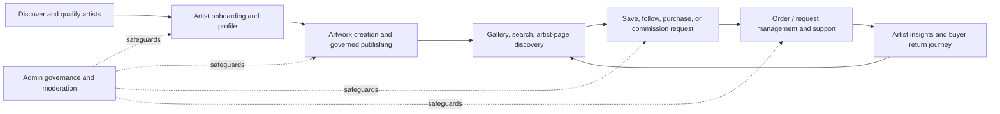

# FANNAN Product Vision

| Document attribute | Value |
| --- | --- |
| Document ID | FANNAN-SRS-PV-3.1 |
| Status | Baseline for product planning and architecture |
| Product | FANNAN |
| Intended audience | Product, design, engineering, QA, operations, and AI-assisted development teams |
| Target platforms | Responsive web, Flutter mobile application, artist dashboard, customer dashboard, and admin dashboard |
| Requirements standard | IEEE 29148-aligned product requirements |

## 1. Overview

FANNAN is a premium Palestinian digital marketplace where artists and artisans can present original work, build an audience, sell products, and receive custom commission requests. Buyers use FANNAN to discover meaningful work, evaluate it with confidence, purchase it through a dependable marketplace, and form ongoing relationships with artists.

The product is not a general social network, a generic e-commerce catalogue, or a portfolio-hosting utility. Its primary job is to make Palestinian creative work discoverable, trustworthy, and commercially viable while preserving the artist’s authorship, identity, and context. Marketplace transactions, artist portfolios, community interactions, commissions, and digital exhibitions must reinforce that primary job.

This document establishes product direction and decision boundaries. It is the source of truth for prioritisation; it does not replace detailed feature specifications, API conventions, data-model documentation, security requirements, or design-system documentation.

## 2. Vision Statement

**FANNAN will be the most trusted and culturally resonant digital destination for discovering, collecting, and supporting Palestinian art and craftsmanship worldwide.**

FANNAN makes each work feel like more than a listing: it is a considered encounter with an artist, their practice, materials, and cultural context. The experience must feel premium without being exclusionary, international without diluting Palestinian identity, and commercially effective without reducing artists to inventory providers.

## 3. Mission Statement

FANNAN enables Palestinian artists and artisans to build sustainable creative businesses by giving them professional tools to present, sell, and grow their work, while giving buyers an accessible, trustworthy way to discover and collect authentic art.

## 4. Goals

### 4.1 Strategic Goals

| ID | Goal | Why it matters | Measurement horizon |
| --- | --- | --- | --- |
| G-PV-01 | Establish a trusted marketplace for Palestinian art and craft. | Buyer trust is required for conversion, repeat purchase, and brand reputation. | MVP through scale |
| G-PV-02 | Help artists generate sustainable commercial opportunities. | Artist supply quality and retention determine marketplace health. | MVP through scale |
| G-PV-03 | Make high-quality artwork discoverable beyond an artist’s existing network. | Discovery creates demand and reduces dependence on external social platforms. | MVP |
| G-PV-04 | Build a culturally grounded premium brand. | A distinct identity creates defensibility and attracts the intended audience. | Continuous |
| G-PV-05 | Operate a reliable, accessible, and scalable digital product. | Trust is lost when payments, listings, dashboards, or essential content fail. | MVP through scale |

### 4.2 Product Goals

1. Enable verified artists to create a professional public presence and publish artwork with complete, buyer-relevant information.
2. Enable customers to browse, search, evaluate, save, follow, and purchase available artwork.
3. Enable customers to request commissions and artists to manage those requests without exposing private details publicly.
4. Provide role-appropriate dashboards so artists can manage their catalogues and performance, customers can manage their relationship with the marketplace, and administrators can govern the platform.
5. Create meaningful discovery paths through curated galleries, category browsing, artist pages, and search—not only through a chronological feed.
6. Preserve a coherent experience across responsive web and Flutter mobile applications, using shared domain rules and a shared design system.

## 5. Business Value

| Value area | Business value | Mechanism |
| --- | --- | --- |
| Marketplace revenue | Creates a transaction-based revenue foundation. | Purchases of eligible artworks and products through FANNAN. |
| Supply quality | Attracts and retains artists with professional presentation and management tools. | Artist profiles, artwork publishing, commissions, and analytics. |
| Demand growth | Converts cultural interest into repeated buyer engagement. | Discovery, follows, favorites, editorial gallery experiences, and trustworthy checkout. |
| Brand equity | Positions FANNAN as a recognisable premium Palestinian creative brand. | Artist-first presentation, cultural integrity, curatorial quality, and reliable service. |
| Operational control | Makes quality, safety, and policy enforcement manageable as the catalogue grows. | Administrative review, moderation, roles, auditability, and structured workflows. |

Business value will not be pursued through dark patterns, deceptive scarcity, undisclosed promotions, or product decisions that compromise artist ownership and buyer trust.

## 6. User Value

### 6.1 Primary Users

| User | Need | Value delivered by FANNAN |
| --- | --- | --- |
| Artist | A credible way to present, sell, and grow a creative practice. | Professional profile, catalogue, sales opportunity, commission workflow, audience building, and analytics. |
| Artisan | A marketplace that communicates workmanship, material, and provenance. | Structured product presentation, visual storytelling, and a premium discovery environment. |
| Buyer / collector | Confidence that a work is authentic, accurately represented, and purchasable. | Artist context, product detail, saved works, clear availability, secure ordering, and support. |
| Commission customer | A safe path from idea to a custom work. | Structured request submission, clear artist communication path, and transparent request status. |
| Curator / cultural explorer | A thoughtful way to discover emerging and established work. | Gallery-led exploration, artist profiles, categories, and culturally meaningful context. |
| Administrator | Controls to operate a safe and dependable marketplace. | Moderation, governance, support visibility, and operational oversight. |

### 6.2 Accessibility and Inclusion Value

FANNAN must serve users with diverse access needs, devices, languages, connectivity conditions, and digital confidence. The product will conform to WCAG 2.2 AA as a minimum for supported interfaces. Arabic and English are first-class content and interface considerations; direction, typography, mixed-script content, and localized terminology must be designed intentionally rather than treated as translation afterthoughts.

## 7. Product Philosophy

### 7.1 Artist-First, Artwork-First

The artwork and its maker are the core units of value. Interface density, recommendation placement, search ranking, product cards, and editorial choices must elevate the work, not compete with it. FANNAN should give artists control over accurate presentation while retaining marketplace quality standards.

### 7.2 Premium Through Clarity

Premium does not mean ornamental complexity. It means clear information, purposeful whitespace, high-quality imagery, refined typography, intentional motion, dependable performance, and respectful interaction. A buyer should never need to decode price, availability, materials, dimensions, shipping implications, or the next action.

### 7.3 Cultural Integrity Is a Product Constraint

Palestinian cultural identity informs visual language, voice, editorial treatment, and marketplace stewardship. It must not be reduced to decoration, an optional theme, or an unsupported provenance claim. The product must represent artists accurately, avoid extractive storytelling, and treat cultural context with care.

### 7.4 Trust Before Growth Tactics

Discovery and conversion must be earned through relevance, clarity, and service. FANNAN will not manipulate users with misleading stock messages, hidden fees, coercive notifications, ambiguous subscriptions, or opaque ranking claims.

### 7.5 Calm, Fast, and Accessible by Default

Fast loading, predictable navigation, keyboard support, readable content, and resilient error recovery are part of the product experience. A visually elegant interface that excludes users, loses work, or blocks a purchase is not premium.

## 8. Problem Statement

Palestinian artists and artisans frequently depend on fragmented tools: social platforms for discovery, direct messages for inquiries, separate payment arrangements, informal commission tracking, and individual websites that are difficult for buyers to discover. This fragmentation creates several connected problems:

1. Artists may have strong work but lack a trusted, professional environment for presenting and selling it.
2. Buyers have difficulty discovering artists outside existing personal or social-media networks and may lack confidence in provenance, availability, pricing, and fulfilment.
3. Custom commissions often begin through unstructured communication, resulting in incomplete requirements, unclear expectations, and avoidable disputes.
4. Cultural context and artistic practice are difficult to communicate through generic product catalogues or fast-moving social feeds.
5. Administrators lack centralized tooling to maintain marketplace quality, enforce policies, and support users consistently.
6. Existing broad marketplaces can make individual Palestinian voices harder to find and may not provide a culturally appropriate presentation model.

## 9. Solution Statement

FANNAN provides one integrated, role-aware platform where:

- artists create public profiles and publish structured artwork listings;
- buyers discover work through gallery, search, category, artist, and saved-content pathways;
- customers purchase available products through a dependable marketplace flow;
- customers submit commission requests through a structured workflow;
- followers and favorites create repeat-discovery pathways without making social engagement the primary product;
- artists access a dashboard for catalogue and performance management; and
- administrators govern quality, safety, and operational processes.

The solution will use a documented Laravel REST API consumed by the Next.js web application, Flutter application, and role-specific dashboards. All clients must share business rules through documented API contracts; no client may invent state transitions, permissions, pricing logic, or fields absent from the API specification.

## 10. Value Proposition

| Audience | FANNAN value proposition | Proof required in product experience |
| --- | --- | --- |
| Artists and artisans | A premium home for building an audience and a sustainable creative business. | Professional public presence, clear publishing workflow, commission opportunities, sales visibility, and credible support. |
| Buyers and collectors | An inspiring and trustworthy way to discover and collect Palestinian work. | Accurate artwork details, meaningful artist context, clear availability, secure transaction flow, and dependable post-purchase communication. |
| Commission customers | A more structured and respectful way to request custom work. | Clear request requirements, status transparency, privacy, and artist-controlled response process. |
| Cultural community | A destination where Palestinian creative practice is visible on its own terms. | Curatorial quality, respectful content treatment, and artist-centered storytelling. |

## 11. Product Scope

### 11.1 In Scope for the Product Direction

| Domain | Included capability |
| --- | --- |
| Identity and roles | Customer, artist, and administrator account experiences with documented authorization boundaries. |
| Artist presence | Public artist profiles, portfolio presentation, and follow relationships. |
| Artwork catalogue | Structured artwork/product creation, publishing, availability, imagery, categorisation, and public product detail. |
| Marketplace | Browsing, search, favorites, cart and purchase flows as defined in dedicated commerce requirements. |
| Commissions | Structured commission request submission and artist-side request management. |
| Digital gallery | Curated and browsable presentation of work and artists. |
| Dashboards | Artist, customer, and administrator experiences appropriate to documented permissions. |
| Community signals | Following and favorites; any additional social interaction requires separate specification. |
| Cross-platform delivery | Responsive website and Flutter application backed by shared REST API contracts. |
| Quality | Security, privacy, observability, performance, accessibility, and operational readiness requirements. |

### 11.2 MVP Boundaries

The MVP proves that FANNAN can attract quality supply, help buyers discover work, and complete a trustworthy purchase or commission-intent flow. It prioritizes end-to-end quality over a broad but shallow feature set.

| MVP outcome | Minimum product capability |
| --- | --- |
| Artist can establish presence | Account, artist profile, portfolio/listing management, and public artist page. |
| Buyer can discover work | Gallery, categories, artist pages, product detail, and search/filter capabilities defined in feature requirements. |
| Buyer can express intent | Favorites, follows, cart/purchase pathway, and commission request pathway. |
| Marketplace can be operated | Administrative oversight and moderation capabilities required to protect users and catalogue quality. |
| Teams can launch safely | Responsive interfaces, API documentation, tests, WCAG 2.2 AA baseline, monitoring, and documented support/error flows. |

## 12. Out of Scope (MVP)

The following are intentionally excluded from MVP unless approved through a change-controlled requirement. Their exclusion prevents undocumented complexity, unvalidated operational commitments, and inconsistent client behaviour.

| Area | Not in MVP | Rationale |
| --- | --- | --- |
| Social network | Public posts, comments, direct messages, stories, and algorithmic feed. | Requires significant moderation, privacy, abuse-prevention, and notification operations beyond MVP validation. |
| Auctions | Live bidding, reserve prices, bidding agents, and timed auction settlement. | Introduces legal, financial, fairness, and real-time reliability complexity. |
| Artist subscriptions | Paid membership tiers or recurring artist billing. | Requires pricing validation, entitlement management, and billing support. |
| Secondary resale | Resale marketplace, provenance transfer, and royalty enforcement. | Requires specialist policy, legal, and transaction design. |
| Live events | Livestream exhibitions, live selling, and event ticketing. | Requires real-time infrastructure and event operations. |
| Generative AI features | AI-generated artwork, automated artist evaluation, or AI purchase recommendations. | Requires governance, consent, bias, provenance, and IP policies not yet specified. |
| Cryptocurrency / NFTs | Wallets, tokens, blockchain provenance, or crypto payments. | Does not support validated MVP needs and adds regulatory/support complexity. |
| Multi-vendor fulfilment tooling | Carrier integrations, warehousing, returns automation, or international tax automation beyond approved commerce requirements. | Requires operational model and regional policy decisions. |
| Offline-first editing | Full local draft synchronization and conflict resolution. | Valuable but adds complex state management; basic resilient upload/retry is still required. |

## 13. Competitive Positioning

FANNAN competes for attention with social media, broad e-commerce marketplaces, portfolio platforms, and gallery websites. It differentiates through the combination of focused cultural positioning, artist-led storytelling, trusted commerce, and structured commission discovery.

| Alternative | Strength | Limitation for FANNAN users | FANNAN position |
| --- | --- | --- | --- |
| Social platforms | Large existing audiences and informal discovery. | Content is ephemeral, commerce is fragmented, and presentation is not optimized for collecting. | Turn discovery into durable artist presence and purchase readiness. |
| Broad marketplaces | Familiar transaction patterns and large catalogues. | Weak cultural context, inconsistent quality, and low artist differentiation. | Curated, culturally grounded marketplace with a premium presentation standard. |
| Portfolio platforms | Professional visual presentation. | Often lack purchasing, commission, and marketplace operations. | Combine professional portfolio with discovery and commerce. |
| Physical galleries | Curatorial trust and rich in-person viewing. | Limited reach, hours, geography, and catalogue accessibility. | Extend discovery and collecting digitally; do not claim to replace physical experience. |

FANNAN must avoid competing primarily on lowest price, catalogue volume, or addictive engagement. Its defensible position is trust, relevance, care, and a coherent artist-to-buyer journey.

## 14. Product Principles

| ID | Principle | Decision rule | Business, user, and technical value |
| --- | --- | --- | --- |
| PP-01 | Artwork leads | Give visual work and essential context priority over UI chrome and promotional clutter. | Strengthens premium brand, supports informed purchasing, and keeps components focused. |
| PP-02 | Artists retain agency | Do not change an artist’s public representation or commercial data without an explicit governed process. | Builds supply trust, respects authorship, and requires auditable workflows. |
| PP-03 | Make trust visible | Surface accurate availability, price, material, dimensions, identity, and status in context. | Improves conversion, reduces support demand, and creates deterministic product states. |
| PP-04 | Use progressive disclosure | Reveal complexity when a user needs it, not all at once. | Reduces cognitive load and supports responsive, reusable interfaces. |
| PP-05 | Design for both scripts | Arabic and English are equal product requirements. | Broadens access, protects cultural integrity, and prevents expensive localization rework. |
| PP-06 | Accessible is usable | Meet WCAG 2.2 AA and test essential flows with real assistive interaction. | Reduces exclusion and legal/reputational risk; produces resilient components. |
| PP-07 | State must be explicit | Loading, empty, error, success, pending, and unavailable states require designed content. | Builds trust, reduces ambiguity, and supports testable API-client contracts. |
| PP-08 | Privacy is intentional | Collect and expose only data needed for a documented product purpose. | Protects users, reduces compliance exposure, and limits data-model sprawl. |
| PP-09 | Build reusable systems | Features use shared documented components, tokens, API conventions, and domain rules. | Improves consistency, delivery speed, and maintainability across web and mobile. |
| PP-10 | Measure without manipulation | Instrument meaningful outcomes and use evidence to improve the experience. | Enables responsible iteration without sacrificing user trust. |

## 15. Success Metrics (KPIs)

Metrics are decision tools, not targets to optimize in isolation. Product analytics must be privacy-aware and use documented event definitions. Baselines and launch targets will be approved after market, pricing, and operating-model validation; no team may invent targets to claim success.

| KPI | Definition | Why it matters | Segment / cadence |
| --- | --- | --- | --- |
| Verified artist activation rate | Percentage of verified artists who complete a public profile and publish at least one eligible listing within a defined activation window. | Measures supply onboarding value. | Artist; weekly and cohort-based |
| Listing publish success rate | Percentage of eligible listing-publish attempts completed without user-blocking error. | Identifies catalogue workflow reliability. | Artist; weekly |
| Artwork discovery-to-detail rate | Percentage of gallery/search impressions that lead to an artwork-detail view. | Measures discovery relevance and presentation. | Customer; weekly by source |
| Product-detail-to-purchase conversion | Percentage of eligible product detail sessions that result in a completed order. | Measures purchase readiness, not merely traffic. | Customer; weekly and monthly |
| Gross merchandise value | Total approved completed-order value in the reporting currency and period. | Measures marketplace economic activity. | Marketplace; monthly |
| Repeat buyer rate | Percentage of buyers with a subsequent completed order within an approved retention window. | Measures trust and lasting demand. | Customer cohorts; monthly |
| Commission response rate | Percentage of valid commission requests receiving an artist response within the documented service window. | Measures usefulness of commission workflow. | Artist / commission; weekly |
| Favorite-to-return rate | Percentage of users who return to a saved artwork or artist within a defined window. | Measures durable discovery intent. | Customer; monthly |
| Support-contact rate | Support contacts per completed order, listing publish, or commission request. | Detects friction and unclear information. | Feature and platform; weekly |
| Accessibility conformance | Percentage of critical user journeys passing documented WCAG 2.2 AA automated and manual checks. | Measures inclusive launch readiness. | Release; every release |
| Core Web Vitals / app performance | Approved performance measurements for critical public pages and core mobile flows. | Protects discovery, conversion, and perceived quality. | Platform; continuous |
| Platform reliability | Availability and error-rate measures for documented critical API and client flows. | Trust requires dependable service. | Operations; continuous |

### 15.1 Metric Guardrails

- Do not improve conversion by hiding fees, creating false urgency, making cancellation difficult, or reducing disclosure.
- Do not treat follower count or raw page views as proof of artist success without activation, sales, or meaningful engagement context.
- Do not compare artists publicly using sales or performance metrics unless a future, consented feature explicitly defines that behaviour.
- Break down relevant metrics by platform, language/direction, device class, and accessibility issue category to detect exclusionary outcomes.

## 16. Product Lifecycle

| Lifecycle stage | User outcome | Product responsibility | Exit condition |
| --- | --- | --- | --- |
| Supply onboarding | Artist understands whether and how to join. | Provide clear requirements, accessible onboarding, and honest verification status. | Artist is accepted, pending, declined with reason where policy permits, or abandons. |
| Profile creation | Artist has a credible public identity. | Collect only required profile data and preview public presentation. | Profile is complete enough for documented publishing rules. |
| Catalogue publishing | Artwork is accurately represented and available for discovery. | Validate structured data, media requirements, permissions, and moderation state. | Listing is published, changes requested, rejected under policy, or remains draft. |
| Discovery | Buyer finds relevant work and artist context. | Provide fast, accessible browsing, filters, search, gallery, and public pages. | Buyer views detail, saves/follows, starts purchase, starts commission, or exits. |
| Intent and transaction | Buyer makes a safe, informed request or purchase decision. | Provide transparent terms, validation, secure handoff, and state visibility. | Order or request reaches a documented terminal or active state. |
| Fulfilment and support | Parties understand next steps and can resolve issues. | Expose appropriate status, support pathways, and administrative controls. | Order/request is completed, cancelled, refunded, resolved, or otherwise terminal per policy. |
| Retention | Buyer and artist receive ongoing value. | Surface saved work, followed artists, relevant updates, and aggregated artist insights with consent. | User returns, changes preferences, or becomes inactive. |

## 17. Functional Requirements

The following are product-direction requirements. Detailed feature SRS documents must refine, not contradict, them.

### FR-PV-01 — Role-Aware Marketplace Foundation

| Field | Requirement |
| --- | --- |
| ID | FR-PV-01 |
| Title | Role-aware marketplace foundation |
| Description | FANNAN shall provide role-appropriate experiences for customers, artists, and administrators across supported platforms. |
| Priority | Must have |
| Business Value | Enables governed marketplace operations and avoids using ad hoc screens or permissions as the product scales. |
| User Value | Users receive only the tools and information relevant to their responsibilities. |
| Actors | Customer, artist, administrator, authenticated service. |
| Preconditions | User identity and role assignment exist according to the identity and authorization specification. |
| Flow | 1. User authenticates. 2. Client retrieves documented authorized context. 3. Client presents allowed routes and actions. 4. API independently authorizes every request. |
| Alternative Flows | Unauthenticated visitors may access only documented public content. A user with no active artist authorization remains a customer unless a documented workflow changes their status. |
| Validation Rules | Clients must not infer role privileges. Server responses and policies are authoritative. |
| Permissions | Role and resource permissions are defined in the authorization specification; no undocumented role may gain access. |
| Errors | Unauthorized access returns the documented API error and the client offers a safe recovery path without exposing protected data. |
| Acceptance Criteria | Given a role, when it accesses a protected action, then the API permits only documented permissions; given a direct route attempt, then the client does not expose unauthorized content. |
| Future Expansion | Additional staff roles, curator roles, and delegated team access require a separate authorization design. |

### FR-PV-02 — Artist-to-Buyer Discovery and Commerce Journey

| Field | Requirement |
| --- | --- |
| ID | FR-PV-02 |
| Title | Artist-to-buyer discovery and commerce journey |
| Description | FANNAN shall support a coherent path from public artist and artwork discovery to a documented purchase or commission-intent action. |
| Priority | Must have |
| Business Value | Connects marketplace supply to demand and validates FANNAN’s core commercial model. |
| User Value | Buyers can make informed decisions; artists receive qualified interest through a professional channel. |
| Actors | Visitor, customer, artist, administrator. |
| Preconditions | A listing is eligible for public display under the catalogue and moderation rules. |
| Flow | 1. User discovers an artwork or artist. 2. User reviews accurate public details. 3. User saves, follows, starts purchase, or submits a commission request as applicable. 4. System records and communicates the outcome using documented state transitions. |
| Alternative Flows | Unavailable work remains clearly represented according to listing policy; unauthenticated users are asked to authenticate only when an action requires an account. |
| Validation Rules | Availability, price, artist identity, and call to action must derive from documented backend data. |
| Permissions | Public users view only public content; private request and transaction details remain restricted to authorized parties. |
| Errors | If price, availability, or transaction state cannot be confirmed, the system must not imply that the item can be purchased. |
| Acceptance Criteria | Given a publicly eligible listing, when a buyer views it, then essential factual details and an appropriate next action are accessible; when status changes, then the next action updates consistently across clients. |
| Future Expansion | Personalized recommendations, auction paths, and resale paths require independent specifications. |

### FR-PV-03 — Accessible Cross-Platform Experience

| Field | Requirement |
| --- | --- |
| ID | FR-PV-03 |
| Title | Accessible cross-platform experience |
| Description | FANNAN shall provide equivalent access to critical marketplace and dashboard outcomes on responsive web and Flutter mobile, subject to platform-appropriate interaction patterns. |
| Priority | Must have |
| Business Value | Expands addressable audience and reduces brand, compliance, and support risk. |
| User Value | Users can discover, manage, and transact regardless of device or access need. |
| Actors | All users, including keyboard, screen-reader, magnification, and reduced-motion users. |
| Preconditions | Feature has approved requirements, design-system patterns, and API contract. |
| Flow | 1. Team designs with semantic/accessibility requirements. 2. Clients implement shared business outcomes. 3. QA verifies web and mobile acceptance criteria. |
| Alternative Flows | Where a platform cannot use the same control, it provides an equivalent accessible outcome rather than omitting the capability. |
| Validation Rules | Critical flows must meet WCAG 2.2 AA requirements defined in the accessibility specification. |
| Permissions | Accessibility support does not alter authorization; it changes how authorized outcomes are reached. |
| Errors | Error messages must identify the issue, explain recovery, preserve entered work where possible, and be perceivable with assistive technology. |
| Acceptance Criteria | Given a critical flow, when tested with keyboard, screen reader, reflow/zoom, and reduced motion, then the user can complete the documented outcome without a Level A or AA blocker. |
| Future Expansion | Additional languages and platform-specific assistive integrations require localization and platform requirements. |

## 18. UX Considerations

1. **Discovery begins with visual confidence.** Artwork imagery must load progressively, preserve meaningful aspect ratios, and never obscure essential product facts with decorative overlays.
2. **Context supports collecting.** Artist, title, medium, dimensions, price, availability, and relevant edition or fulfilment information must be easy to locate on every product detail experience.
3. **Dashboards prioritize action over metrics.** An artist should see what needs attention—drafts, requests, inventory or order issues—before secondary analytics.
4. **Empty states create a next step.** “No favorites” or “No artworks yet” must explain the state and offer a relevant, permission-appropriate action without fabricating content.
5. **Mobile is not a reduced website.** Mobile may use different navigation and density, but it cannot hide essential buyer, artist, or support capabilities.
6. **Language and direction are structural.** RTL changes are tested at component, page, and data-content level; mirrored visuals must not make product imagery or meaning incorrect.
7. **Sensitive moments deserve clarity.** Payments, order status, commission requests, publishing, account settings, and destructive actions require explicit confirmation and recovery guidance.

## 19. Technical Notes

| Topic | Direction |
| --- | --- |
| Architecture | Use feature-first organization with Clean Architecture boundaries, SOLID design, and repository pattern implementations where specified. |
| Frontend | Next.js, React, strict TypeScript, Tailwind CSS, and documented FANNAN design tokens/components. Do not use `any`. |
| Mobile | Flutter consumes the documented REST API and follows the same domain states, validation rules, and permissions as web. |
| Backend | Laravel REST API is the contract authority. Endpoints, fields, request/response shapes, error conventions, and state transitions must be documented before client implementation. |
| Data | PostgreSQL is the system of record. Database fields are created only through approved data-model documentation and migrations. |
| Performance | Redis may support documented caching, queues, rate limiting, or session-related needs; it must not become an undocumented source of truth. |
| Infrastructure | Docker supports reproducible environments; AWS and Cloudflare configuration must satisfy approved security, availability, and observability requirements. |
| Testing | Unit, integration, API-contract, end-to-end critical-flow, accessibility, and regression tests are required in proportion to change risk. |
| Documentation | Every implemented feature links to an approved requirement, API contract, data model, permissions, errors, and acceptance criteria. |

## 20. Edge Cases

| Scenario | Required product behaviour |
| --- | --- |
| Artwork becomes unavailable while buyer is viewing it | Show current availability before a purchase commitment; do not allow a stale client state to confirm availability. |
| Artist profile is incomplete or under review | Do not expose a misleading public presence; show the artist an actionable, private status. |
| Product has incomplete essential metadata | Prevent public publish when documentation defines the data as required; preserve draft work. |
| User loses network while uploading media or submitting a request | Clearly state pending/failed status, preserve recoverable form state, and offer documented retry. |
| Customer opens a deep link while unauthenticated | Preserve the safe intended destination after authentication when policy permits; never expose protected content. |
| Arabic content mixed with English title, price, or dimensions | Maintain readable bidi order, correct language semantics, and logical start/end alignment. |
| Artist has no public listings | Public page remains dignified and accurate; it does not imply stock or invent a catalogue. |
| Search returns no results | Explain the result, retain query/refinement context, and offer relevant adjustments without claiming unavailable items exist. |
| Payment or commission action returns an ambiguous result | Do not announce success until confirmed by the documented authoritative state; provide recovery/support path. |
| Admin action changes a listing’s eligibility | Record the documented status/reason and expose only the information each affected party is permitted to see. |
| Screen reader user encounters dynamic gallery or cart updates | Announce concise, relevant state changes without repeated or disruptive announcements. |
| User is at 400% zoom or 320 px viewport | Essential content and actions reflow and remain operable without hidden overflow. |

## 21. Dependencies

| Dependency | Why it is required | Owner / decision needed |
| --- | --- | --- |
| Brand and design system | Ensures premium, accessible, bilingual visual consistency. | Product design and design-system owners |
| Identity and authorization specification | Defines account lifecycle, roles, permissions, and protected-resource rules. | Backend, security, product |
| Catalogue and media specification | Defines artwork/product fields, images, availability, review, and publishing rules. | Product, backend, artist operations |
| Commerce and payment specification | Defines order, payment, fees, cancellation, refund, tax, shipping, and regional obligations. | Product, finance, legal, backend |
| Commission workflow specification | Defines request fields, visibility, response states, and dispute/support handling. | Product, artist operations, backend |
| Content moderation and community policy | Defines eligibility, prohibited content, review actions, appeals, and enforcement. | Operations, legal, trust and safety |
| Localization and content strategy | Defines Arabic/English source content, translation responsibility, and cultural editorial guidance. | Content, product design |
| Analytics plan | Defines consent, event taxonomy, retention, KPI calculation, and data access. | Product, data, privacy |
| Infrastructure/security baseline | Defines environments, deployment, secrets, backups, monitoring, incident handling, and availability targets. | DevOps, security |

## 22. Risks

| Risk | Impact | Likelihood | Mitigation | Early signal |
| --- | --- | --- | --- | --- |
| Insufficient high-quality artist supply at launch | Marketplace lacks compelling discovery and buyer trust. | Medium | Validate artist onboarding, curate launch cohort, and prioritize artist value before broad acquisition. | Low verified-artist activation or low listing completion. |
| Buyer trust gap | Low conversion and reputational damage. | Medium | Make factual details, policies, status, support, and secure commerce flows explicit. | High product-detail exits, support questions, payment abandonment. |
| Scope expansion into social or logistics features | Launch delay and brittle architecture. | High | Enforce MVP boundaries and change control; require dedicated SRS before new domains. | Unplanned endpoints, fields, roles, or dashboard modules. |
| Cultural misrepresentation | Loss of community trust and brand harm. | Medium | Establish editorial governance and feedback channels with artists/cultural advisors. | Artist complaints, inconsistent language, or unsupported claims. |
| Accessibility debt | Exclusion, rework, legal/reputational risk. | Medium | Use design-system patterns, automated checks, manual testing, and release gates. | Keyboard blockers, contrast regressions, inaccessible custom controls. |
| Operational complexity of commerce | Failed orders, disputes, and support overload. | Medium | Document state models, escalation routes, and policies before release. | Ambiguous statuses, manual workarounds, repeat support contacts. |
| API/client contract drift | Inconsistent web/mobile behaviour and production defects. | Medium | Version/document contracts, test them, and prohibit undocumented fields/endpoints. | Client-specific workarounds or divergent states. |
| Media performance and cost | Slow discovery experience and unplanned infrastructure spend. | Medium | Define media lifecycle, optimized delivery, limits, monitoring, and fallback behavior. | Poor image performance or upload failures. |
| Privacy or security incident | Severe trust, legal, and business impact. | Low to medium | Apply least privilege, secure SDLC, documented retention, monitoring, and incident response. | Unauthorized access patterns, exposed data, abnormal API behavior. |

## 23. Assumptions

| ID | Assumption | Consequence if false | Validation owner |
| --- | --- | --- | --- |
| A-PV-01 | A meaningful launch cohort of artists and artisans will participate in onboarding. | Marketplace discovery may not achieve minimum quality or breadth. | Product and artist partnerships |
| A-PV-02 | Buyers value a dedicated Palestinian art marketplace enough to use it alongside existing social discovery. | Acquisition and conversion strategy must be reconsidered. | Product and growth |
| A-PV-03 | FANNAN can establish compliant payment, fulfilment, and support operations for its launch markets. | Commerce launch must narrow or be delayed. | Finance, legal, operations |
| A-PV-04 | Artists can provide sufficient, accurate listing information and media with product guidance. | Publishing needs stronger assisted onboarding or operational support. | Artist operations and product |
| A-PV-05 | Arabic and English content can be maintained to approved quality levels. | Language rollout or scope must be adjusted to prevent unequal experience. | Content and product |
| A-PV-06 | The selected stack can meet approved performance, security, and availability requirements. | Architecture or infrastructure decisions must be revised before scale. | Engineering and DevOps |
| A-PV-07 | Moderation and administrative capacity will be available for launch policy needs. | Catalogue quality and response times may be unsafe or inconsistent. | Operations and trust/safety |

## 24. Open Questions

These questions require an accountable decision before the dependent implementation begins. They are not permission to invent product behaviour.

| ID | Question | Decision needed from | Blocks / affects |
| --- | --- | --- | --- |
| OQ-PV-01 | Which launch countries, currencies, payment methods, and fulfilment responsibilities are supported? | Founders, finance, legal, operations | Commerce, taxes, shipping, refunds, customer communications |
| OQ-PV-02 | What artist verification standard, review process, and appeal process applies at launch? | Product, artist operations, legal | Onboarding, public status, moderation, support |
| OQ-PV-03 | Which product categories and artwork types are eligible for MVP sale and commission requests? | Product, curation, operations | Catalogue fields, policies, search/filter, fulfilment |
| OQ-PV-04 | What commission agreement, payment, milestone, cancellation, and dispute model will FANNAN support? | Product, legal, finance, operations | Commission workflow and payments |
| OQ-PV-05 | What languages are supported at launch, and what is the translation/editorial approval workflow? | Product, content, design | Information architecture, localization, support |
| OQ-PV-06 | What is FANNAN’s revenue model and fee disclosure policy? | Founders, finance, legal | Checkout, artist economics, reporting, legal copy |
| OQ-PV-07 | What data retention, deletion, consent, and privacy requirements apply in launch markets? | Legal, privacy, security | Data model, analytics, account lifecycle |

## 25. Future Improvements

Future work is intentionally directional. It must be prioritized only after evidence from MVP outcomes and documented requirements.

1. Curator-led editorial collections and richer digital exhibition formats.
2. More advanced artist analytics with privacy-safe, actionable insights.
3. Enhanced commission lifecycle capabilities after the commercial and legal model is validated.
4. Localized discovery and commerce for additional markets, languages, and currencies.
5. Carefully governed community interactions that offer value beyond existing social platforms.
6. Operational integrations for fulfilment, returns, and customer-service efficiency where supported by a documented launch-market model.
7. Accessibility improvements beyond AA, including additional personalization and assistive-technology optimization.

## 26. Acceptance Criteria

This product vision is accepted as a planning baseline when all of the following are true:

- [ ] Product, design, engineering, operations, and leadership agree that FANNAN’s primary purpose is a Palestinian artist-and-artisan marketplace with portfolio, discovery, commerce, commission, and governed community signals.
- [ ] MVP scope and explicit exclusions are used in planning; teams do not implement excluded domains without an approved requirement change.
- [ ] All detailed feature specifications map their goals, actors, permissions, states, APIs, data fields, errors, and acceptance criteria back to this document where applicable.
- [ ] Web, Flutter, and dashboard teams treat the REST API contract as authoritative and do not create undocumented endpoints, database fields, or client-only business rules.
- [ ] WCAG 2.2 AA, bilingual/RTL support, design-system compliance, and responsive behaviour are treated as release requirements for critical flows.
- [ ] KPI definitions are implemented through an approved analytics plan before launch measurement begins.
- [ ] Open questions that block a feature are resolved by named owners before that feature enters implementation.
- [ ] The risks and dependencies are reviewed at each major planning and launch-readiness checkpoint.

## 27. Summary

FANNAN is a premium, culturally grounded marketplace built to make Palestinian creative work more discoverable, more trusted, and more commercially sustainable. The product succeeds when artists can establish meaningful professional presence and opportunity, while buyers can confidently discover and collect work through an experience that is elegant, accessible, fast, and operationally reliable.

The MVP should prove this core loop with depth: artist onboarding and publishing, artwork discovery, buyer intent and commerce/commission pathways, role-aware dashboards, and responsible administration. Product growth must preserve the principles in this document—artist agency, cultural integrity, visible trust, accessibility, and documented, reusable technical foundations.
