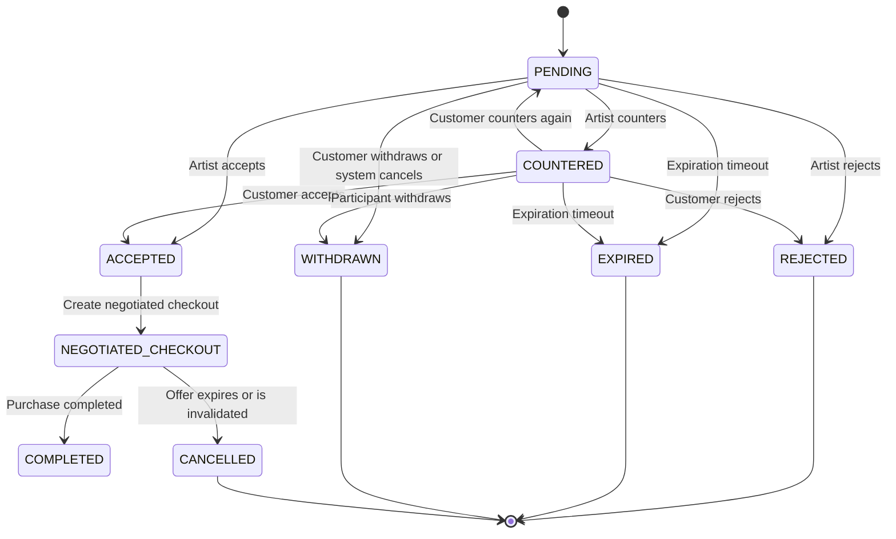

# FANNAN Negotiation & Offers

| Field | Value |
| --- | --- |
| Document ID | FANNAN-SRS-NEG-3.17 |
| Version | 1.0 |
| Status | Product requirements baseline |
| Parent documents | [Product Vision](3.1%20Product%20Vision.md), [User Roles](3.2%20User%20Roles.md), [User Stories](3.3%20User%20Stories.md), [Functional Requirements](3.4%20Functional%20Requirements.md), [Non-Functional Requirements](3.5%20Non%20Functional%20Requirements.md), [Marketplace Features](3.6%20Marketplace%20Features.md), [Artist Features](3.7%20Artist%20Features.md), [Customer Features](3.8%20Customer%20Features.md), [Admin Features](3.9%20Admin%20Features.md), [Notifications](3.10%20Notifications.md), [Search](3.11%20Search.md), [Checkout](3.12%20Checkout.md), [Payments](3.13%20Payments.md), [Shipping](3.14%20Shipping.md), [Analytics](3.15%20Analytics.md), [Future Features](3.16%20Future%20Features.md) |
| Product | FANNAN |
| Applies to | Marketplace product, customer storefront, artist dashboard, admin tools, mobile app, notifications, checkout, analytics |
| Requirements standard | IEEE 29148-aligned product requirements |

## 1. Feature Overview

FANNAN Negotiation & Offers is a structured marketplace feature that allows a customer to submit a purchase offer for an artwork that the artist has enabled for negotiation. The feature is intentionally designed to feel like a marketplace negotiation flow, not a chat application.

The feature solves a common problem in art commerce: customers often want to negotiate price, while artists may want flexibility in pricing without exposing private pricing strategy or entering a free-form conversation. Instead of messaging, the system creates a structured negotiation flow using offers, counter-offers, acceptance, rejection, expiration, and final negotiated checkout.

This feature is optional per artwork. An artist may configure each artwork as either:

- Fixed Price
- Negotiable

If negotiation is disabled, the product keeps the standard Buy Now flow and the Make an Offer action is not displayed. If negotiation is enabled, the product shows both Buy Now and Make an Offer, allowing the customer to proceed with a normal purchase or submit an offer.

This feature differs from traditional marketplace checkout because it introduces a temporary price negotiation stage before the customer proceeds to checkout. The original product price remains unchanged for catalog and display purposes, while the final agreed price is stored and enforced only when the negotiation is accepted and the checkout is created.

Structured negotiation is preferred over chat for MVP because it is easier to audit, easier to secure, easier to test, and easier to support. It preserves the commercial intent of negotiation while eliminating the complexity, inconsistency, and moderation burden that real-time messaging would introduce.

## 2. Goals

The following goals define the expected value of the feature:

| Goal ID | Goal | Measure |
| --- | --- | --- |
| NEG-GOAL-001 | Increase conversion of otherwise undecided buyers | Higher product-to-offer and offer-to-purchase conversion |
| NEG-GOAL-002 | Give artists flexibility in pricing | Offer acceptance rate and artist-controlled negotiation settings |
| NEG-GOAL-003 | Improve customer engagement | Offer submissions, repeat visits, and acceptance of negotiated checkout |
| NEG-GOAL-004 | Lower friction in price negotiation | Structured flow replaces direct chat dependence |
| NEG-GOAL-005 | Preserve artist control | Only allowed actions are based on artist-configured settings |
| NEG-GOAL-006 | Safeguard trust and accountability | Server-side validation, audit logs, and clear statuses |

## 3. Non-Goals

These are explicitly out of scope for the MVP negotiation implementation:

- No real-time chat or live messaging between buyer and artist
- No voice-based negotiation
- No automated AI negotiation or pricing bots
- No public offer history visible to all users
- No anonymous seller bidding or customer identity masking
- No auction system or live bidding engine
- No unlimited negotiation rounds
- No negotiation of shipping or payment terms outside the agreed price
- No public display of private artist minimum price rules
- No support for group offers or bulk offers in MVP

These exclusions are intentional. The goal is to ship a simple, professional, low-complexity negotiation flow that can scale later if a more advanced offer engine or auction system becomes necessary.

## 4. Actors

### 4.1 Customer

The customer is the party making the offer. They may:

- View eligible artwork
- Submit an offer if negotiation is enabled
- Receive status updates and counter-offers
- Accept a counter-offer
- Reject a counter-offer
- Submit a new counter-offer if allowed
- Complete checkout after an agreement is accepted

### 4.2 Artist

The artist is the party receiving and responding to offers. They may:

- Enable or disable negotiation per artwork
- View incoming offers in their dashboard
- Accept, reject, or counter an offer
- See offer history and time remaining
- Maintain control over pricing flexibility and offer policy

### 4.3 Admin

The admin reviews and supports the system when required. Admin responsibilities include:

- Reviewing suspicious or fraudulent negotiation activity
- Viewing negotiation history for investigation
- Overriding or canceling negotiation actions when necessary under strict policy
- Configuring global defaults and approval settings
- Auditing dispute activity and offer anomalies

### 4.4 System

The system is the authoritative engine that:

- Validates all offer inputs
- Applies the business rules
- Enforces expiration, state transitions, and permissions
- Prevents double-selling and inconsistent pricing
- Generates notifications
- Records all events for auditability

## 5. Terminology

The following terms are used consistently throughout this document:

| Term | Definition |
| --- | --- |
| Offer | A customer-submitted proposed price for an eligible artwork. |
| Counter Offer | A revised price proposed by the artist or customer in response to an active offer. |
| Negotiation | The full process of offer creation, response, counter-offer, and settlement around a single artwork purchase discussion. |
| Negotiated Price | The final agreed price accepted by both parties for a specific transaction. |
| Original Price | The artwork’s standard listed price before negotiation. |
| Offer Expiration | The server-authoritative deadline by which an offer or counter-offer must be acted upon. |
| Offer Round | A single direction of negotiation within the life of a negotiation, such as Customer → Artist or Artist → Customer. |
| Offer Status | The state of a single offer record, such as PENDING, ACCEPTED, REJECTED, EXPIRED, or WITHDRAWN. |
| Negotiation Status | The lifecycle status of the overall negotiation, such as OPEN, ACCEPTED, REJECTED, EXPIRED, or CANCELLED. |
| Accepted Offer | A valid offer accepted by the relevant party and eligible for negotiated checkout. |
| Rejected Offer | An offer or counter-offer that is explicitly rejected. |
| Expired Offer | An offer that reaches the expiration timestamp without acceptance or valid continuation. |
| Withdrawn Offer | A customer or artist action to withdraw or cancel an active offer before resolution. |
| Locked Price | The final price locked for a negotiated checkout after agreement. |
| Negotiated Checkout | The checkout instance created after an accepted offer becomes a valid purchase agreement. |

## 6. Artist Configuration

Each artwork must be explicitly configured by the artist to control negotiation behavior.

### 6.1 Required Artwork Setting

| Setting | Type | Default | Description |
| --- | --- | --- | --- |
| allowOffers | Boolean | false | Whether the artwork accepts direct customer offers. |

### 6.2 Behavior

#### When allowOffers = false

The customer sees the standard storefront flow:

- Product detail page
- Buy Now button
- Normal checkout flow
- No Make an Offer action displayed
- No negotiation-related states or entry points

#### When allowOffers = true

The customer sees both:

- Buy Now
- Make an Offer

The customer can either proceed directly with the fixed-price purchase or submit an offer.

### 6.3 Optional Artist Settings (Future or Controlled MVP)

The following settings may be configurable in a future iteration, but they must be treated carefully because they directly affect negotiation policy and fairness.

| Setting | Type | MVP Recommendation | Notes |
| --- | --- | --- | --- |
| minimumAcceptablePrice | Currency value | Future | Must be private and never exposed to customer. |
| maxDiscountPercent | Percentage | Future | Supports artist-controlled pricing guidance. |
| maxNegotiationRounds | Integer | MVP recommended default, not fully customizable initially | Prevents endless negotiation loops. |
| offerExpirationHours | Integer | MVP default recommended | Controls offer validity timeline. |

### 6.4 Private Pricing Rules

The artist’s internal rules, including minimum acceptable price, must never be exposed to the customer in the product UI. The customer can only see:

- the original price
- their submitted offer
- the current offer status
- the artist’s response if any
- the final negotiated price when accepted

The customer must not be able to see messages such as: “Minimum acceptable price: $90” or any internal threshold information.

## 7. Customer Experience

### 7.1 Customer Journey Overview

1. Customer opens an artwork page.
2. Product is checked for eligibility.
3. If negotiation is enabled, the customer sees Buy Now and Make an Offer.
4. Customer clicks Make an Offer.
5. Offer form opens.
6. Customer enters proposed price and optional note.
7. Offer is validated server-side.
8. Offer is submitted.
9. System creates offer record in PENDING state.
10. Artist receives offer notification.
11. Artist accepts, rejects, or counters.
12. Customer receives result.
13. If countered, customer may accept, reject, or counter again.
14. When agreement is reached, a negotiated checkout is created.
15. Customer completes purchase at locked negotiated price.

### 7.2 Desktop Experience

The desktop experience should be concise and professional. The customer should not feel like they are entering a chat thread. The flow should be structured around a modal or side-panel form that clearly displays:

- Artwork name
- Artist name
- Original price
- Offer amount input
- Optional note
- Offer expiration information
- Submit button
- Cancel button

### 7.3 Mobile Experience

The mobile experience should prioritize simplicity and touch ergonomics. The flow should use a bottom sheet or full-screen modal with large tap targets and a clear price field.

Recommended mobile behavior:

- Large numeric field for price
- Clear summary card
- Countdown timer shown in a readable format
- Single CTA button with strong visual hierarchy
- Offer history list with status badges
- Offer result confirmation screen after acceptance or rejection

### 7.4 Responsive Web Experience

The responsive flow must work across desktop, tablet, and mobile with consistent logic and content hierarchy. The same negotiation semantics must be preserved across devices.

## 8. Make an Offer UI

The Make an Offer UI must include the following information:

| Field | Required | Description |
| --- | --- | --- |
| Artwork name | Yes | The item being offered on. |
| Artist | Yes | Name of the artist or artisan. |
| Original price | Yes | Current fixed price of the artwork. |
| Offer input | Yes | Numeric amount in the supported currency. |
| Optional note | Optional | Short customer note explaining interest or context. |
| Expiration info | Yes | States the offer expiration time and deadline. |
| Submit | Yes | Confirms the offer for server validation. |
| Cancel | Yes | Closes the form without submitting. |

### 8.1 Optional Note Policy

The optional note is allowed only if the product team decides that lightweight context adds value without requiring actual messaging. If allowed, the note must have clearly defined limits and rules.

Recommended MVP:

- Optional, not required
- Maximum length: 250 characters
- Plain text only
- No links, contact information, or external addresses
- No profanity, harassment, spam, or abusive language
- Visible only to the artist and internal admin review flows
- Not published publicly as a comment or review

### 8.2 Note Moderation

The system must sanitize and moderate notes before they are shown to the artist. Notes that violate content policy must be rejected or redacted depending on product policy.

## 9. Offer Validation

Offer validation must always be enforced server-side. The client may assist with UX, but it cannot be trusted for business logic.

### 9.1 Core Validation Rules

- Offer must be numeric
- Offer must be greater than zero
- Offer must use a supported currency
- Offer may not exceed platform maximum configured limits
- Offer must be submitted only for available and purchasable artwork
- Artwork must be eligible for negotiation
- Customer must be authenticated and authorized to submit offers
- Offer must not be created for deleted, archived, or sold-out items
- Offer must respect current marketplace policy for minimum or maximum values if such rules are enabled

### 9.2 Special Cases

| Scenario | Required Behavior |
| --- | --- |
| Offer equals original price | Allowed only if product policy allows; otherwise it behaves like a direct buy attempt and may convert to standard purchase flow. |
| Offer higher than original price | Allowed if the product policy allows and the customer is permitted to initiate a counter above list price. If not allowed, it is rejected with clear guidance. |
| Extremely low offers | Allowed as a valid submission if above minimum thresholds, but may be treated as low-bid or flagged for review when policy demands. |
| Decimal values | Allowed only to supported precision such as two decimal places per currency. |
| Currency conversion | The system must apply the official conversion rule. The offer is recorded in the selected currency and converted at the server. |
| Out-of-stock artwork | Offer submission is rejected or the item is blocked from negotiation. |
| Deleted artwork | Offer creation is blocked immediately. |
| Archived artwork | Offer creation is blocked unless the product is still active for negotiated purchase by policy. |
| Artist disables negotiation after a pending offer | The offer remains valid only if it was already submitted under the prior valid policy and not yet expired. The system must not quietly discard valid history. |

## 10. Offer Lifecycle

The negotiation lifecycle is a controlled state machine. Only valid state transitions are allowed.

### 10.1 State Definitions

| State | Meaning |
| --- | --- |
| PENDING | A submitted offer is active and awaiting a response. |
| COUNTERED | The latest offer has been revised by the other party and is awaiting a response. |
| ACCEPTED | A valid offer or counter-offer has been accepted and may become a negotiated checkout. |
| REJECTED | The offer or counter-offer was refused. |
| EXPIRED | The offer reached its expiration deadline without valid resolution. |
| WITHDRAWN | A participant withdrew the offer or counter-offer before it resolved. |
| CANCELLED | The offer was cancelled by the system due to a critical invalidation, such as product unavailability or admin action. |
| NEGOTIATED_CHECKOUT | The agreement has been locked and checkout is available for purchase completion. |
| COMPLETED | Purchase process completed successfully. |

### 10.2 State Transition Rules

- A customer may submit only one active offer at a time for the same artwork unless the system explicitly allows multiple concurrent negotiation entries under policy.
- Only the latest active offer or counter-offer can be accepted.
- A rejected offer cannot be reopened without creating a new offer.
- An expired offer cannot be accepted.
- A withdrawn or cancelled offer cannot be revived.
- A direct purchase at the original price is separate from a negotiation and must not alter the active negotiation state unless the customer chooses to stop negotiating.

## 11. Negotiation Rounds

Negotiation rounds define the number of sequential exchanges allowed within one negotiation.

### 11.1 Recommended MVP Model

Recommended default:

- Maximum 3 rounds total
- Round 1: Customer offers
- Round 2: Artist counters or accepts/rejects
- Round 3: Customer accepts, rejects, or counters

This keeps the experience simple and avoids infinite loops.

### 11.2 Why this is appropriate for MVP

A three-round model is sufficient to provide real flexibility without making the flow feel like a complex bargaining game. It keeps decision-making clear, improves supportability, and reduces operational burden.

### 11.3 When the Maximum Is Reached

When the maximum round count is reached:

- The negotiation becomes locked for further counter-offers
- The last active offer remains visible as the final state
- The customer or artist may still accept the latest offer if allowed
- If no acceptance is made, the negotiation expires or is marked final by policy

## 12. Counter Offers

Counter offers are revised proposals made in response to an active offer.

### 12.1 Who Can Counter

- Artist can counter a customer offer
- Customer can counter an artist counter-offer
- Admin may take override actions under controlled policy

### 12.2 When Countering Is Allowed

Countering is allowed only while:

- The offer remains active
- The artwork remains eligible for negotiation
- The maximum negotiation round has not been reached
- The offer has not expired, been rejected, or been accepted

### 12.3 Counter Price Rules

- Counter price must be numeric and valid
- Counter price must respect currency and platform constraints
- Counter price may be equal to, above, or below the previous offer depending on policy
- Counter price should reflect the latest active offer and not infer hidden private pricing rules
- Countering cannot silently override a previously accepted offer

### 12.4 Active Offer Rule

Only the latest active offer or counter-offer remains valid. Previous versions remain as part of the offer history but cannot be reactivated unless the flow is intentionally reopened by policy.

## 13. Offer Expiration

This is a critical business rule. Expiration must be enforced by the backend and not by frontend-only timers.

### 13.1 Default Expiration

Recommended MVP default:

- 72 hours for initial offer
- 48 hours for counter-offer

These values can be configured globally but must be documented and auditable.

### 13.2 Countdown Behavior

- The UI shows a countdown timer for active offers and counter-offers
- The countdown is informational only
- The authoritative timer is server-side

### 13.3 After Expiration

When an offer expires:

- The offer enters EXPIRED state
- The customer and artist are notified
- The negotiation may no longer be accepted
- A new offer can be created only if the artwork remains eligible and the customer chooses to initiate a fresh negotiation

### 13.4 Renewal

Expired offers are not automatically renewed. A new offer must be created if the customer still wishes to negotiate.

## 14. Agreement

A negotiation becomes an agreement only under specific conditions.

### 14.1 Agreement Conditions

An agreement is valid only when all of the following are true:

- One party accepted the latest valid offer or counter-offer
- The artwork is still available
- The negotiation has not expired
- The agreed price is acceptable under the current validation rules
- The customer is still authorized to purchase

### 14.2 Agreement Metadata

The agreement must include:

- Offer ID
- Product ID
- Customer ID
- Artist ID
- Original price
- Agreed price
- Currency
- Agreement timestamp
- Expiration of purchase opportunity

### 14.3 Purchase Opportunity Expiration

After an agreement is reached, the customer is given a limited-time opportunity to complete the purchase. The exact window should be configurable but should be short enough to protect inventory and avoid stale negotiation.

Recommended default:

- 24 hours from agreement approval

If the customer does not complete purchase in time, the negotiated agreement expires and the artwork returns to ordinary availability unless another policy decision is taken.

## 15. Negotiated Checkout

Once a valid agreement exists, the customer receives a purchase call-to-action with the negotiated price locked in.

### 15.1 Checkout Behavior

The customer must see:

- Complete Purchase
- Negotiated price
- Artwork summary
- Agreement expiry
- Final order summary

The checkout must be created from the negotiated agreement, not by letting the customer re-enter a different price.

### 15.2 Critical Rule

The customer must never be able to modify the negotiated price during checkout. If they attempt to do so, the action must be rejected with a server-side validation error.

### 15.3 Invalid or Stale Agreement Cases

If any of the following occurs, the negotiated checkout must fail gracefully:

- Artwork becomes unavailable
- Another customer bought the item first
- Artist removes the artwork
- Artist changes the standard price
- Agreement expired
- Customer leaves checkout without completion
- Customer returns after expiry and tries to complete an invalid negotiated agreement

In these cases, the system must show a clear message and create a safe recovery path such as restarting negotiation or returning to the product page.

## 16. Pricing Rules

The pricing model must stay clear and auditable.

### 16.1 Key Rules

| Concept | Definition |
| --- | --- |
| Original Price | The product’s standard public price shown in the catalog. |
| Current Product Price | The current catalog or live product price before negotiation. |
| Offer Price | A customer-submitted proposal. |
| Counter Offer Price | A revised price after a response. |
| Agreed Price | The final accepted price in the negotiation. |
| Negotiated Checkout Price | The locked transaction amount used in checkout. |

### 16.2 Major Principle

The original product price must not be silently overwritten when negotiation occurs. The product must preserve the original fixed-price context while creating a separate negotiated transaction price attached to the agreed offer.

This is important because:

- the catalog price remains honest and transparently viewable
- historical negotiation records remain auditable
- the final sale price is tied to the accepted offer rather than mutating the product’s base price
- payment and checkout logic can validate the exact agreed amount without ambiguity

## 17. Inventory & Concurrency

This feature introduces concurrency risk because multiple customers may attempt to negotiate the same artwork at the same time.

### 17.1 MVP Strategy

For the MVP, use a safe and simple approach:

- Multiple offers may exist across different customers, but only one active accepted negotiation may be valid at a time for a given artwork.
- An accepted offer should reserve the item for a short time window to prevent immediate double-selling.
- The reservation is not a permanent hold; it is a short-term purchase opportunity to protect inventory until customer checkout or expiration.
- If another customer purchases the item first via direct checkout, the prior negotiation must be invalidated.

### 17.2 Required Safeguards

- The backend must validate artwork availability before acceptance
- The backend must prevent double-selling using server-side inventory checks
- A product must not be sold twice under different agreed prices
- Offer and checkout logic must remain consistent under concurrent actions

## 18. Artist Experience

Artist dashboard functionality is required for a complete MVP experience.

### 18.1 Offers Section

The artist dashboard must include an Offers section with at least these filters:

- Status
- Artwork
- Date
- Price
- Round count

### 18.2 Offer Types to Display

- Pending offers
- Countered offers
- Accepted offers
- Rejected offers
- Expired offers

### 18.3 Offer Detail View

Each offer detail must contain:

- Artwork name
- Original price
- Customer offer price
- Offer timestamp
- Time remaining
- Offer history
- Current status
- Accept action
- Reject action
- Counter action

### 18.4 Artist Analytics

The dashboard should include useful analytics for negotiation performance, such as:

- Offer submission rate
- Acceptance rate
- Rejection rate
- Counter-offer rate
- Average discount accepted
- Average time to response
- Average rounds per negotiation

## 19. Customer Experience

Customers also need a clear personal view of their negotiation activity.

### 19.1 Customer Offers Section

The customer dashboard or account page must include:

- My Offers
- Offer history
- Pending offers
- Counter offers
- Accepted offers
- Rejected offers
- Expired offers

### 19.2 Offer Detail

Each customer offer detail should include:

- Artwork name
- Artist name
- Original price
- Offer price
- Current response status
- Time remaining
- History of rounds
- Accept counter action if applicable
- Reject counter action if applicable
- Submit another counter if allowed
- Complete purchase if accepted

### 19.3 Empty States

If the customer has no negotiation activity, display helpful empty states such as:

- “No offers yet”
- “Your negotiation history will appear here”
- “Artwork must enable offers before negotiation is available”

## 20. Notifications

Notifications are required for each meaningful transaction in the negotiation lifecycle.

### 20.1 Required Notification Events

| Event | Recipient | Channel |
| --- | --- | --- |
| Offer Submitted | Artist | In-App + Email (MVP may use In-App only) |
| Offer Received | Artist | In-App |
| Offer Accepted | Customer | In-App + Email |
| Offer Rejected | Customer | In-App |
| Counter Offer Received | Customer | In-App |
| Offer Expiring Soon | Both parties | In-App + Email optional |
| Offer Expired | Both parties | In-App |
| Negotiated Price Accepted | Customer | In-App |
| Negotiated Checkout Created | Customer | In-App |
| Purchase Completed | Customer + Artist | In-App + Email |

### 20.2 Channel Policy

- In-App notifications are required for MVP.
- Push and email may be added in a later phase if product policy supports it.
- Notification content must remain concise and avoid exposing private internal pricing rules.

## 21. Notification Content Rules

Notifications must never expose private business information such as:

- internal minimum acceptable price
- internal moderation details
- internal fraud signals
- internal auction or pricing logic

### 21.1 Allowed Content

The customer may see:

- the offered amount
- the final accepted amount
- the status of the offer
- the expiration date/time
- a standard next-step action

The artist may see:

- the customer’s offer amount
- the offer timeline
- the final accepted price
- relevant system-generated status updates

## 22. Permissions

| Action | Customer | Artist | Admin |
| --- | --- | --- | --- |
| Submit Offer | Yes | No | Yes, controlled support workflow |
| Accept Offer | No | Yes | Yes, controlled support workflow |
| Reject Offer | No | Yes | Yes, controlled support workflow |
| Counter Offer | Yes | Yes | Yes, controlled support workflow |
| View Own Offers | Yes | Yes | Yes |
| View Other User Offers | No | No | Yes |
| Modify Offer After Submission | No | No | Admin-only controlled action |
| Cancel Fraudulent Offer | No | No | Yes |
| Create Negotiated Checkout | Yes, after acceptance | No | Yes, controlled support workflow |
| Override Agreement | No | No | Yes, controlled support policy |
| Resolve Dispute | No | No | Yes |

## 23. Security

Security requirements are essential because prices, offers, inventory, and account state all influence financial outcomes.

### 23.1 Authorization

- Users must authenticate before creating or responding to offers.
- Offer actions must be checked against the user’s permission and ownership context.
- Only the authorized customer or artist can act on their own negotiation records.

### 23.2 Authentication

- All negotiation actions must require a valid session or equivalent auth token.
- Sensitive actions such as acceptance, rejection, or checkout creation must require revalidation.

### 23.3 Ownership Validation

The backend must validate that:

- the customer owns the offer being revised or withdrawn
- the artist owns the artwork linked to the offer
- the artwork is the same one referenced by the offer
- the user has permission to act on the negotiation lifecycle

### 23.4 Price Tampering Prevention

The backend must never trust client-submitted values for:

- price
- product ID
- artist ID
- customer ID
- status
- agreement value

All core values must be server-authoritative.

### 23.5 Replay Prevention and Idempotency

- A repeated click or duplicate request must not create multiple offers
- Server-side idempotency keys must be used where appropriate
- The same action must not result in inconsistent state transitions

### 23.6 Rate Limiting

- Limit offer creation attempts per user within a time window
- Limit repeated counter-offers and repeated actions for the same product
- Enforce fraud and abuse controls for suspicious patterns

### 23.7 Audit Logging

Every important action must be logged, including:

- actor
- action type
- timestamp
- offer ID
- product ID
- old state
- new state
- source device or session context when available

## 24. Abuse Prevention

The market must protect itself against spam, manipulation, and abuse.

### 24.1 MVP Safeguards

- Minimum offer threshold per artwork category or marketplace policy
- Maximum daily offer count per user
- Repeated low offers may be flagged or limited
- Repeated counter-offers may be rate-limited
- Suspicious notes are moderated or rejected
- Fake account detection and fraud review are supported through admin workflows

### 24.2 Future Safeguards

- Dynamic pricing risk flags
- Behavioral detection models
- Escalated trust thresholds for high-value deals
- More granular limit rules by customer segment or geography

## 25. Offer Notes

Customer and artist notes are optional and separate from chat.

### 25.1 MVP Decision

Recommendation: keep note support optional and lightweight. It should support simple reason-giving without creating a messaging requirement.

### 25.2 Rules

- Maximum length: 250 characters
- Plain text only
- Sanitization and moderation required
- Not publicly visible outside the negotiation record
- Not searchable publicly
- Not displayed to unrelated users
- If abusive content is detected, the note is not shown and is flagged for review

## 26. Admin Controls

Admin must be able to support and supervise the negotiation ecosystem.

### 26.1 Required Admin Actions

- View all negotiations with basic search and filters
- Filter by date, status, artist, customer, and product
- Inspect full offer history and state timeline
- View suspicious activity and flagged offers
- Cancel fraudulent or abusive offers
- Resolve disputes involving stale or invalid negotiation states
- Audit price changes, statuses, and system actions
- Configure global negotiation defaults and policy settings

### 26.2 Protected Actions

Changes that affect business integrity must require elevated permissions, such as:

- force-canceling an accepted negotiation
- overriding a failed agreement
- modifying an order associated with a negotiated price
- resetting stale negotiation states during support cases

## 27. Analytics

Negotiation analytics are required to measure value and operational quality.

### 27.1 Core Metrics

| Metric | Definition |
| --- | --- |
| Offer Submission Rate | Percentage of eligible product visits that lead to an offer submission |
| Offer Acceptance Rate | Percentage of offers accepted by artists |
| Offer Rejection Rate | Percentage of offers rejected |
| Counter Offer Rate | Percentage of offers that lead to counter-offers |
| Average Discount | Average difference between original price and accepted negotiated price |
| Average Negotiation Rounds | Mean number of rounds per successful negotiation |
| Negotiation-to-Purchase Conversion | Percentage of negotiations that reach checkout and purchase |
| Negotiated GMV | Total revenue from accepted negotiated agreements |
| Time to Agreement | Average time to first accepted agreement |
| Expired Offer Rate | Percentage of offers that expire before resolution |
| Artist Offer Conversion | Percentage of offers that convert to accepted agreements for an artist |
| Customer Offer Conversion | Percentage of customer offer attempts that lead to purchase |

### 27.2 Event Names

Suggested event names for downstream analytics:

- offer_viewed
- offer_submitted
- offer_accepted
- offer_rejected
- offer_countered
- offer_expiring_soon
- offer_expired
- agreement_created
- checkout_created
- checkout_completed
- negotiation_cancelled

## 28. Database Requirements

This document intentionally does not define the complete database schema, but it does define the conceptual entities needed for later implementation.

### 28.1 Conceptual Entities

| Entity | Purpose |
| --- | --- |
| Offer | Represents a customer-submitted price request for an artwork. |
| Negotiation | Represents the lifecycle of a negotiation thread over one artwork discussion. |
| Offer Participant | Represents a customer or artist participating in a negotiation. |
| Offer Event | Represents each system or user action on the offer state timeline. |
| Negotiated Agreement | Stores the final accepted and locked price. |
| Negotiated Checkout | Stores the checkout created from a valid agreement. |
| Offer Status | Enumerated lifecycle state for an offer. |
| Offer Round | Tracks the round count and sequence of offer/counter-offer steps. |

### 28.2 Conceptual Relationships

- One artwork may have many offers over time
- One negotiation may include multiple offer rounds
- One offer belongs to one customer and one product
- One artist may receive many offers across multiple artworks
- One negotiated agreement corresponds to one accepted offer
- One negotiated agreement may create one negotiated checkout
- Each offer and agreement should record audit events and timestamps

## 29. API Requirements

The detailed API contract will be documented later, but the backend capabilities are required now.

### 29.1 Required Capabilities

- Create Offer
- Get Offer
- List Customer Offers
- List Artist Offers
- Accept Offer
- Reject Offer
- Counter Offer
- Withdraw Offer
- Expire Offer
- Create Negotiated Checkout
- Get Offer History
- List Offer Events

### 29.2 Authorization Requirements

| Capability | Required Permission |
| --- | --- |
| Create Offer | Authenticated customer with valid artwork access |
| Get Offer | Customer owns the offer, artist owns the product, or admin |
| List Customer Offers | Authenticated customer |
| List Artist Offers | Authenticated artist |
| Accept Offer | Authenticated artist for their own product |
| Reject Offer | Authenticated artist for their own product |
| Counter Offer | Authenticated customer or artist with valid negotiation state |
| Withdraw Offer | Authenticated participant |
| Expire Offer | System or admin support action |
| Create Negotiated Checkout | Authenticated customer with valid accepted agreement |
| Get Offer History | Authorized participant or admin |

## 30. Frontend Requirements

The frontend must support professional structured negotiation interactions.

### 30.1 Required UI Components

| Component | Purpose |
| --- | --- |
| MakeOfferButton | Entry point from product detail page |
| MakeOfferModal | Offer form with amount and optional note |
| OfferInput | Numeric field and validation errors |
| OfferSummary | Summary of product and price context |
| OfferStatusBadge | Status labeling such as Pending, Accepted, Rejected |
| OfferTimeline | Sequential record of negotiation actions |
| CounterOfferModal | Form for counter-offer input |
| OfferExpirationTimer | Countdown display |
| NegotiatedPriceCard | Final agreed price summary |
| NegotiatedCheckoutBanner | CTA for completing purchase |
| OfferHistory | Full record of offer state history |

### 30.2 Responsive Behavior

- Desktop: modal or side panel
- Tablet: modal or separated summary layout
- Mobile: bottom sheet or full-screen view
- All flows must preserve status clarity and avoid confusing state changes

## 31. Mobile Requirements

The mobile app must preserve the same business logic and customer experience, with a strong emphasis on simplicity and accessibility.

### 31.1 Required Mobile UX Priorities

- Bottom sheet for offer creation
- Large tap targets for actions
- Clear numeric input with currency formatting
- Offer status cards in account and order history
- Countdown timers with clear state labels
- Strong action buttons for Accept / Reject / Counter
- No requirement for chat messaging

### 31.2 Notification Behavior

Push notifications should be used sparingly and only for critical events such as:

- offer received
- offer accepted
- offer rejected
- counter offer received
- offer expiring soon

## 32. Accessibility

The feature must comply with WCAG 2.2 AA principles.

### 32.1 Accessibility Requirements

- Keyboard navigation across all modal and form flows
- Focus management for dialogs and dynamic content updates
- Screen-reader labels for amount input and status changes
- Sufficient color contrast for status badges and calls to action
- Clear error messages without revealing internal error details
- Large touch targets on mobile
- Available countdown text that is screen-reader friendly
- Reduced motion support for animated transitions

## 33. Edge Cases

The feature must handle the following edge conditions explicitly.

| Edge Case | Required Handling |
| --- | --- |
| Artist disables offers after submission | Existing valid offers remain valid unless policy clearly invalidates them. |
| Artist deletes artwork | Offer becomes invalid and the customer is notified. |
| Artist archives artwork | Negotiation must stop or become invalid unless policy allows archived items to still transact. |
| Artwork becomes sold | Offer or agreement must be invalidated and no negotiated checkout may proceed. |
| Artwork becomes out of stock | Offer creation blocked; accepted agreements must not complete. |
| Customer account suspended | Inactive or restricted user cannot continue negotiation or checkout. |
| Artist account suspended | All open offers are paused or reviewed by admin. |
| Offer expires while user is viewing it | UI must refresh state to expired and disable actions. |
| Counter offer expires | The offer history remains visible and the negotiation becomes inactive. |
| Two customers receive accepted offers | Only one valid accepted offer may proceed to checkout; the rest are invalidated. |
| Customer tries to pay an old negotiated price | Payment attempt must fail server-side if price mismatch occurs. |
| Product price changes | Original price remains historical and the negotiated agreement remains the canonical transaction price. |
| Currency change | Agreement retains the currency and conversion rules used at acceptance time. |
| Payment fails | Agreement remains valid or is released according to order/payment policy; customer must see clear recovery guidance. |
| Customer abandons checkout | Agreement may expire according to policy unless the system explicitly preserves it. |
| Duplicate offer submission | Only one valid offer may be created; duplicates are rejected or merged under policy. |
| Network retry or double click | Duplicate submissions must be prevented using idempotency and validation. |
| Concurrent accept/reject actions | Only one valid state transition can succeed; the others are rejected. |

## 34. Error Handling

User-facing errors must be clear, human-readable, actionable, and never expose internal implementation details.

### 34.1 Error Examples

| Error | User-Facing Message |
| --- | --- |
| Invalid price | “Please enter a valid offer amount.” |
| Offer too low | “Your offer is below the allowed range for this artwork.” |
| Product unavailable | “This artwork is no longer available for negotiation.” |
| Offer expired | “This offer expired. Please submit a new offer.” |
| Not allowed | “Negotiation is currently not available for this artwork.” |
| Duplicate submission | “Your offer has already been submitted.” |
| Agreement expired | “This negotiated agreement expired. Please check the artwork for the latest availability.” |

## 35. Audit Trail

Every important negotiation action must be recorded.

### 35.1 Required Events

| Event Name | Description |
| --- | --- |
| OFFER_CREATED | A customer submitted a new offer. |
| OFFER_VIEWED | A user opened the offer or offer detail. |
| OFFER_ACCEPTED | The artist accepted a valid offer. |
| OFFER_REJECTED | The offer was rejected. |
| COUNTER_OFFER_CREATED | A counter-offer was created. |
| OFFER_EXPIRED | The offer or counter-offer expired. |
| OFFER_WITHDRAWN | The user withdrew the offer. |
| AGREEMENT_CREATED | A valid agreement was reached. |
| CHECKOUT_CREATED | Negotiated checkout was created. |
| CHECKOUT_COMPLETED | Purchase completed successfully. |

### 35.2 Logged Data

At minimum, the system should log:

- user ID or actor type
- offer ID
- product ID
- old state
- new state
- timestamp
- IP/device context where relevant
- reason or policy trigger when applicable

## 36. Business Rules

The following explicit business rules define the feature:

| Rule ID | Rule |
| --- | --- |
| NEG-001 | An artwork must explicitly allow negotiation before a customer can submit an offer. |
| NEG-002 | A customer cannot modify an offer after submission. |
| NEG-003 | Only the latest active offer or counter-offer may be accepted. |
| NEG-004 | A rejected or expired offer cannot be reused. |
| NEG-005 | An agreement requires a valid accepted offer and product availability. |
| NEG-006 | The original product price remains unchanged during negotiation. |
| NEG-007 | The negotiated checkout must use the agreed price and not a user-entered override. |
| NEG-008 | The backend is authoritative for expiration, validation, and state transitions. |
| NEG-009 | A negotiation must have a finite number of rounds. |
| NEG-010 | An artwork cannot be sold twice under multiple valid accepted offers. |
| NEG-011 | Admin actions may override or resolve invalid states under controlled policy. |
| NEG-012 | A customer or artist may only act on valid offer states and authorized records. |
| NEG-013 | Negotiation must be auditable and reviewable for support and compliance. |
| NEG-014 | Notes and communication related to offers must not create a hidden messaging requirement. |
| NEG-015 | The system must maintain a clear distinction between original price, offer price, and negotiated checkout price. |

## 37. User Stories

### 37.1 Customer Stories

| ID | Story | Priority | Acceptance Criteria |
| --- | --- | --- | --- |
| NEG-CUST-01 | As a customer, I want to offer a price for a negotiable artwork so that I can purchase it at a price I can accept. | High | Given an eligible artwork with negotiation enabled, when the customer enters a valid offer and submits it, then the offer is created and the artist is notified. |
| NEG-CUST-02 | As a customer, I want to receive a counter-offer result so that I know whether the artist accepted, rejected, or adjusted the price. | High | Given an offer is in response, when the artist counters, rejects, or accepts, then the customer sees the corresponding status update. |
| NEG-CUST-03 | As a customer, I want to accept a counter-offer so that I can complete a purchase quickly. | High | Given a valid counter-offer exists, when the customer accepts it, then the agreement is created and checkout is opened with the negotiated price locked. |
| NEG-CUST-04 | As a customer, I want to see my offer history so that I understand the negotiation timeline. | Medium | Given I have submitted one or more offers, when I open My Offers, then I see the current status and historical rounds. |
| NEG-CUST-05 | As a customer, I want to be notified when my offer expires so that I know whether I need to create a new offer. | Medium | Given an active offer reaches expiration, when the backend marks it expired, then the customer receives an expiration notification. |

### 37.2 Artist Stories

| ID | Story | Priority | Acceptance Criteria |
| --- | --- | --- | --- |
| NEG-ART-01 | As an artist, I want to enable or disable offers per artwork so that I control how and when customers can negotiate. | High | Given I manage an artwork, when I set allowOffers to true or false, then the product reflects the appropriate negotiation behavior. |
| NEG-ART-02 | As an artist, I want to review incoming offers in my dashboard so that I can decide how to respond. | High | Given a customer submits an offer, when it reaches the artist dashboard, then the artist can review the details and select Accept, Reject, or Counter. |
| NEG-ART-03 | As an artist, I want to reject an offer so that I maintain control over pricing and sales. | High | Given a valid pending offer exists, when the artist rejects the offer, then the status is updated and the customer is notified. |
| NEG-ART-04 | As an artist, I want to counter an offer so that I can negotiate a fair price without requiring chat. | High | Given a valid offer exists and the maximum rounds are not exceeded, when the artist sends a counter-offer, then the negotiation enters a new round and the customer is notified. |
| NEG-ART-05 | As an artist, I want to see my negotiation performance so that I can understand how pricing and offers impact conversion. | Medium | Given the artist dashboard includes negotiation metrics, when the artist opens reports, then relevant offer acceptance and rejection metrics are visible. |

### 37.3 Admin Stories

| ID | Story | Priority | Acceptance Criteria |
| --- | --- | --- | --- |
| NEG-ADM-01 | As an admin, I want to review suspicious negotiation activity so that I can prevent fraud and abuse. | High | Given a flagged or suspicious offer exists, when the admin opens the negotiation review view, then the full state history and entity context are visible. |
| NEG-ADM-02 | As an admin, I want to cancel fraudulent or invalid negotiations so that the system remains trustworthy. | High | Given an invalid or abusive negotiation exists, when the admin cancels it, then the system records the action and updates state appropriately. |
| NEG-ADM-03 | As an admin, I want to audit negotiation actions so that I can investigate issues and support customers. | Medium | Given a negotiation event has been created, when the admin views the audit trail, then all state changes and actor actions are visible. |

## 38. Acceptance Criteria

### 38.1 Given / When / Then Coverage

#### AC-01: Negotiation disabled

Given an artwork has negotiation disabled,
When a customer views the product detail page,
Then the Make an Offer action must not be displayed and the standard Buy Now flow remains the only purchase path.

#### AC-02: Negotiation enabled

Given an artwork has negotiation enabled,
When a customer views the product detail page,
Then both Buy Now and Make an Offer are available.

#### AC-03: Offer submission

Given the customer is authenticated and the artwork is eligible,
When the customer submits a valid offer,
Then the system creates a PENDING offer and notifies the artist.

#### AC-04: Offer rejection

Given a valid pending offer exists,
When the artist rejects the offer,
Then the offer transitions to REJECTED and the customer receives a rejection notification.

#### AC-05: Offer acceptance

Given a valid pending offer exists,
When the artist accepts the offer,
Then the offer transitions to ACCEPTED and the negotiated checkout is created for the customer.

#### AC-06: Counter-offer

Given a valid offer exists,
When the artist submits a counter-offer,
Then the negotiation enters COUNTERED state and the customer is notified of the revised price.

#### AC-07: Counter acceptance

Given a valid counter-offer exists,
When the customer accepts it,
Then the offer transitions to ACCEPTED and the negotiated checkout is created.

#### AC-08: Counter rejection

Given a valid counter-offer exists,
When the customer rejects it,
Then the negotiation reaches REJECTED and the customer or artist may initiate a new flow if permitted by policy.

#### AC-09: Expiration

Given an active offer reaches the configured expiration time,
When the backend processes the expiry,
Then the offer becomes EXPIRED and both parties receive the expiration notice.

#### AC-10: Price integrity

Given a customer has an accepted negotiated price,
When the customer attempts to modify the price during checkout,
Then the system rejects the change and preserves the agreed price.

#### AC-11: Inventory integrity

Given a product is sold or becomes unavailable,
When an accepted offer or negotiation exists,
Then the system blocks the negotiated checkout and informs the customer of the product status.

#### AC-12: Audit trail

Given a negotiation action occurs,
When the system processes it,
Then an audit event is recorded with actor, timestamp, state change, and applicable metadata.

#### AC-13: Admin review

Given an offer is flagged or suspicious,
When an admin reviews it,
Then the admin can inspect the full history and apply controlled support actions.

## 39. MVP Definition

### 39.1 MUST HAVE

- Artist can enable or disable negotiation per artwork
- Customer sees Make an Offer only when enabled
- Customer can submit a valid offer amount
- Offer status transitions are supported: PENDING, ACCEPTED, REJECTED, COUNTERED, EXPIRED, WITHDRAWN, CANCELLED
- Artist can accept, reject, or counter a pending offer
- Customer can accept, reject, or counter a counter-offer
- Backend enforces expiration and valid state transitions
- Negotiated price is locked for checkout
- In-app notifications and status updates exist
- Audit trail is maintained
- Admin can review suspicious activity and resolve invalid states

### 39.2 SHOULD HAVE

- Optional note field for offers
- Countdown indicator in UI
- Clear My Offers dashboard
- Offer filters in artist dashboard
- Expanded analytics for negotiation outcomes
- Support for product-specific negotiation defaults

### 39.3 COULD HAVE

- Email notifications
- Richer analytics dashboards
- Better counter-offer suggestions
- Offer-specific business rules by artist segment or product category

### 39.4 NOT IN MVP

- Real-time chat
- AI pricing negotiation
- Public offer history to all users
- Auction system
- Bulk negotiation
- Anonymous negotiation
- Voice-based negotiation
- Unlimited rounds

## 40. Future Enhancements

The following capabilities are intentionally excluded from MVP but may be considered later:

- Automated negotiation or AI-assisted offer suggestions
- Artist minimum-price rules with transparent customer-facing education
- Smart counter-offers based on historical patterns
- Unified negotiation chat or concierge messaging
- VIP customer offer tiers
- Scheduled or delayed offers
- Bulk negotiation for multiple item purchases
- Offer analytics deeply integrated with customer segmentation
- Auction or bidding features

## 41. Dependencies

This feature depends on several product and platform capabilities.

| Dependency | Impact |
| --- | --- |
| Products | Artwork must support negotiation settings and current availability state. |
| Artists | Artist dashboard, controls, and response state are required. |
| Customers | Customer account and offer history views are required. |
| Authentication | Users must be authenticated for valid negotiation actions. |
| Notifications | Offer lifecycle notifications must be delivered across supported channels. |
| Orders | Accepted negotiation must eventually create an order and purchase process. |
| Checkout | Negotiated checkout must use server-validated pricing. |
| Payments | Payment authorization must match the negotiated price. |
| Inventory | Product availability and reservation rules are crucial for preventing double-sale. |
| Analytics | Offer metrics and events are required for business measurement. |
| Admin | Admin review, support, and fraud actions are required for trust and operations. |

## 42. Risks

### 42.1 Business Risks

- Customers may feel negotiation is not worth the effort if the process is too complex.
- Artists may fear price leakage or unpredictability if negotiation is too open.
- Poor offer policy may lead to low conversion or discount fatigue.

### 42.2 Technical Risks

- Race conditions during simultaneous acceptance or checkout creation
- Inventory inconsistency and double-selling
- Price mismatch between the frontend and backend

### 42.3 UX Risks

- Too many rounds may create user frustration
- Inconsistent states may confuse both customer and artist
- Mobile flows may be too heavy or slow if not carefully designed

### 42.4 Fraud Risks

- fake customer accounts
- spam offers
- abuse of counters and notes
- price manipulation attempts

### 42.5 Operational Risks

- Support teams may need clear workflows for invalid or disputed negotiations
- Admin capacity may need to review edge-case cases during launch

## 43. Open Questions

The following decisions should be confirmed before implementation:

| Question | Recommended Decision | Reason | Impact |
| --- | --- | --- | --- |
| Should offer notes be allowed in MVP? | Yes, but optional and capped at 250 characters | Improves context without requiring chat | Medium |
| What is the default maximum round count? | 3 rounds total | Balances flexibility and simplicity | High |
| What is the default expiration time? | 72 hours for initial offers, 48 hours for counter-offers | Gives time to respond while preserving urgency | High |
| How long should a negotiated checkout remain valid? | 24 hours after agreement | Prevents stale price lock and inventory risk | High |
| Should artists be allowed to set custom minimum prices? | Not in MVP | Too much complexity for early release | Medium |
| Should countering be allowed above list price? | Only by explicit policy | Reduces pricing ambiguity | Medium |
| Should email notifications be required in MVP? | In-app notifications are required; email optional | Keeps implementation lean while maintaining visibility | Medium |

## 44. Implementation Readiness Checklist

### 44.1 Design

- [ ] Artwork offer states are defined
- [ ] Offer UX is designed for desktop and mobile
- [ ] Error states are designed
- [ ] Offer lifecycle flow is reviewed by product and design

### 44.2 Database

- [ ] Offer and negotiation entities are modeled conceptually
- [ ] Inventory concurrency strategy is documented
- [ ] Audit event model is defined

### 44.3 Backend

- [ ] Server-side validation is designed
- [ ] State transitions are defined and protected
- [ ] Expiration logic is authoritative
- [ ] Inventory reservation and double-sale prevention are designed

### 44.4 API

- [ ] Offer endpoints are defined
- [ ] Authorization and permission checks are documented
- [ ] Error and idempotency strategy are defined

### 44.5 Frontend

- [ ] Offer entry points are implemented
- [ ] Offer history and statuses are visible
- [ ] Notifications are surfaced in the UI

### 44.6 Mobile

- [ ] Offer flow works in bottom-sheet form
- [ ] Countdown timers are accessible and readable
- [ ] Push notifications are configured if required

### 44.7 Testing

- [ ] Offer validation tests exist
- [ ] State transition tests exist
- [ ] Expiration tests exist
- [ ] Inventory concurrency tests exist
- [ ] Admin review and audit tests exist

### 44.8 Deployment

- [ ] Production monitoring is configured
- [ ] Admin support workflow is documented
- [ ] Launch and rollback plan is approved

## 45. Final Summary

The final MVP negotiation design is a structured, auditable, server-authoritative feature that allows artists to enable negotiation on eligible artworks without requiring chat or direct messaging. Customers can submit an offer, receive artist responses, counter as needed, and complete checkout only after a valid agreement is reached and the negotiated price is locked.

The feature is intentionally simple, professional, and operationally safe. It prioritizes clarity, inventory protection, secure validation, accurate audit logs, and predictable user flows. It creates business value by increasing flexibility for artists and conversion opportunities for customers while preserving trust and control.

The design is intentionally shaped like a marketplace feature, not a chat application. That makes it suitable for an MVP that is reliable, enforceable, supportable, and ready for later expansion into more advanced negotiation products or auction experiences.
