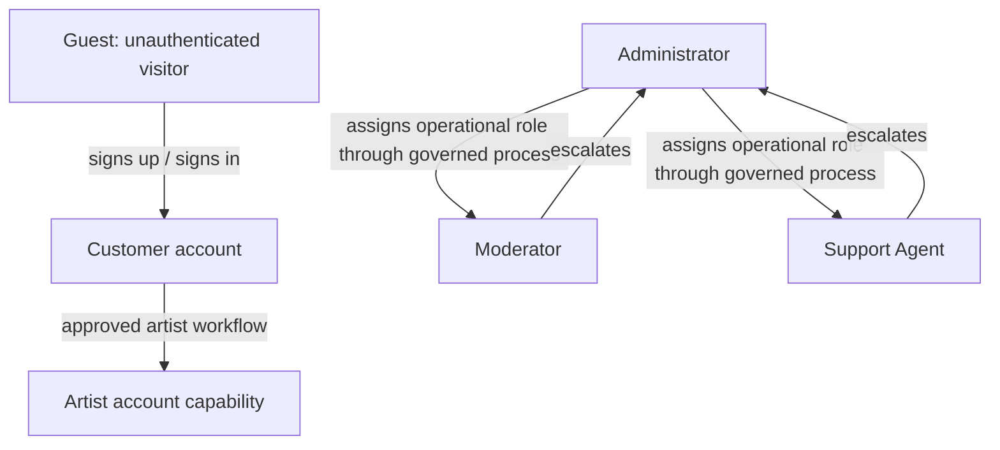
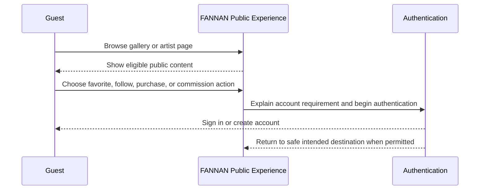
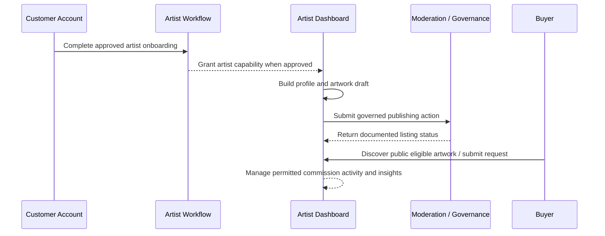
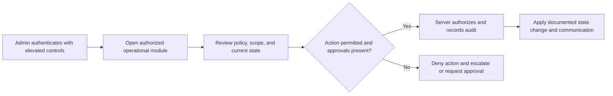

# FANNAN User Roles and Access Control

| Document attribute | Value |
| --- | --- |
| Document ID | FANNAN-SRS-UR-3.2 |
| Status | Authorization and experience baseline |
| Parent document | [Product Vision](3.1%20Product%20Vision.md) |
| Applies to | Responsive web, Flutter mobile application, customer dashboard, artist dashboard, and admin dashboard |
| Requirements standard | IEEE 29148-aligned product requirements |

## 1. Overview

This document defines the human roles supported by FANNAN, their access boundaries, and the product journeys they enable. It is the role baseline for information architecture, UI states, API authorization, operational tooling, QA test cases, and support procedures.

FANNAN is a marketplace for Palestinian artists and artisans. Role design must preserve artist agency, protect customer data, support trustworthy transactions, and give operational staff only the access necessary to perform their duties. A role controls what a user is allowed to request; it does not grant access merely because a screen, route, or client-side button is visible.

The Laravel REST API is the authorization authority. Next.js and Flutter clients must render permitted experiences but must never be relied upon to enforce access. Every protected API request must be authorized server-side against the authenticated principal, the role assignment, and the target resource.

## 2. Goals

| ID | Goal | Why it matters |
| --- | --- | --- |
| G-UR-01 | Define clear, least-privilege access for each platform role. | Prevents unauthorized access, data exposure, and operational mistakes. |
| G-UR-02 | Give artists a focused path to manage their public presence, artwork, commissions, and insights. | Delivers the artist-first value central to the marketplace. |
| G-UR-03 | Give customers a simple path from discovery to saved work, purchase, and commission request. | Supports buyer confidence and marketplace conversion. |
| G-UR-04 | Separate moderation, support, and administration responsibilities. | Reduces risk by avoiding broad staff access for narrow operational tasks. |
| G-UR-05 | Make access state understandable and accessible across web and mobile. | Avoids confusing dead ends and supports WCAG 2.2 AA critical flows. |
| G-UR-06 | Establish extensible role boundaries without shipping unapproved future capabilities. | Keeps MVP focused while preventing incompatible future architecture. |

## 3. Business Value

| Value | Role-model contribution |
| --- | --- |
| Trust | Buyers, artists, and staff can rely on clear ownership and controlled access to sensitive actions. |
| Marketplace quality | Moderators and administrators can govern public catalogue quality without altering unrelated financial or private data. |
| Artist retention | Artists receive professional tools and transparent limits rather than opaque or inconsistent access. |
| Operational efficiency | Support agents resolve documented cases with targeted access and escalation paths. |
| Security and compliance | Least privilege, auditable staff actions, and server-enforced authorization reduce exposure. |
| Delivery quality | Shared role definitions prevent web, mobile, and API implementations from drifting. |

## 4. User Value

- **Guests** can evaluate FANNAN’s catalogue and artists before creating an account.
- **Customers** can organize their relationship with FANNAN and complete account-required buyer actions.
- **Artists** can operate their creative presence and marketplace catalogue without needing administrative access.
- **Moderators** can protect public content and marketplace quality through a constrained operational workspace.
- **Support agents** can assist users through documented service workflows without accessing sensitive controls unnecessarily.
- **Administrators** can govern platform configuration, users, operational assignments, and escalated marketplace decisions.

## 5. Scope

### 5.1 In Scope

1. The roles Guest, Customer, Artist, Admin, Moderator, and Support Agent.
2. Role-specific navigation and dashboard access.
3. Role permissions and restrictions for documented marketplace, portfolio, commission, dashboard, and operational capabilities.
4. Authentication expectations, session safety, authorization enforcement, auditability, and role-change behavior.
5. Future-role design constraints.

### 5.2 Out of Scope

| Excluded item | Reason |
| --- | --- |
| Detailed identity-provider protocol, credential schema, token format, and session implementation | Must be defined in the dedicated authentication and security specifications. |
| Database schema or field definitions | This document defines product access needs only; approved data-model documentation is required before migrations or fields are created. |
| Payment, shipping, refunds, tax, commission contract, moderation policy, and appeal rules | These require their own feature and policy specifications. |
| Public social roles, direct-message permissions, auction roles, subscription entitlements, and resale privileges | These are outside MVP in the Product Vision. |
| Staff organization chart or employment policy | Operational governance is not a substitute for platform authorization design. |

## 6. Role Model and Authorization Principles

### 6.1 Role Assignment Model

1. **Guest** is an unauthenticated access state, not a persisted staff or marketplace privilege.
2. **Customer** is the baseline authenticated marketplace role.
3. **Artist** is an approved creator capability. An artist retains customer capabilities unless a future specification explicitly changes the model.
4. **Admin**, **Moderator**, and **Support Agent** are internal operational roles. They must be assigned through a governed process and are not self-selectable during public registration.
5. Role assignment, removal, suspension, and reactivation are security-sensitive operations. They require documented authorization, an audit record, and immediate server-side effect.
6. A client may show a role-specific navigation entry only after retrieving authoritative permitted capabilities. Hiding a control is not authorization.

### 6.2 Core Authorization Rules

| Rule | Requirement |
| --- | --- |
| Least privilege | Grant the minimum capability required for the role’s documented work. |
| Server enforcement | Every protected REST API operation verifies identity, role/capability, and resource ownership or scope. |
| Ownership | Artists may manage only their own profile, artwork, and permitted commission records; customers may manage only their own account data and buyer records. |
| Deny by default | An undefined permission, endpoint, role, or resource relationship is denied. |
| No client inference | Clients must not create permissions based on route names, profile flags, cached UI state, or user-entered values. |
| Auditability | Staff actions that affect users, public content, access, or governed status must have an immutable audit trail defined by the security specification. |
| Separation of duties | Moderator and support roles cannot use administrator-only authority merely to complete a task; escalations are required. |
| Data minimization | Roles receive only fields required for their documented task. Sensitive data must not be returned “just in case.” |

### 6.3 Permission Notation

| Symbol | Meaning |
| --- | --- |
| ✓ | Permitted within documented resource scope and workflow. |
| O | Permitted only for resources owned by, assigned to, or otherwise scoped to the role. |
| R | Read-only access within documented scope. |
| E | Escalation or approval required; role cannot complete the action independently. |
| — | Not permitted. |

## 7. Permissions Matrix

This matrix expresses product-level permission intent. Detailed API permissions, policies, endpoints, resource states, and fields must be documented separately before implementation.

| Capability | Guest | Customer | Artist | Moderator | Support Agent | Admin |
| --- | --- | --- | --- | --- | --- |
| Browse public gallery, artists, and eligible artwork | ✓ | ✓ | ✓ | ✓ | ✓ | ✓ |
| Search and filter public content | ✓ | ✓ | ✓ | ✓ | ✓ | ✓ |
| View own account settings | — | O | O | O | O | O |
| Manage own public customer-facing profile | — | O | O | — | — | — |
| Save favorites and follow artists | — | O | O | — | — | — |
| View own saved/followed content | — | O | O | — | — | — |
| Start documented purchase flow | — | O | O | — | — | — |
| View own buyer records and permitted statuses | — | O | O | — | R (assigned case only) | R / E per policy |
| Submit commission request | — | O | O | — | — | — |
| View own commission requests | — | O | O | R (review scope only) | R (assigned case only) | R / E per policy |
| Create and edit own artist profile | — | — | O | — | — | E |
| Create, edit, and manage own artwork drafts | — | — | O | — | — | E |
| Submit own artwork for governed publishing | — | — | O | — | — | E |
| Manage permitted incoming commission requests | — | — | O | — | — | E |
| View own artist analytics | — | — | O | — | — | R / E per policy |
| Review assigned content/moderation queue | — | — | — | O | — | ✓ |
| Apply documented moderation decision | — | — | — | O | — | ✓ |
| Access assigned support cases | — | — | — | — | O | ✓ |
| Communicate through approved support workflow | — | — | — | — | O | ✓ |
| Manage role assignments and staff access | — | — | — | — | — | ✓ |
| Manage platform governance/configuration | — | — | — | — | — | ✓ |
| Access audit records | — | — | — | R (own actions / scope only) | R (own actions / scope only) | ✓ |
| View or alter another user’s credentials, secrets, or payment instruments | — | — | — | — | — | — unless explicitly defined by a security-controlled workflow |

## 8. Functional Details: Guest

### 8.1 Role Definition

A Guest is an unauthenticated visitor. Guests are essential to artist discovery and must receive a high-quality public experience, but they cannot create private marketplace state or access account-specific information.

| Field | Requirement |
| --- | --- |
| Role ID | ROLE-GUEST |
| Title | Guest |
| Description | An unauthenticated visitor browsing FANNAN’s public, eligible catalogue and artist content. |
| Priority | Must have |
| Business Value | Enables low-friction discovery and acquisition while protecting private data and transaction integrity. |
| User Value | Lets a prospective buyer or artist understand FANNAN before committing to registration. |
| Actors | Visitor, public-content service. |
| Preconditions | No authenticated session is required. Public content must be eligible for public visibility. |
| Primary Flow | 1. Guest enters a public route. 2. Guest browses gallery, artist, or artwork content. 3. Guest chooses a permitted public navigation action or an account-required action. 4. For account-required actions, the product explains the requirement and routes to authentication. |
| Alternative Flows | A deep link to protected content returns a safe authentication/authorization response without revealing private data. An unavailable public listing presents a documented unavailable state. |
| Validation Rules | Public responses expose only approved public fields. Guest input, such as search text, follows documented validation and abuse controls. |
| Permissions | Public browsing, public search/filtering, and access to public artist/artwork pages only. |
| Errors | If content is unavailable, removed, or not public, do not reveal private reason data. Present a clear recovery route such as returning to the gallery. |
| Acceptance Criteria | Given no session, when a visitor opens public content, then they can browse it without private account data being returned; when they invoke an account-required action, then they are directed to authentication without losing safe context. |
| Future Expansion | Guest wish lists, localized content preference, or newsletter enrollment require separate consent, privacy, and feature specifications. |

### 8.2 Responsibilities

Guests have no operational obligations. Their only product responsibility is to use public experiences in accordance with the platform’s terms and applicable policy.

### 8.3 Authentication, Profile, Dashboard, and Navigation

| Area | Requirement |
| --- | --- |
| Authentication | None. A guest may start sign-up or sign-in from a documented account-required action. |
| Profile fields | None. Client-side preferences are not a user profile and must not be treated as authenticated identity. |
| Dashboard access | None. |
| Navigation | Public gallery, artists, artwork detail, categories, search, public informational pages, and authentication entry points. |
| Allowed actions | Browse, search, filter, view public artwork/artist details, and initiate authentication. |
| Forbidden actions | Purchase completion, favorites, follows, commission submission, dashboard access, publishing, moderation, support-case access, and staff operations. |
| Security considerations | Never expose private identifiers, buyer records, draft content, review rationale, internal notes, or protected media through public routes or predictable identifiers. |

### 8.4 Guest Journey

## 9. Functional Details: Customer

### 9.1 Role Definition

A Customer is an authenticated marketplace user. Customer is the base account role; an approved Artist retains customer capabilities for personal buyer activity unless a more detailed specification states otherwise.

| Field | Requirement |
| --- | --- |
| Role ID | ROLE-CUSTOMER |
| Title | Customer |
| Description | An authenticated user who discovers artists and artwork, saves favorites, follows artists, makes permitted purchases, and submits commission requests. |
| Priority | Must have |
| Business Value | Converts discovery into measurable marketplace demand and supports repeat engagement. |
| User Value | Provides an organized, trustworthy way to collect work and manage private buyer activity. |
| Actors | Authenticated customer, artist, commerce service, commission service, support agent. |
| Preconditions | A valid authenticated account and any additional eligibility required by the relevant action. |
| Primary Flow | 1. Customer signs in. 2. Customer discovers public content. 3. Customer saves/follows or starts a permitted purchase or commission action. 4. Customer receives documented status and can view their own related records. |
| Alternative Flows | If an artwork becomes unavailable, the customer receives accurate availability rather than a stale purchase confirmation. If a required action fails, entered data is preserved where safe and a recovery path is shown. |
| Validation Rules | Customer actions use documented resource states and server validation. A customer may create only data tied to their own account. |
| Permissions | Own account management, favorites, follows, permitted commerce/commission actions, and own customer dashboard. |
| Errors | Authentication expiry, authorization failure, invalid input, unavailable content, and transaction/request errors use documented API and accessible UI error conventions. |
| Acceptance Criteria | Given an authenticated customer, when they save/follow or begin a documented purchase/commission flow, then only their own private state is created or retrieved and they receive clear status feedback. |
| Future Expansion | Gift purchasing, shared collections, curator accounts, subscriptions, and social interactions require separate requirements. |

### 9.2 Responsibilities

- Maintain accurate account information required for documented marketplace actions.
- Provide truthful information in commission requests and support interactions.
- Respect marketplace, artist, and transaction policies.
- Secure their own device and credentials; report suspected unauthorized activity through documented support routes.

### 9.3 Profile Fields

The following are role-visible profile information categories, not approved database fields. The account and privacy specifications must define exact fields, requiredness, validation, retention, and visibility before implementation.

| Category | Purpose | Visibility |
| --- | --- | --- |
| Account identity and contact details | Authentication, account recovery, purchase/service communication. | Private to customer and authorized service workflows. |
| Display preference | Personalizes language, direction, and accessibility-aware presentation where supported. | Private. |
| Communication preferences | Records documented notification and marketing choices. | Private; consent-controlled. |
| Buyer delivery/billing details | Supports a documented commerce flow. | Private and limited to authorized commerce/service processing. |

### 9.4 Dashboard and Navigation

| Area | Requirement |
| --- | --- |
| Dashboard access | Customer dashboard: saved artwork, followed artists, own permitted purchase records, own commission requests, account/settings, and documented notifications. |
| Primary navigation | Gallery, artists, search, favorites, account/dashboard, and authenticated action entry points. |
| Allowed actions | Manage own settings; save/remove favorites; follow/unfollow artists; view own records; initiate documented purchase or commission flows; contact support through approved route. |
| Forbidden actions | Publish as an artist without approval; view another user’s private records; modify another artist’s content; access staff dashboards; change order/commission state outside permitted user actions; assign roles. |
| Security considerations | Protect account recovery and buyer records; avoid exposing order/commission data through shared devices, URLs, browser history, logs, or notifications. Re-authentication may be required for high-risk settings changes when specified by security requirements. |

### 9.5 Customer Journey

1. A Guest discovers work and chooses an account-required action.
2. The user creates or accesses a Customer account through the approved authentication flow.
3. The Customer explores artist and artwork content and saves favorites or follows artists for later discovery.
4. The Customer uses an eligible artwork’s documented purchase pathway or submits a structured commission request.
5. The Customer views only their own relevant statuses, receives accessible error/success feedback, and can access support when a documented issue occurs.

## 10. Functional Details: Artist

### 10.1 Role Definition

An Artist is an authenticated Customer with approved artist capability. This includes artists and artisans; the role does not make an unsupported claim about artistic medium or identity. Artist capability enables professional public presence, structured catalogue publishing, and management of permitted commission activity.

| Field | Requirement |
| --- | --- |
| Role ID | ROLE-ARTIST |
| Title | Artist |
| Description | An approved creator who manages a public artist presence, artwork catalogue, permitted commission requests, followers, and own analytics. |
| Priority | Must have |
| Business Value | Creates high-quality supply, artist retention, and a durable marketplace catalogue. |
| User Value | Gives creators a professional, artist-first environment to present work and pursue commercial opportunities. |
| Actors | Approved artist, customer, administrator, moderator, catalogue service, commission service. |
| Preconditions | Valid authenticated account and completed approved artist onboarding/authorization state. Exact review requirements are defined by the artist verification specification. |
| Primary Flow | 1. Customer completes approved artist onboarding. 2. Artist creates or updates permitted public profile information. 3. Artist creates artwork drafts with required metadata/media. 4. Artist submits or publishes according to governed catalogue rules. 5. Artist manages permitted requests and views own insights. |
| Alternative Flows | If artist approval is pending, declined, suspended, or withdrawn, the product explains the permitted next step without exposing internal staff notes. If a listing needs changes, draft work is preserved and actionable feedback is shown where policy permits. |
| Validation Rules | Artist may mutate only owned resources. Publishing requires all required information and successful server-side validation. Client-side validation supplements, never replaces, API enforcement. |
| Permissions | Own artist profile, own catalogue drafts/listings within state rules, permitted incoming commission records, own follower aggregate/analytics, and artist dashboard. |
| Errors | Show actionable, accessible errors for validation, upload, publishing, authorization, state conflict, and connectivity problems. Do not claim a listing is public until the authoritative state confirms it. |
| Acceptance Criteria | Given an approved Artist, when they manage their profile or catalogue, then they can access only their own resources and every publish/status result reflects the server-authoritative state. |
| Future Expansion | Teams/delegates, studio accounts, subscriptions, advanced fulfilment, live sales, auctions, and resale roles require separate role and policy requirements. |

### 10.2 Responsibilities

- Maintain accurate public identity, artwork descriptions, media, availability, price, material, and dimensions required by the approved catalogue specification.
- Ensure submitted work complies with marketplace eligibility, intellectual-property, and content policies.
- Respond to commission requests according to documented service expectations where the artist has accepted commission availability.
- Keep private buyer/request data confidential and use it only through FANNAN’s authorized workflow.
- Notify FANNAN of account compromise, inaccurate public information, or material status changes using documented support paths.

### 10.3 Profile Fields

These categories define the product information an Artist profile needs to represent. They are not a database schema; exact fields and validation are owned by the profile, catalogue, privacy, and verification specifications.

| Category | Purpose | Visibility |
| --- | --- | --- |
| Public artist identity | Identifies the artist or studio as presented to buyers. | Public after approval. |
| Biography and practice context | Gives buyers meaningful, artist-controlled context. | Public after approval. |
| Location/context where policy permits | Helps contextualize practice without creating unnecessary privacy risk. | Visibility controlled by artist/policy. |
| Public media and portfolio presentation | Supports artwork-first discovery and public profile quality. | Public when eligible. |
| Commission availability and permitted preferences | Lets buyers understand whether a structured commission request is appropriate. | Public as approved. |
| Private account and operational details | Supports authentication, verification, payouts, or service workflows. | Restricted; exact access defined separately. |

### 10.4 Dashboard and Navigation

| Area | Requirement |
| --- | --- |
| Dashboard access | Artist dashboard: profile completion/status, artwork catalogue, publishing states, permitted commission requests, follower aggregates, own analytics, and account/settings. |
| Primary navigation | Public gallery/discovery, own public profile preview, artist dashboard, artwork management, commissions, analytics, account/settings. |
| Allowed actions | Create/edit own drafts; submit/publish within state policy; manage own public profile; respond to permitted commission requests; view own approved aggregate insight; access own customer capabilities. |
| Forbidden actions | Access other artists’ drafts, private analytics, buyer details beyond a permitted transaction/request scope, internal moderation queues, staff accounts, platform configuration, role assignment, or unsupported public social tools. |
| Security considerations | Protect private artist operations and buyer/request data; prevent insecure object references across artist resources; log governed publishing/review transitions; use signed or controlled media access where required by media policy. |

### 10.5 Artist Journey

## 11. Functional Details: Moderator

### 11.1 Role Definition

A Moderator is an internal operational role responsible for reviewing assigned public-content and marketplace-quality cases under documented policy. A Moderator is not an Administrator and does not receive unrestricted access to users, payments, roles, or platform configuration.

| Field | Requirement |
| --- | --- |
| Role ID | ROLE-MODERATOR |
| Title | Moderator |
| Description | An internal user assigned to review content or marketplace-quality cases and apply only documented moderation outcomes within assigned scope. |
| Priority | Must have for governed marketplace launch |
| Business Value | Protects catalogue quality, safety, trust, and cultural integrity as the marketplace scales. |
| User Value | Gives artists and buyers a more dependable, consistent public marketplace. |
| Actors | Moderator, artist, customer, administrator, moderation service. |
| Preconditions | Authenticated internal account, current moderator assignment, required training/authorization, and assigned case scope. |
| Primary Flow | 1. Moderator enters assigned moderation workspace. 2. Moderator reviews the minimum necessary content/context. 3. Moderator selects a documented decision and reason. 4. System validates authority, records audit data, updates governed state, and triggers permitted user communication. |
| Alternative Flows | Ambiguous, high-risk, conflict-of-interest, or policy-exception cases are escalated to an Administrator or designated policy owner. |
| Validation Rules | Decisions require documented state transitions and reason categories. Moderators cannot bypass required review gates or create undocumented reasons. |
| Permissions | Read assigned queue/case content; apply assigned moderation outcomes; view own scoped audit history; escalate cases. |
| Errors | If assignment/scope is missing or state changed concurrently, deny the action, refresh authoritative state, and preserve no uncommitted decision as final. |
| Acceptance Criteria | Given an assigned case, when a Moderator submits an allowed decision, then the system applies only the documented transition, records the action, and exposes no unrelated private data. |
| Future Expansion | Specialized cultural review, senior moderator, appeals reviewer, and regional moderation roles require separate policy and separation-of-duties requirements. |

### 11.2 Responsibilities, Access, and Limits

| Area | Requirement |
| --- | --- |
| Responsibilities | Review assigned content/cases consistently; select documented decisions; record required rationale; escalate out-of-scope cases; protect confidential information. |
| Authentication | Internal authenticated account with the security controls required for elevated roles. The exact method is owned by the authentication/security specification. |
| Profile fields | Internal work identity, assigned operational role, and permitted work preferences only as defined by staff-account policy. These are not public artist/customer profile fields. |
| Dashboard access | Moderation workspace only; it must display assigned work, required decision context, escalation actions, and appropriate audit/status information. |
| Navigation | Assigned queue, case detail, policy references, own work status, escalation route, and account/security settings. |
| Allowed actions | Review assigned cases; request/record documented moderation outcome; escalate; view only necessary scoped content and own audit history. |
| Forbidden actions | Change platform configuration; assign roles; access full buyer/payment records; edit artist work as the artist; impersonate users; bypass policy states; resolve own conflicts of interest. |
| Security considerations | Enforce queue assignment or policy scope server-side; record every decision; redact sensitive data; limit exports; expire access on role removal; prevent use of moderation notes in public responses unless policy explicitly permits. |

### 11.3 Moderator Journey

1. Moderator authenticates to the internal workspace using the required elevated-role controls.
2. The system retrieves only assigned or otherwise authorized review cases.
3. Moderator reviews the minimum information required by policy and selects an allowed decision or escalation.
4. The API validates current role, case assignment, state, and transition.
5. The system records an audit event, updates the authoritative state, and provides only the user communication approved for that outcome.

## 12. Functional Details: Support Agent

### 12.1 Role Definition

A Support Agent is an internal operational role that assists customers and artists through documented support processes. Support access is case-scoped and purpose-limited; it does not grant administrative, moderation, financial, or account-credential authority.

| Field | Requirement |
| --- | --- |
| Role ID | ROLE-SUPPORT-AGENT |
| Title | Support Agent |
| Description | An internal user who views and acts on assigned support cases using approved tools, templates, and escalation paths. |
| Priority | Must have for launch operations |
| Business Value | Reduces buyer/artist friction, protects retention, and makes operational issues visible. |
| User Value | Provides a dependable, respectful path to resolve account, discovery, publishing, commission, and permitted transaction issues. |
| Actors | Support Agent, customer, artist, administrator, support service. |
| Preconditions | Authenticated internal account, current support assignment, appropriate training, and assigned or authorized case. |
| Primary Flow | 1. Agent opens an assigned case. 2. Agent reviews minimum necessary account/resource context. 3. Agent communicates or performs a documented case action. 4. Agent records outcome or escalates. |
| Alternative Flows | Security, payment, policy, moderation, legal, privacy, or authority-sensitive cases are escalated; the agent does not improvise a resolution. |
| Validation Rules | Every case action follows documented scope, state, templates, and authorization. Sensitive changes require the authorized workflow, not a support shortcut. |
| Permissions | Read assigned-case context; create approved case communications/notes; perform approved low-risk actions; escalate; view own scoped audit history. |
| Errors | If user or case data is unavailable, stale, or out of scope, show safe error state and escalate/refresh; do not expose data or promise completion. |
| Acceptance Criteria | Given an assigned support case, when an agent assists the user, then the agent accesses only minimum required data, records the action, and escalates any action outside documented scope. |
| Future Expansion | Tiered support, specialist queues, multilingual support roles, and customer-success roles require separate access and training requirements. |

### 12.2 Responsibilities, Access, and Limits

| Area | Requirement |
| --- | --- |
| Responsibilities | Assist within case scope, communicate clearly, protect privacy, document outcome, and escalate correctly. |
| Authentication | Internal authenticated account with security controls appropriate to potentially sensitive customer data. |
| Profile fields | Internal work identity, assignment, and approved operational preferences only. Exact data is defined by staff-account policy. |
| Dashboard access | Support workspace with assigned cases, permitted customer/artist context, response tools, escalation controls, and case history. |
| Navigation | Assigned queue, case detail, approved knowledge/policy references, escalation route, own work status, account/security settings. |
| Allowed actions | View assigned case context; respond through approved channel; record notes; perform approved low-risk actions; escalate; request authorized assistance. |
| Forbidden actions | View arbitrary user data; change staff roles; access credentials/secrets; alter payments or payout data outside approved workflow; make moderation judgments; impersonate users; promise unsupported outcomes. |
| Security considerations | Apply case-based authorization, masked/minimized sensitive data, audit logs, secure copy/paste/export controls where required, and immediate revocation upon assignment removal. |

### 12.3 Support Agent Journey

1. Support Agent authenticates to the internal workspace.
2. The workspace displays only assigned or authorized cases and the minimum context required to assist.
3. The agent uses an approved response/action, records the result, and checks whether the user can continue.
4. If the case involves moderation, security, payment, legal, privacy, or an unsupported action, the agent escalates through the defined workflow.
5. The case reaches a documented status; no sensitive action is performed solely because a user requested it.

## 13. Functional Details: Admin

### 13.1 Role Definition

An Admin is the highest operational platform role defined for MVP. Admin authority is broad but not unlimited: sensitive actions must remain policy-governed, audited, and subject to separation-of-duties controls. Admin is not a justification to access data without a documented business purpose.

| Field | Requirement |
| --- | --- |
| Role ID | ROLE-ADMIN |
| Title | Admin |
| Description | An authorized internal user responsible for governed platform administration, role assignment, escalations, and operational oversight. |
| Priority | Must have |
| Business Value | Enables safe launch operations, policy enforcement, and resolution of escalations that cannot be handled by constrained roles. |
| User Value | Provides accountable governance when artists or buyers need a trusted platform decision. |
| Actors | Admin, customer, artist, moderator, support agent, platform services. |
| Preconditions | Authenticated internal account, current administrative assignment, documented elevated-access controls, and a legitimate operational purpose. |
| Primary Flow | 1. Admin opens authorized operational area. 2. Admin reviews required context and policy. 3. Admin performs a permitted governed action. 4. System validates authority, records audit data, updates authoritative state, and communicates applicable outcome. |
| Alternative Flows | High-risk, irreversible, financial, legal, or security incidents follow approved dual-control, incident, or escalation procedures where required; no ad hoc override is permitted. |
| Validation Rules | Admin actions use documented states/reasons and required approvals. Administrative UI cannot create fields, endpoints, policies, or role types absent from approved specifications. |
| Permissions | Governed user/role administration, operational oversight, escalated moderation/support decisions, configuration and reporting only as documented. |
| Errors | If an action is outside current authority, violates transition rules, or lacks required approval, deny and record an appropriate security/audit event without exposing sensitive internals. |
| Acceptance Criteria | Given a documented administrative action, when an Admin performs it with required authority and approval, then the action is server-authorized, audited, and consistently reflected across clients. |
| Future Expansion | Super-admin, finance-admin, security-admin, compliance officer, and tenant-specific administrator roles require separate least-privilege definitions. |

### 13.2 Responsibilities, Access, and Limits

| Area | Requirement |
| --- | --- |
| Responsibilities | Govern platform access, resolve escalations, oversee operational quality, enforce approved policies, and maintain auditable decisions. |
| Authentication | Elevated internal authentication required. The specific authentication factors, device/session restrictions, and re-authentication rules are defined by security requirements. |
| Profile fields | Internal work identity, administrative assignment, and security/account settings; not a public artist profile. |
| Dashboard access | Admin dashboard with documented user/role management, operational queues, governed reporting, escalations, moderation/support oversight, and configuration surfaces. |
| Navigation | Admin dashboard modules only where allowed; all operational navigation must indicate sensitive state and provide safe recovery. |
| Allowed actions | Assign/revoke documented roles; resolve authorized escalations; oversee operational records; manage documented platform settings; view governed reports/audits; delegate cases within policy. |
| Forbidden actions | Access secrets or credentials outside security-controlled workflow; erase audit records; bypass required approval; alter data without a documented product/policy purpose; impersonate users without an approved security/support procedure; create undocumented capabilities. |
| Security considerations | Strong authentication, least privilege within admin modules, reason capture, immutable audits, session protection, sensitive-action confirmation, data minimization, periodic access review, and separation of duties for high-risk actions. |

### 13.3 Admin Journey

## 14. Future Roles

Future roles are placeholders for architecture and planning only. They have **no MVP permissions**, dashboard access, API endpoints, database fields, or navigation items until a dedicated approved SRS defines them.

| Future role | Potential purpose | Why it is not MVP | Required before implementation |
| --- | --- | --- | --- |
| Curator | Creates governed editorial collections or gallery programming. | Editorial workflow and authority boundaries are not yet specified. | Curation policy, ownership model, publishing/review workflow, audit rules. |
| Artist Team Member | Helps an artist/studio manage catalogue or requests. | Delegated access creates privacy, ownership, and revocation complexity. | Delegation model, resource scopes, invitation/revocation, audit requirements. |
| Finance Operations | Handles approved payment, payout, refund, or reconciliation tasks. | Financial operations and compliance scope are unresolved. | Commerce model, legal review, separation of duties, secure data access design. |
| Security / Compliance Officer | Reviews security events, privacy requests, and compliance evidence. | Requires formal governance and legal obligations. | Incident response, privacy, retention, access review, audit specification. |
| Translator / Content Editor | Supports multilingual editorial quality. | Editorial workflow and content governance are not defined. | Content lifecycle, translation approval, source ownership, publication permissions. |
| Curatorial Partner / Gallery Partner | Participates in selected digital-gallery programming. | External organization access model is not defined. | Partner tenancy, contracts, branding, data access, review workflow. |

## 15. UX Considerations

1. **State before action.** Do not show an enabled control that a role cannot use. If a user can become eligible, explain the requirement and provide the appropriate route.
2. **No access surprises.** A protected deep link must return a clear, accessible message and safe navigation, not a blank screen or generic failure.
3. **Role switching must be explicit.** An Artist who also buys work should understand whether they are in public/customer or artist-dashboard context; avoid accidental actions in the wrong context.
4. **Staff interfaces are task-focused.** Moderator and support views should show assigned work, necessary context, policy/status, and escalation—not broad user directories by default.
5. **Sensitive data is visually and structurally restrained.** Avoid exposing private buyer or artist data in navigation labels, page titles, browser history, screenshots, or uncontrolled exports.
6. **Accessible permissions feedback.** Disabled/unavailable actions must have an understandable reason when relevant; status changes and errors must be keyboard and screen-reader perceivable.
7. **Bilingual and RTL support.** Role labels, permission explanations, timestamps, personal names, and mixed-script case data must preserve meaning in Arabic and English layouts.

## 16. Technical Notes

| Topic | Requirement |
| --- | --- |
| API design | Each endpoint must document authentication requirement, authorization policy, target-resource scope, request/response fields, state rules, error codes, and audit requirement before clients implement it. |
| Laravel | Enforce authorization with documented policies/gates or equivalent application-layer rules. Controller route protection alone is insufficient for resource ownership. |
| Next.js / React | Use strict TypeScript and documented capability data. Do not use `any`, hard-coded role strings scattered across components, or client-only permission checks as security boundaries. |
| Flutter | Consume the same documented permissions and state contracts as web. Do not invent mobile-only role transitions or hidden staff access. |
| Architecture | Keep role and authorization logic in a reusable domain/application boundary. Feature clients compose approved capability checks; they do not duplicate policy logic. |
| Repository pattern | Repositories may retrieve authorized data but must not bypass domain authorization rules or return fields outside the caller’s scope. |
| Caching | Cache keys and invalidation must be scoped to user/role/tenant context where needed. Never leak privileged response data through shared caches. |
| Observability | Log authorization failures and staff actions without recording secrets, credentials, or unnecessary personal data. Monitor permission-denied spikes and anomalous staff access. |
| Testing | Cover positive authorization, cross-user access denial, role removal, stale client state, direct API access, deep links, accessibility, and audit behavior for every protected feature. |

## 17. Edge Cases

| Scenario | Required behavior |
| --- | --- |
| Customer is approved as Artist during an active session | Refresh authoritative capabilities safely; show new artist entry point only after server confirmation. |
| Artist capability is suspended or withdrawn | Immediately deny restricted artist operations server-side; preserve required records; show a private, policy-aligned status and support/escalation route. |
| Staff role is removed while a dashboard tab is open | Subsequent requests are denied; client clears protected state and routes to a safe page without retaining cached sensitive data. |
| Moderator opens a case that is reassigned concurrently | The API rejects stale decisions and returns current permitted state; client does not display the previous assignment as actionable. |
| Support agent receives a request involving payment, privacy, security, or moderation | Agent follows the documented escalation route and cannot use a generic support action to override protected workflows. |
| Public listing is later restricted | Guests/customers lose access according to public state; private internal rationale is not exposed. |
| Artist attempts to alter another artist’s predictable resource URL | API denies access without revealing whether the target resource exists or who owns it. |
| User is signed in on shared device | Account/dashboard routes protect private content; sign-out/session behavior follows the security specification; public routes do not display residual private state. |
| Role-specific navigation is cached after permission change | Client refreshes/invalidates capabilities; server remains authoritative for every request. |
| A user requires accessibility accommodations | Role permissions do not change, but every authorized task remains operable with keyboard, screen reader, reflow/zoom, and reduced-motion support. |
| Future role label appears in client data | Deny by default; do not render access or assume a permission mapping until the role is documented and approved. |

## 18. Dependencies

| Dependency | Required contribution |
| --- | --- |
| Product Vision | Defines MVP roles, product boundaries, artist-first principles, and excluded domains. |
| Authentication and session specification | Defines identity proofing, account lifecycle, token/session safety, recovery, and elevated authentication. |
| Authorization/API convention specification | Defines endpoint policy documentation, error conventions, capability representation, and versioning. |
| Account, artist profile, and verification specifications | Define exact fields, statuses, validation, visibility, and artist approval lifecycle. |
| Catalogue and moderation specifications | Define listing states, queue assignment, moderation decisions, reason visibility, and appeal process. |
| Commerce and commission specifications | Define private resource scopes, buyer/artist actions, status transitions, and financial/contract boundaries. |
| Support operations specification | Defines case lifecycle, agent actions, communication channels, escalation, and service-level expectations. |
| Security, privacy, and audit specification | Defines staff controls, audit events, data minimization, retention, access reviews, and incident handling. |
| Accessibility and design-system specifications | Define accessible navigation, focus, status feedback, responsive behavior, Arabic/RTL presentation, and reusable components. |

## 19. Risks

| Risk | Impact | Mitigation |
| --- | --- | --- |
| Clients enforce permissions only in UI | Private data or restricted actions can be accessed directly. | Enforce every action server-side; test direct API and object-reference attacks. |
| Admin role becomes a catch-all | Excess access increases fraud, privacy, and operational error risk. | Split roles, require scoped modules, audits, approvals, and future specialist roles. |
| Undefined artist approval/review states | Confusing onboarding, inconsistent publishing, and support burden. | Define artist verification and listing state machines before implementation. |
| Support staff access exceeds case need | Customer/artist privacy and security are compromised. | Use case-scoped access, masked data, audits, and escalation. |
| Mobile and web drift | Users see inconsistent permissions and outcomes across platforms. | Share REST contracts, capability definitions, acceptance tests, and release checks. |
| Future roles are partially implemented early | Undocumented fields/endpoints and authorization gaps appear. | Deny by default; require dedicated role SRS and API/data documentation. |
| Poor role-status UX | Users repeatedly encounter confusing denials or abandon onboarding. | Provide clear statuses, safe recovery, and accessible explanations without leaking sensitive policy data. |

## 20. Open Questions

| ID | Question | Owner | Impact |
| --- | --- | --- |
| OQ-UR-01 | What exact artist verification states, evidence, review service levels, and appeal rights apply at launch? | Product, artist operations, legal | Artist onboarding, profile visibility, catalogue publishing, support. |
| OQ-UR-02 | Which moderation decisions exist, which reasons are user-visible, and how are appeals handled? | Trust/safety, legal, product | Moderator workspace, states, notifications, audit. |
| OQ-UR-03 | Which specific low-risk actions may Support Agents perform without administrator approval? | Support operations, security, product | Support permission matrix and API policies. |
| OQ-UR-04 | Which actions require elevated re-authentication, dual control, or explicit reason capture? | Security, legal, operations | Admin/staff interface and audit controls. |
| OQ-UR-05 | What buyer/artist account data is required for launch commerce and which staff roles may view each category? | Legal, finance, privacy, product | Data model, payment/shipping, support access. |
| OQ-UR-06 | Will launch include a formal curator workflow or only administrator-managed gallery selection? | Product, curation, founders | Future Curator role and digital-gallery scope. |

## 21. Future Improvements

1. Introduce capability-based entitlements beneath role level when validated workflows need more granular delegation.
2. Add time-bound and approval-bound elevated access for exceptional support or incident cases.
3. Define artist studio/team delegation with clear ownership, revocation, and audit controls.
4. Create specialist finance, security, compliance, and curation roles only after their operational policies and separation-of-duties needs are approved.
5. Add role-access review reporting and automated dormant-access detection after launch operating patterns are understood.

## 22. Acceptance Criteria

- [ ] The API treats Guest, Customer, Artist, Moderator, Support Agent, and Admin as the only current roles/states described by this document; unknown roles are denied by default.
- [ ] Every protected endpoint and dashboard action has documented authentication, authorization, ownership/scope, validation, error, and audit behavior before implementation.
- [ ] Customer and Artist resources cannot be read or modified by another customer/artist through UI manipulation, direct API calls, or predictable identifiers.
- [ ] Artist capability is granted, changed, suspended, and removed only through documented governed workflows, with immediate server-side enforcement.
- [ ] Moderator and Support Agent access is scoped to assigned/authorized work and cannot grant administrator privileges.
- [ ] Administrative actions are subject to least privilege, documented state rules, audit requirements, and any required approvals.
- [ ] Web and Flutter expose equivalent permitted outcomes and do not create platform-specific role behavior without approved requirements.
- [ ] All role-specific navigation, dashboards, errors, focus changes, and status updates meet the FANNAN accessibility baseline.
- [ ] QA includes authorization-negative tests, cross-resource tests, session/role-change tests, staff-scope tests, and accessible deep-link/error tests for every protected feature.
- [ ] No database field, API endpoint, permission, role, or future-role capability is introduced solely from this document without the dependent detailed specification.

## 23. Summary

FANNAN’s role model is deliberately narrow for MVP: Guests discover public work; Customers create private marketplace intent; approved Artists operate their own creative presence and catalogue; Moderators protect marketplace quality; Support Agents resolve scoped cases; and Admins govern the platform through audited, policy-bound authority.

This structure supports an artist-first marketplace without turning internal operations into unrestricted access. Teams must implement it as a server-enforced, documented capability model shared by web and mobile—not as a collection of client-side visibility rules. Future roles remain intentionally inactive until their product, policy, data, API, security, and operational requirements are approved.
