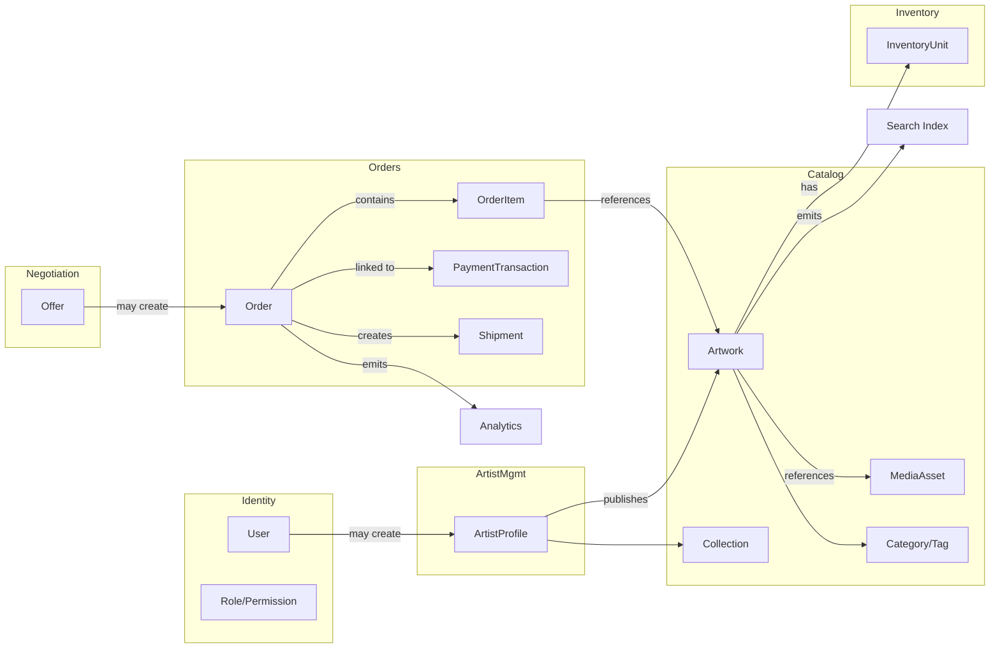

# 4.1 Domain Model

Document ID: FANNAN-DOMAIN-4.1
Version: 1.0
Status: Conceptual domain model (MVP-focused)

> Purpose: This document defines the conceptual domain model for FANNAN at the business level. It provides bounded contexts, core entities, aggregates, lifecycles, ownership, events, and an architectural context map. It is intentionally implementation-agnostic: no SQL, Prisma schema, or API contracts are defined here.

Table of Contents
- 1. Overview
- 2. Bounded Contexts
- 3. Core Domain Entities
- 4. Entity Responsibilities
- 5. Aggregates and Aggregate Roots
- 6. Entity Lifecycles (key state transitions)
- 7. Ownership Model
- 8. Domain Invariants
- 9. Domain Events
- 10. Context Map
- 11. MVP vs Future Domain
- 12. Mermaid Domain Diagram
- 13. Domain Decisions
- 14. Open Questions

---

1. Domain Overview

FANNAN is a premium marketplace connecting Palestinian artists with buyers (customers and collectors). The platform combines discovery, portfolio presentation, commerce (orders/payments/shipping), commissions/negotiation, media management, and role-based dashboards (artist, customer, admin). The domain model must support physical and digital artworks, unique and quantity-based inventory, negotiation/offers (MVP), and a provider-agnostic payment and shipping abstraction.

Design goals
- Business-first: model the real-world concepts (artist, artwork, order, commission) clearly and consistently.
- Extensible: maintain a clean separation between MVP and future capabilities.
- Consistency: share vocabulary with 03.0 Domain Glossary.
- Integrity: use aggregates to protect invariants and lifecycle transitions.

2. Bounded Contexts

The model is organized into bounded contexts that align with business responsibilities and deployment/ownership boundaries. MVP contexts are intentionally limited to avoid premature complexity.

MVP bounded contexts (recommended):
- Identity & Access
- Artist Management
- Catalog & Product
- Inventory
- Orders & Checkout
- Negotiation & Offers
- Payments
- Shipping
- Media
- Notifications
- Administration
- Search & Recommendation (product-facing discovery)
- Analytics (event collection / read-models)

Future / optional contexts (phase-based):
- Commissions (if later separated from negotiation)
- Auctions
- Live Events
- Courses & Workshops
- NFT Platform
- API Platform / Developer Accounts

Notes
- Do not create unnecessary separate contexts for small concerns. For MVP, some contexts are co-located conceptually (e.g., Catalog & Product may be housed in the same module as Inventory with clear separation of responsibilities).

3. Core Domain Entities

This section lists the core business entities that appear across contexts. Each entity here is a conceptual object representing a distinct business concept.

Primary domain entities (MVP):
- User (Account)
- ArtistProfile (Artist)
- Artwork (Product / Listing)
- MediaAsset
- InventoryUnit (SKU / logical inventory unit)
- Order
- OrderItem
- PaymentTransaction
- Shipment / ShipmentTracking
- Offer (Negotiation)
- Review (artist reviews; MVP scoped to artist-level reviews)
- Category
- Tag
- Collection
- Notification
- Session / AuthSession (conceptual)
- Role / Permission (authorization model)

Supporting / read-only or analytic entities:
- ActivityEvent (audit/activity log)
- CatalogIndexEntry (search/read model)
- DashboardMetric (aggregated KPIs)

Future entities (phase-based):
- CommissionRequest / CommissionProposal
- AuctionListing / Bid
- Subscription / Membership
- NFTAsset

4. Entity Responsibilities

For each core entity, the responsibilities are defined at a business level. This clarifies what the entity owns and what it must not own.

User (Account)
- Represents an identity used across the platform (may act as customer, artist, or both).
- Owns authentication credentials, basic profile information, preferences, and contact methods.
- Does NOT own marketplace product records (those are owned by ArtistProfile) unless the user publishes artwork.

ArtistProfile
- Represents an artist’s public-facing professional profile, biography, verification status, policy consents, payout details, and portfolio metadata.
- Owns relationships to Artwork, Collections, FeaturedArtwork, and Artist-specific analytics.
- Does NOT own PaymentTransaction lifecycle for orders created by buyers (payments are part of Orders & Payments context), though it is referenced for payouts.

Artwork (Product/Listing)
- Represents a publishable item that an artist can sell or showcase. Includes type (physical/digital), availability, visibility state, and metadata (dimensions, materials, story).
- Owns references to MediaAsset(s), InventoryUnit(s), base pricing, and listing visibility rules.
- Should NOT embed fulfillment or shipment details (those are part of Orders/Shipments).

InventoryUnit
- Represents the inventory model for a sellable SKU: quantity, reservations, and availability rules.
- Owns counts and stock-management concerns.
- Does NOT manage financial settlement or order state.

Order
- Represents a buyer’s commitment to purchase: order-level totals, status, customer references, shipping address, taxes (future), coupon references, and payment status.
- Owns a collection of OrderItem(s) and references to PaymentTransaction(s) and Shipment(s).
- Is an aggregate root for order consistency and lifecycle transitions.

OrderItem
- Represents a line in an order pointing to an Artwork and InventoryUnit snapshot (price, quantity, variance due to negotiated offers).
- Owns item-specific fulfillment instructions (e.g., custom notes, variant selections) but not global order invariants.

PaymentTransaction
- Represents a single payment attempt, including provider reference, status, and reconciliation metadata.
- Owns provider-specific transaction metadata and state for refunds.
- Does NOT own inventory locks or order state by itself; it triggers order state transitions.

Offer (Negotiation)
- Represents a buyer-initiated offer on a specific artwork when offers are enabled.
- Owns the negotiation lifecycle (status, rounds, agreed price when accepted) and privacy constraints (private minimum must never be exposed).
- May lead to an Order creation when accepted.

MediaAsset
- Stores metadata about images/videos (S3 reference, mime type, dimensions, thumbnails) and access controls.
- Owns content references and optimization metadata.
- Does NOT store binaries in the primary relational database.

Category / Tag / Collection
- Taxonomy and editorial groupings for discovery and navigation.
- Do NOT duplicate product data; only store references and membership.

Notification
- Abstract representation of messages to users (email/push/in-app). Owns template references, delivery state, and recipient metadata.

5. Aggregates and Aggregate Roots

The model uses aggregates to protect invariants and structure transactions. Aggregates should be sized to preserve performance and avoid excessive distributed transactions.

Recommended aggregates (MVP):
- User Aggregate: root = User
  - Includes account profile, contact methods, preferences, and roles; external references to ArtistProfile if applicable.
- Artist Aggregate: root = ArtistProfile
  - Includes public profile, verification state, portfolio metadata, and references to artworks (artwork list may be separate collection outside strict aggregate to avoid large aggregate growth).
- Artwork Aggregate: root = Artwork
  - Includes artwork metadata, visibility state, linked MediaAsset IDs, base price, and reference to InventoryUnits (inventory may be an internal component or a separate aggregate depending on scale).
- Inventory Aggregate: root = InventoryUnit
  - Manages stock counts and reservation logic; exposes availability checks.
- Order Aggregate: root = Order
  - Manages order state transitions, items, and interactions with PaymentTransaction and Shipment aggregates.
- Offer Aggregate: root = Offer
  - Encapsulates negotiation rounds and acceptance, leading to orchestration with Order creation.
- Payment Aggregate: root = PaymentTransaction
  - Tracks provider interactions and refund lifecycle.
- Shipment Aggregate: root = Shipment
  - Tracks fulfilment state, carrier references, tracking numbers, and delivery state.

Aggregate sizing notes
- Avoid embedding large collections inside aggregate roots when those collections grow unbounded (e.g., an artist’s entire catalogue). Instead, use references and bounded queries.
- Prefer eventual consistency for cross-aggregate denormalized read models (e.g., search index, dashboard counters) using domain events.

6. Entity Lifecycles (Key State Transitions)

This section highlights the lifecycle and states for major entities.

ArtistProfile
- States: Draft -> Submitted -> Pending Verification -> Approved | Rejected -> Active -> Suspended
- Transitions:
  - Draft -> Submitted (artist completes onboarding)
  - Submitted -> Pending Verification (system acknowledges admin review)
  - Pending Verification -> Approved/Rejected (admin decision)
  - Approved -> Active (artist can publish artworks)
  - Active -> Suspended (policy violation) and back to Active (after remediation)

Artwork
- States: Draft -> Published -> Hidden | Suspended | Archived
- Availability sub-states: Available | Reserved | Sold | Out of Stock
- Transitions:
  - Draft -> Published (artist publishes listing)
  - Published -> Hidden (artist hides listing without deleting)
  - Published -> Suspended (moderation)
  - Published -> Archived (deliberate archival)

InventoryUnit
- States: InStock -> Reserved -> Sold -> Restocked
- Transitions triggered by: order placement (reserve), order confirmation (decrement), cancellation/expiration (release), restock operations

Offer
- States: Pending -> Countered -> Accepted -> Rejected -> Withdrawn -> Expired
- Transitions controlled by buyer, artist, or system timeouts (expiration)

Order
- States: Created -> PaymentPending -> Paid -> Processing -> Shipped -> Delivered -> Completed | Cancelled | Refunded
- Payment states may be managed in tandem or as separate PaymentTransaction states; chosen design must ensure idempotency and reliable reconciliation.

PaymentTransaction
- States: Initiated -> Pending -> Succeeded -> Failed -> Refunded | PartiallyRefunded

Shipment
- States: Pending Fulfillment -> Picked -> InTransit -> OutForDelivery -> Delivered -> Returned

7. Ownership Model

Ownership clarifies which bounded context or aggregate is the authoritative source for a given concept.

Authority map (conceptual):
- Identity & Access: authoritative for User, Role, Session, and Auth policy
- Artist Management: authoritative for ArtistProfile, verification status, and artist settings
- Catalog & Product: authoritative for Artwork metadata and listing state
- Inventory: authoritative for InventoryUnit counts and availability reservations
- Orders & Checkout: authoritative for Order lifecycle and order-level invariants
- Payments: authoritative for PaymentTransaction and refund lifecycle
- Shipping: authoritative for Shipment tracking and carrier state
- Media: authoritative for MediaAsset metadata and references (binaries in object storage)
- Administration: authoritative for moderation state, verification requests, and platform settings
- Search & Recommendation: read model aggregations built from authoritative sources (not the source of truth for write operations)

Notes
- Single-writer principle: where possible, ensure one bounded context owns updates for a given concept; other contexts reference it read-only or via denormalized projections.

8. Domain Invariants

Critical business rules that must always hold true. These invariants guide transaction boundaries and integrity checks.

Examples (non-exhaustive):
- Order total must equal sum(OrderItem.price * qty) +/- discounts + shipping.
- InventoryUnit.available >= 0 at all times; reservations must not permit negative available stock.
- An Artwork marked as "unique" must have inventory quantity <= 1.
- A Verified Artist must have passed the verification process before publishing sellable listings.
- Accepted Offer must create or reference a single deterministic purchase opportunity (to avoid double-selling).
- Payment reconciliation: an order cannot move to Paid without at least one succeeded PaymentTransaction covering the order amount (subject to COD rules).
- Auditability: critical transitions (artist verification, order cancellation, refunds) must emit auditable events logged in ActivityEvent for administrative review.

9. Domain Events

Events are conceptual signals used to inform other bounded contexts and to build read-models.

Core domain events (MVP):
- UserRegistered
- ArtistVerificationRequested
- ArtistVerificationApproved / ArtistVerificationRejected
- ArtworkPublished / ArtworkUpdated / ArtworkSuspended
- InventoryReserved / InventoryReleased / InventoryDecremented
- OfferCreated / OfferCountered / OfferAccepted / OfferRejected
- OrderCreated / OrderConfirmed / OrderCancelled / OrderCompleted
- PaymentInitiated / PaymentSucceeded / PaymentFailed / PaymentRefunded
- ShipmentCreated / ShipmentUpdated / ShipmentDelivered
- ReviewSubmitted
- NotificationSent

Usage notes
- Events are authoritative for building denormalized read models (search index, dashboards) and asynchronous processes (notifications, analytics).
- Events must avoid leaking sensitive data (e.g., private minimums in negotiations).

10. Context Map

High-level relationships between bounded contexts and integration patterns.

- Identity & Access -> (synchronous auth) -> All contexts (authentication/authorization)
- Artist Management -> Catalog & Product (owns artist profile and authorizes listing changes)
- Catalog & Product -> Inventory (calls to check availability, may reserve stock)
- Orders & Checkout -> Inventory (reserve), Payments (charge), Shipping (create shipment)
- Negotiation & Offers -> Orders (offer acceptance triggers order creation)
- Payments -> Orders (payment results update order state) and Administration (financial reports)
- Media -> Catalog & Product, Artist Management (stores media metadata)
- Notifications -> All contexts (subscriptions and triggers)
- Search & Recommendation <- Event stream from Catalog, Orders, and Analytics
- Analytics <- Events from all contexts (read-models for dashboards)

Integration patterns
- Prefer synchronous calls for authentication/authorization and immediate availability checks when necessary for a good UX.
- Prefer asynchronous event-driven integration for eventual consistency concerns (search index updates, dashboard metrics, email notifications).
- Use idempotent operations and correlation IDs for cross-context workflows (e.g., order + payment + shipment).

11. MVP vs Future Domain

MVP scope (explicit)
- Identity & Access: full account model, email verification, basic session/auth
- Artist Management: profile, verification workflow, portfolio metadata
- Catalog & Product: artwork/listing creation, publish/unpublish, metadata
- Inventory: simple quantity management and reservation for orders
- Orders & Checkout: order creation, COD payment, order lifecycle, basic failure/recovery
- Negotiation & Offers: buyer offers with finite rounds and deterministic outcomes
- Payments: provider-agnostic abstraction but initial support for COD; design for future provider integration
- Shipping: carrier abstraction and shipment tracking hooks (integration later)
- Media: S3-based assets (metadata stored in DB), thumbnails
- Notifications: in-app and email triggers for key events
- Search & Recommendation: basic indexed search and autocomplete
- Analytics: event capture and essential dashboards

Future scope (deferred)
- Full online payment provider integrations, refunds, and settlement flows
- Commission domain modeled explicitly (rich proposals/workflow)
- Auctions, subscriptions, live events, AR preview, NFT support
- Advanced personalization and machine learning recommendations

Clear separation
- Model future domains conceptually but do not implement operational workflows in MVP; design for extensibility and avoid irreversible schema choices that prevent later expansion.

12. Mermaid Domain Diagram (high-level)

13. Domain Decisions

Document key architectural decisions and rationale for traceability.

D1 — Single Account Model
- Decision: Use a single User account which can assume Customer and Artist capabilities (no separate authentication identities).
- Rationale: Simplifies UX; a person can act as both buyer and seller without multiple accounts.
- Implication: ArtistProfile is an augmenting concept owned by Artist Management.

D2 — Inventory as a First-Class Concept
- Decision: Model InventoryUnit as a discrete concept to support unique and quantity-based products.
- Rationale: Prevents double-selling of unique items and supports reservations for in-progress orders.

D3 — Negotiation (Offers) in MVP
- Decision: Include Negotiation & Offers in MVP as a structured, finite-round process.
- Rationale: Core marketplace differentiation and artist/customer expectation.
- Constraint: Do not expose private minimums; accepted offers must create a clear purchase opportunity.

D4 — Payment Provider Agnosticism
- Decision: Build payment domain to be provider-agnostic; MVP supports COD but designs for third-party integrations later.
- Rationale: Reduces early operational lock-in and simplifies compliance concerns for launch.

D5 — Media Binaries in Object Storage
- Decision: Store binaries in S3 (or equivalent) and store metadata/URLs in the database.
- Rationale: Scalability and performance; relational DB should not carry binary payloads.

D6 — Event-Driven Read Models
- Decision: Use domain events to populate search indices and analytic read models asynchronously.
- Rationale: Keeps write models small and authoritative while enabling responsive read surfaces.

14. Open Questions

15. Internationalization & Localization Addendum

Localization is a cross-cutting platform capability, not a separate marketplace bounded context or MVP microservice. It spans Identity & Access, Catalog, Notifications, Search, API, and web/mobile presentation.

### Localization data classes

- **System/UI translations:** stable namespaced keys owned by FANNAN and resolved at runtime.
- **User-generated marketplace content:** artwork titles, descriptions, artist biographies, collection names, category labels, and tag labels, stored separately from UI resources.
- **Domain data:** IDs, prices, quantities, currencies, statuses, timestamps, payment states, and workflow values remain language-neutral.

### Locale resolution and fallback

The effective locale is resolved in this order:

1. Explicit supported locale supplied by the request.
2. Authenticated user's `preferred_locale`.
3. Browser/device locale for guests.
4. FANNAN default locale `en`.

The system supports `ar` (RTL) and `en` (LTR) for MVP and must be extensible for future locales. Missing translations fall back to English, emit an observable missing-translation metric, and never change business behavior.

### Localization ownership

The shared application localization module owns locale resolution, translation-resource lookup, formatting policy, template selection, and cache versioning. It does not own Artwork, Order, Payment, or other marketplace aggregates.

### Localization events

Add conceptual events for `TranslationResourcePublished`, `MessageTemplatePublished`, `LocalizedContentUpdated`, and `LocalizedContentRemoved`. Existing notification and search events should carry locale/content-version metadata where consumers render text or rebuild localized read models.

### Domain invariants

- Business logic uses stable translation keys and structured parameters, never hard-coded user-facing prose.
- A user may have at most one preferred locale.
- Each translated source entity has at most one active translation per locale.
- Historical notification, email, and push content retains the locale and template version used.
- No artwork or profile is required to have both Arabic and English content; missing content follows the fallback policy.

List unresolved decisions intended for further stakeholder input.

Q1 — Payment Provider Roadmap
- Which provider(s) are targeted for online payments post-launch? PCI and regional compliance considerations may influence timeline.

Q2 — Tax Handling
- Will taxes be in-scope for launch or treated as a future capability (the product docs note Taxes as Future)? Clarify region-specific VAT/GST rules as needed.

Q3 — Returns & Refund Policy
- Define business policy for returns, exchanges, and refunds for physical and digital goods (time windows, restocking, refund eligibility).

Q4 — Negotiation Depth
- Maximum number of negotiation rounds and acceptable expiration policies for offers (timeouts).

Q5 — Search/Indexing SLA
- What are acceptable latency and freshness requirements for search indexes (near-real-time vs batch)?

Q6 — Data Retention & Audit
- Retention policy for activity logs, financial transactions, and media references.

Q7 — Multi-currency & Internationalization
- Will the initial MVP support multi-currency pricing, or is currency conversion a future enhancement?

---

Appendix: How to use this document
- This conceptual domain model is the authoritative basis for subsequent 4.2 (logical schema), 4.3 (physical/data modeling), and API design work.
- Avoid translating this document verbatim to SQL or Prisma; treat it as the source of truth for domain boundaries and invariants.

Change history
- 1.0 — Initial draft (2026-08-29)
