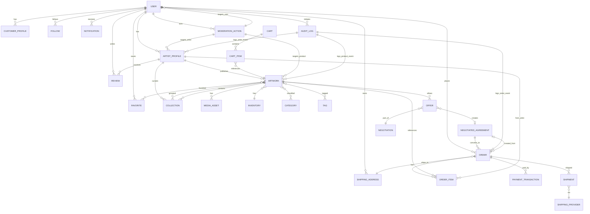

# 4.3 Entity Relationships

**Document ID:** FANNAN-DATABASE-4.3  
**Version:** 1.0  
**Status:** Entity relationship design for MVP database schema  
**Source:** 4.1 Domain Model, 4.2 Entity Definitions, 02_PRODUCT_REQUIREMENTS

> **Purpose:** This document specifies every important entity relationship in the FANNAN domain model. For each relationship, it documents cardinality, optionality, ownership, cascade behavior, and business meaning. It also includes relationship matrices, ER diagrams, and critical integrity constraints to guide Prisma schema and PostgreSQL DDL.

---

## Table of Contents

1. [Notation & Legend](#notation--legend)
2. [Core Relationships by Entity](#core-relationships-by-entity)
3. [Relationship Matrix](#relationship-matrix)
4. [Cardinality Rules](#cardinality-rules)
5. [Ownership & Authority Rules](#ownership--authority-rules)
6. [Cascade Behavior Recommendations](#cascade-behavior-recommendations)
7. [Mermaid Entity-Relationship Diagram](#mermaid-entity-relationship-diagram)
8. [Referential Integrity & Constraints](#referential-integrity--constraints)
9. [Dangerous Relationships & Anti-Patterns](#dangerous-relationships--anti-patterns)
10. [Circular Dependencies & Mitigation](#circular-dependencies--mitigation)
11. [Foreign Key Reference Guide](#foreign-key-reference-guide)

---

## Notation & Legend

### Relationship Cardinality
- **1:1** — One-to-one (each record in Entity A relates to exactly one record in Entity B, and vice versa)
- **1:N** — One-to-many (one record in Entity A relates to zero or more records in Entity B; each record in Entity B relates to exactly one in Entity A)
- **N:M** — Many-to-many (records in Entity A may relate to multiple records in Entity B, and vice versa)

### Optionality
- **Required (Mandatory)** — Relationship must exist; foreign key is NOT NULL
- **Optional** — Relationship may or may not exist; foreign key IS NULL or join may not exist

### Ownership & Direction
- **Owned by A** — Entity A is the aggregate root or authoritative context; Entity B is subordinate
- **FK direction** — The logical direction of the foreign key (which table stores the reference)

### Cascade Behavior
- **CASCADE** — Delete/update in parent cascades to child
- **SET NULL** — Delete in parent sets child FK to NULL (requires optional relationship)
- **RESTRICT** — Delete/update in parent is forbidden if child exists
- **NO ACTION** — Default SQL behavior; delete/update raises error if constraint violated

---

## Core Relationships by Entity

### Localization Relationship Rules

Localization relationships are subordinate to their source entities and do not create new marketplace aggregates.

| Relationship | Cardinality | Optionality | Ownership | Integrity rule |
|---|---:|---|---|---|
| User -> preferred locale | 1:0..1 scalar | Optional | User | Canonical supported locale only |
| Artwork -> ArtworkTranslation | 1:N | Optional | Artwork | Unique active translation per artwork/locale |
| ArtistProfile -> ArtistProfileTranslation | 1:N | Optional | ArtistProfile | Unique active translation per profile/locale |
| Category -> CategoryTranslation | 1:N | Optional | Category | Unique active translation per category/locale |
| Tag -> TagTranslation | 1:N | Optional | Tag | Unique active translation per tag/locale |
| Translation key -> TranslationResource | 1:N | Required for localized key | Localization module | Unique active value per key/locale |
| Template key/channel -> MessageTemplate | 1:N | Required for localized channel | Notification module | Unique active version per key/channel/locale |

Translation rows are created, published, superseded, and deleted under the source lifecycle. Deleting a source must not leave orphaned translations. Missing Arabic or English content is allowed and follows the documented fallback policy.

### Notification Localization Relationship

Notification records reference a stable template key and structured parameters. When rendered, the notification records the resolved locale, fallback locale if used, template version, and immutable rendered title/body where historical display or audit requires it. Clients must not invent notification business wording.

### 1. USER ↔ ARTIST PROFILE

| Property | Value |
|----------|-------|
| **Entity A** | User |
| **Entity B** | ArtistProfile |
| **Cardinality** | 1:N (one user may have one artist profile; one profile belongs to one user) |
| **Actual Cardinality** | 1:1 (in practice, MVP allows one artist profile per user) |
| **Optionality** | Optional (user may not be an artist) |
| **Ownership** | User aggregate; ArtistProfile is child of User |
| **FK Direction** | `artist_profile.user_id` → `user.id` |
| **Cascade** | DELETE user → SET NULL or soft-delete artist_profile (preserve seller reputation) |
| **Business Meaning** | Artist capabilities are optional for a user; when present, user can publish and sell artworks |
| **Constraints** | unique(user_id) at artist_profile (one profile per user); user must exist before creating profile |
| **Related Rules** | Enabling artist role requires passing verification process; ArtistProfile.verification_status must transition through Pending/Approved states |

---

### 2. USER ↔ CUSTOMER CAPABILITY / PROFILE

| Property | Value |
|----------|-------|
| **Entity A** | User |
| **Entity B** | CustomerCapability / CustomerProfile |
| **Cardinality** | 1:1 (one user may have one customer profile) |
| **Optionality** | Optional (user may not make purchases) |
| **Ownership** | User aggregate; customer profile is child |
| **FK Direction** | `customer_profile.user_id` → `user.id` |
| **Cascade** | DELETE user → SET NULL or archive customer_profile (preserve purchase history for orders) |
| **Business Meaning** | Customer role is implicit for all users; customer profile tracks preferences, addresses, and purchase metadata |
| **Constraints** | unique(user_id) at customer_profile |
| **Related Rules** | Customer profile is often lazily created on first purchase; no explicit approval needed |

---

### 3. USER ↔ ORDER (as Buyer)

| Property | Value |
|----------|-------|
| **Entity A** | User |
| **Entity B** | Order |
| **Cardinality** | 1:N (one user may create many orders) |
| **Optionality** | Optional (user may not have purchased anything) |
| **Ownership** | User owns orders (in the sense of buyer accountability); marketplace owns order lifecycle |
| **FK Direction** | `order.buyer_id` → `user.id` (or `user_id` for customer) |
| **Cascade** | DELETE user → RESTRICT (orders may not be deleted; use soft-delete user) |
| **Business Meaning** | Each order belongs to a buyer (user acting in customer role); preserves purchase history |
| **Constraints** | `NOT NULL` (order must have a buyer); FK must reference active/valid user |
| **Related Rules** | User must be verified (email confirmed) before creating an order; order creation triggers payment and shipment workflows |

---

### 4. USER ↔ FOLLOWS RELATIONSHIP

| Property | Value |
|----------|-------|
| **Entity A** | User (Follower) |
| **Entity B** | ArtistProfile or User (Followed) |
| **Cardinality** | N:M (user can follow multiple artists; artist can be followed by multiple users) |
| **Optionality** | Optional |
| **Ownership** | Follower user owns the relationship; followed artist is referenced |
| **FK Direction** | `follow.follower_id` → `user.id`, `follow.followed_artist_id` → `user.id` (or direct to artist_profile.id) |
| **Cascade** | DELETE follower → CASCADE delete follow; DELETE followed artist → CASCADE delete follow |
| **Business Meaning** | Users can follow artists to receive notifications and see their new work |
| **Constraints** | unique(follower_id, followed_artist_id) (prevent duplicate follows); follower_id ≠ followed_artist_id (cannot follow oneself) |
| **Related Rules** | Following is idempotent (second follow attempt on same artist does nothing) |

---

### 5. ARTIST PROFILE ↔ ARTWORK

| Property | Value |
|----------|-------|
| **Entity A** | ArtistProfile (or User) |
| **Entity B** | Artwork / Product |
| **Cardinality** | 1:N (one artist publishes many artworks) |
| **Optionality** | Optional (artist may have no published artworks) |
| **Ownership** | Artist owns artworks; Artwork aggregate root is Artwork |
| **FK Direction** | `artwork.artist_id` → `user.id` (or artist_profile.id) |
| **Cascade** | DELETE artist → SET NULL or soft-delete artworks (preserve order history); RESTRICT if artworks have active orders |
| **Business Meaning** | Artist creates and publishes artworks (products) for sale; artworks define artist's portfolio |
| **Constraints** | `NOT NULL`; artist must exist before publishing artwork; artist must have verification_status = approved |
| **Related Rules** | Artist can hide, suspend, or archive artwork without deleting; archival preserves historical references in orders |
| **Lifecycle** | Artwork states: draft → published → available | hidden | suspended | archived |

---

### 6. ARTWORK ↔ MEDIA ASSET

| Property | Value |
|----------|-------|
| **Entity A** | Artwork |
| **Entity B** | MediaAsset |
| **Cardinality** | 1:N (one artwork has many media; primary image, gallery, downloads) |
| **Optionality** | Optional (artwork may have no media, though UX requires at least one image for published) |
| **Ownership** | Artwork owns media; media is not shareable across artworks in MVP |
| **FK Direction** | `media_asset.artwork_id` → `artwork.id` |
| **Cascade** | DELETE artwork → CASCADE delete media; UPDATE artwork archived → mark media archived |
| **Business Meaning** | Media stores S3 references, metadata (dimensions, alt text), and presentation order |
| **Constraints** | `NOT NULL` (media must reference a parent artwork); mime type validation at application layer |
| **Related Rules** | Media binaries stored in S3; metadata and URLs stored in database; signed URLs for access control |
| **Indexing** | Include order_index for gallery display ordering; consider composite index (artwork_id, order_index) |

---

### 7. ARTWORK ↔ CATEGORY

| Property | Value |
|----------|-------|
| **Entity A** | Artwork |
| **Entity B** | Category |
| **Cardinality** | N:M (artwork belongs to multiple categories; category contains many artworks) |
| **Optionality** | Optional (artwork may have no category) |
| **Ownership** | Artwork references category; category is admin-managed taxonomy |
| **FK Direction** | `product_category.product_id` → `artwork.id`, `product_category.category_id` → `category.id` |
| **Cascade** | DELETE artwork → CASCADE delete product_category join; DELETE category → CASCADE delete joins (or SET NULL depending on category edit policy) |
| **Business Meaning** | Categories enable navigation, filtering, and discovery (e.g., "Paintings", "Sculptures", "Digital Art") |
| **Constraints** | Composite PK on (product_id, category_id); parent category reference (hierarchy) |
| **Related Rules** | Category hierarchy depth should be limited (2-3 levels recommended) to prevent query complexity |

---

### 8. ARTWORK ↔ TAG

| Property | Value |
|----------|-------|
| **Entity A** | Artwork |
| **Entity B** | Tag |
| **Cardinality** | N:M (artwork can have many tags; tag can be on many artworks) |
| **Optionality** | Optional |
| **Ownership** | Artwork references tag; tags are a flexible system-wide taxonomy |
| **FK Direction** | `product_tag.product_id` → `artwork.id`, `product_tag.tag_id` → `tag.id` |
| **Cascade** | DELETE artwork → CASCADE delete product_tag join; DELETE tag → CASCADE delete joins (or archive if tag is popular) |
| **Business Meaning** | Tags provide flexible labeling for discovery and search filtering |
| **Constraints** | Composite PK on (product_id, tag_id); tag names should be normalized (lowercase, unique slug) |
| **Related Rules** | Prefer controlled vocabulary (curated tags) over free-text user tags in MVP to avoid spam/duplication |

---

### 9. ARTWORK ↔ COLLECTION

| Property | Value |
|----------|-------|
| **Entity A** | Collection |
| **Entity B** | Artwork |
| **Cardinality** | N:M (collection contains many artworks; artwork can be in multiple collections) |
| **Optionality** | Optional |
| **Ownership** | Collection aggregates artworks; owned by artist (private) or admin (public) |
| **FK Direction** | `collection_item.collection_id` → `collection.id`, `collection_item.product_id` → `artwork.id` |
| **Cascade** | DELETE collection → CASCADE delete collection_item joins; DELETE artwork → CASCADE delete from collection |
| **Business Meaning** | Collections are curated groupings (e.g., artist series, "Landscapes", " 2024 New Work") for portfolio presentation |
| **Constraints** | Composite PK on (collection_id, product_id); order_index for display sequence |
| **Related Rules** | Collection visibility: private (artist only) or public (published); collections in MVP are artist-curated, not algorithmically generated |

---

### 10. ARTWORK ↔ INVENTORY

| Property | Value |
|----------|-------|
| **Entity A** | Artwork |
| **Entity B** | InventoryUnit |
| **Cardinality** | 1:1 (each artwork has one inventory record; MVP does not support multiple SKUs per artwork) |
| **Optionality** | Required (every artwork must have inventory, even if quantity=1 for unique) |
| **Ownership** | Artwork owns inventory; they share the same aggregate |
| **FK Direction** | `inventory.product_id` → `artwork.id` (can be same table or joined in Prisma) |
| **Cascade** | DELETE artwork → CASCADE delete inventory; inventory lifespan = artwork lifespan |
| **Business Meaning** | Inventory tracks available/reserved quantity; prevents overselling unique items and manages stock for reproducible products |
| **Constraints** | unique(product_id); NOT NULL quantity; quantity >= 0; if artwork.supply_type = unique then quantity = 1 |
| **Related Rules** | Reserved quantity = pending offers + in-checkout items + negotiated holds; available = total - reserved; must never go negative |

---

### 11. ARTWORK ↔ OFFER

| Property | Value |
|----------|-------|
| **Entity A** | Artwork |
| **Entity B** | Offer |
| **Cardinality** | 1:N (artwork may receive many offers; each offer is for one artwork) |
| **Optionality** | Optional (artwork may have no offers) |
| **Ownership** | Artwork defines if offers are enabled (allow_offers flag); Offer is subordinate |
| **FK Direction** | `offer.product_id` → `artwork.id` |
| **Cascade** | DELETE artwork → CASCADE soft-delete offers (preserve negotiation history); UPDATE artwork allow_offers=false → prevent new offers, archive pending |
| **Business Meaning** | Artist controls whether customers can make offers on their artwork; offer lifecycle tied to artwork availability |
| **Constraints** | `NOT NULL` (offer must reference artwork); offer cannot be created if artwork.allow_offers = false |
| **Related Rules** | Accepted offer triggers inventory reservation; expired/rejected offers release reservations; one negotiation session per (user, artwork) pair |

---

### 12. ARTWORK ↔ ARTWORK REVIEW / ARTIST REVIEW

| Property | Value |
|----------|-------|
| **Entity A** | Artwork (indirectly) |
| **Entity B** | Review (actually references Artist) |
| **Cardinality** | 1:N (artwork can be subject of multiple reviews, though reviews target artist not artwork in MVP) |
| **Optionality** | Optional |
| **Ownership** | Artist receives reviews; artwork contextualizes the review |
| **FK Direction** | `review.artist_id` → `user.id` (or artist_profile.id); `review.order_id` → `order.id` (for eligibility context) |
| **Cascade** | DELETE order → SET NULL review.order_id (review remains for reputation); DELETE artist → soft-delete reviews (preserve reputation history) |
| **Business Meaning** | Customers review artists (not individual artworks in MVP) after eligible completed purchases |
| **Constraints** | NOT NULL artist_id; review requires completed order_id for eligibility; unique(artist_id, order_id) prevents duplicate reviews |
| **Related Rules** | Review window: allowed only after order.status = completed, within (e.g.) 90 days; one review per order |

---

### 13. ARTWORK ↔ WISHLIST / FAVORITE

| Property | Value |
|----------|-------|
| **Entity A** | Artwork |
| **Entity B** | Favorite (Wishlist) |
| **Cardinality** | N:M (artwork can be favorited by many users; user can favorite many artworks) |
| **Optionality** | Optional |
| **Ownership** | User owns favorites; artwork is referenced |
| **FK Direction** | `favorite.user_id` → `user.id`, `favorite.product_id` → `artwork.id` |
| **Cascade** | DELETE user → CASCADE delete favorites; DELETE artwork → CASCADE delete favorites (or soft-delete) |
| **Business Meaning** | Users save favorite artworks for later browsing and intent to purchase |
| **Constraints** | Composite PK on (user_id, product_id); unique constraint prevents duplicate favorites; idempotent add |
| **Related Rules** | Favorite is read-only (no update); counts towards engagement metrics |

---

### 14. CART ↔ CART ITEM

| Property | Value |
|----------|-------|
| **Entity A** | Cart |
| **Entity B** | CartItem |
| **Cardinality** | 1:N (cart has many items) |
| **Optionality** | Optional (cart may be empty) |
| **Ownership** | Cart is the aggregate root; CartItem is subordinate |
| **FK Direction** | `cart_item.cart_id` → `cart.id` |
| **Cascade** | DELETE cart → CASCADE delete cart_items |
| **Business Meaning** | Ephemeral shopping session; items snapshot price and quantity at add time |
| **Constraints** | NOT NULL; cart_item.product_id must exist; quantity > 0 |
| **Related Rules** | Cart expiration: guest carts expire after (e.g.) 24 hours; user carts persistent until checkout or explicit clear; item unit_price_snapshot captured at add time (used if checkout delayed) |
| **Lifecycle** | Cart created on first item add; transitioned to Order on checkout |

---

### 15. CART ITEM ↔ ARTWORK

| Property | Value |
|----------|-------|
| **Entity A** | CartItem |
| **Entity B** | Artwork |
| **Cardinality** | N:1 (each cart item references one artwork; artwork can be in many carts) |
| **Optionality** | Required |
| **Ownership** | CartItem references artwork; no deep ownership link |
| **FK Direction** | `cart_item.product_id` → `artwork.id` |
| **Cascade** | DELETE artwork → SET NULL or soft-delete cart_item (artwork removed from all carts); UPDATE artwork → may affect cart_item validity |
| **Business Meaning** | Cart item binds user intent to a specific artwork and quantity |
| **Constraints** | NOT NULL; if artwork is archived/hidden/suspended, cart UI should prompt user to remove or skip |
| **Related Rules** | No automatic inventory reservation on cart add; reservation only on checkout or explicit hold request |

---

### 16. ORDER ↔ ORDER ITEM

| Property | Value |
|----------|-------|
| **Entity A** | Order |
| **Entity B** | OrderItem |
| **Cardinality** | 1:N (order contains one or more items; each item belongs to one order) |
| **Optionality** | Required (order must have at least one item) |
| **Ownership** | Order is aggregate root; OrderItem is subordinate |
| **FK Direction** | `order_item.order_id` → `order.id` |
| **Cascade** | DELETE order → CASCADE delete order_items (order and items are atomic lifecycle) |
| **Business Meaning** | Order items represent line items in the purchase; each may be from different artist (multi-vendor order) |
| **Constraints** | NOT NULL; order must have >= 1 item at creation and completion; sum(order_item.total_price) = order.total_amount (before tax/shipping) |
| **Related Rules** | OrderItem price is snapshot at order time (not linked to artwork current price); negotiated_offer_id may reference agreed price |

---

### 17. ORDER ITEM ↔ ARTWORK

| Property | Value |
|----------|-------|
| **Entity A** | OrderItem |
| **Entity B** | Artwork |
| **Cardinality** | N:1 (each order item references one artwork; artwork can be on many orders) |
| **Optionality** | Required |
| **Ownership** | OrderItem references artwork; no deep ownership |
| **FK Direction** | `order_item.product_id` → `artwork.id` |
| **Cascade** | DELETE artwork → RESTRICT or soft-delete with historical reference preservation; artwork must be findable for order history |
| **Business Meaning** | OrderItem binds a purchase transaction to a specific artwork snapshot (title, artist, price at order time) |
| **Constraints** | NOT NULL; order_item stores denormalized artwork snapshot (title, image, artist name) to preserve history even if artwork is later modified/deleted |
| **Related Rules** | order_item.artist_id should be copied from artwork.artist_id at order time to attribute seller; if seller (artist) is later deleted, order history remains intact |

---

### 18. ORDER ↔ PAYMENT (Payment Transaction)

| Property | Value |
|----------|-------|
| **Entity A** | Order |
| **Entity B** | PaymentTransaction |
| **Cardinality** | 1:N (order may have multiple payment attempts; each payment is for one order) |
| **Optionality** | Optional (order created but payment may not be initiated for COD orders until fulfillment) |
| **Ownership** | Order owns payment intent; Payment is subordinate lifecycle |
| **FK Direction** | `payment.order_id` → `order.id` |
| **Cascade** | DELETE order → cascade soft-delete payments (preserve transaction history for audit); don't hard-delete |
| **Business Meaning** | Order-to-payment link enables tracking payment attempts, refunds, and reconciliation |
| **Constraints** | NOT NULL order_id; payment.amount <= order.total_amount (for partial payments or overpayment handling) |
| **Related Rules** | Order moves to "Paid" status only when sum(successful payments) >= order.total_amount; idempotent payment retries use same payment.provider_reference when possible |

---

### 19. ORDER ↔ SHIPMENT

| Property | Value |
|----------|-------|
| **Entity A** | Order |
| **Entity B** | Shipment |
| **Cardinality** | 1:N (order may be split into multiple shipments; each shipment belongs to one order) |
| **Optionality** | Optional (digital-only orders may not have shipment) |
| **Ownership** | Order coordinates fulfillment; Shipment is subordinate |
| **FK Direction** | `shipment.order_id` → `order.id` |
| **Cascade** | DELETE order → cascade soft-delete shipments (preserve tracking and delivery history) |
| **Business Meaning** | Shipments track physical product delivery via external carrier; order lifecycle tied to shipment status |
| **Constraints** | Applies only if order has physical items (order.shipping_required = true); digital items bypass shipment |
| **Related Rules** | Order moves to "Shipped" when shipment.status changes; "Delivered" when all shipments delivered; shipment cost included in order.total_amount |

---

### 20. ORDER ITEM ↔ INVENTORY (Reservation)

| Property | Value |
|----------|-------|
| **Entity A** | OrderItem |
| **Entity B** | InventoryUnit |
| **Cardinality** | N:1 (order items reserve from inventory) |
| **Optionality** | Implicit (not direct FK; relationship managed through inventory.reserved_quantity and order.status) |
| **Ownership** | OrderItem causes inventory reservation when order status changes |
| **FK Direction** | Indirect: inventory references are via artwork; inventory.reserved_quantity incremented when order created |
| **Cascade** | N/A (not direct FK) |
| **Business Meaning** | When order is placed, inventory.reserved_quantity is incremented; when order completes, inventory.quantity_available is decremented |
| **Constraints** | Invariant: order cannot complete if inventory.quantity_available (after reservation) < 0; unique products: only one unit can be sold per artwork |
| **Related Rules** | Inventory must be reserved before payment to prevent double-selling; if payment fails or order cancelled, reservations released |
| **Transaction Requirement** | Artwork update + inventory update + order creation must be atomic to prevent race conditions |

---

### 21. OFFER ↔ NEGOTIATION (Conceptual Grouping)

| Property | Value |
|----------|-------|
| **Entity A** | Offer |
| **Entity B** | Negotiation (session/round grouping) |
| **Cardinality** | 1:N (negotiation session contains one or more offers; offer belongs to one negotiation) |
| **Optionality** | Optional (offer may stand alone or be part of negotiation session) |
| **Ownership** | Negotiation is parent (aggregate root for negotiation lifecycle); Offer is subordinate |
| **FK Direction** | `offer.negotiation_id` → `negotiation.id` |
| **Cascade** | DELETE negotiation → cascade delete or archive offers (preserve history) |
| **Business Meaning** | Negotiation session encapsulates all rounds of back-and-forth between buyer and artist for one artwork |
| **Constraints** | NOT NULL negotiation_id (structure offers into rounds); negotiation session finite (max rounds enforced at application layer) |
| **Related Rules** | Each offer in sequence is a round; counter-offers create new offers with incrementing round number; negotiation expires after deadline or accepted offer |

---

### 22. OFFER ↔ NEGOTIATED AGREEMENT

| Property | Value |
|----------|-------|
| **Entity A** | Offer |
| **Entity B** | NegotiatedAgreement |
| **Cardinality** | 1:1 (accepted offer creates negotiated agreement; agreement refers back to offer) |
| **Optionality** | Optional (offer may not be accepted) |
| **Ownership** | Offer accepted by artist triggers creation of NegotiatedAgreement |
| **FK Direction** | `negotiated_agreement.offer_id` → `offer.id` (or negotiation_id as parent context) |
| **Cascade** | DELETE offer (or negotiation) → cascade soft-delete agreement (preserve accepted terms) |
| **Business Meaning** | NegotiatedAgreement is the binding outcome of negotiation; captures agreed price, quantity, and expiration |
| **Constraints** | NOT NULL when offer.status = accepted; agreement must be converted to Order within expiration window |
| **Related Rules** | Agreement holds inventory reservation while awaiting customer checkout; expires if not converted to Order within (e.g.) 24 hours |

---

### 23. NEGOTIATED AGREEMENT ↔ ORDER

| Property | Value |
|----------|-------|
| **Entity A** | NegotiatedAgreement |
| **Entity B** | Order |
| **Cardinality** | 1:1 (accepted agreement converted to one order) |
| **Optionality** | Optional (agreement may expire without conversion to order) |
| **Ownership** | Agreement is pre-purchase agreement; Order is final transaction |
| **FK Direction** | `order.negotiated_agreement_id` → `negotiated_agreement.id` (or `offer_id` for direct link) |
| **Cascade** | DELETE agreement → SET NULL order.negotiated_agreement_id (order history preserved); order.negotiated_agreement_id immutable after creation |
| **Business Meaning** | Negotiated order captures agreed price and terms; order.unit_price overrides artwork.base_price |
| **Constraints** | Unique negotiated_agreement_id (each agreement converted to max one order); order.unit_price = agreement.agreed_price |
| **Related Rules** | Order checkout initiates from agreement (pre-filled price/quantity); customer must confirm before final order creation |

---

### 24. ORDER ↔ SHIPPING ADDRESS

| Property | Value |
|----------|-------|
| **Entity A** | Order |
| **Entity B** | ShippingAddress |
| **Cardinality** | N:1 (each order specifies one shipping address; one address can be on many orders) |
| **Optionality** | Required if order.shipping_required = true; NULL for digital-only orders |
| **Ownership** | Order references address; address ownership is User (customer) |
| **FK Direction** | `order.shipping_address_id` → `shipping_address.id` |
| **Cascade** | DELETE address → SET NULL order.shipping_address_id (order keeps denormalized address snapshot instead); UPDATE address → does not cascade |
| **Business Meaning** | Shipping address specifies physical delivery location; copied from user profile at order time or entered at checkout |
| **Constraints** | Validated address format; if NULL, then shipping_required = false |
| **Related Rules** | Order should store denormalized address snapshot (recipient_name, line1, line2, city, postal_code, country) to preserve address at order time even if customer later changes it |

---

### 25. SHIPMENT ↔ SHIPPING PROVIDER

| Property | Value |
|----------|-------|
| **Entity A** | Shipment |
| **Entity B** | ShippingProvider |
| **Cardinality** | N:1 (many shipments via same provider; one provider has many shipments) |
| **Optionality** | Required (shipment must specify carrier) |
| **Ownership** | Shipment references provider; provider is a platform abstraction (not owned by order/user) |
| **FK Direction** | `shipment.shipping_provider_id` → `shipping_provider.id` |
| **Cascade** | DELETE provider → RESTRICT or SET NULL (provider may not be deleted if active shipments exist) |
| **Business Meaning** | Provider abstraction enables switching carriers and supporting multiple providers without schema migration |
| **Constraints** | NOT NULL; provider must exist and be enabled in platform |
| **Related Rules** | Shipment stores provider_reference (external tracking ID) for reconciliation; config_reference in provider table points to secure vault for API keys |

---

### 26. USER ↔ SHIPPING ADDRESS

| Property | Value |
|----------|-------|
| **Entity A** | User |
| **Entity B** | ShippingAddress |
| **Cardinality** | 1:N (user may have multiple addresses; address belongs to one user) |
| **Optionality** | Optional (user may not have saved addresses) |
| **Ownership** | User owns addresses; address lifecycle tied to user |
| **FK Direction** | `shipping_address.user_id` → `user.id` |
| **Cascade** | DELETE user → cascade delete or archive addresses (handle based on order history) |
| **Business Meaning** | User maintains address book for shipping; order checkout can select from saved addresses or enter new |
| **Constraints** | NOT NULL user_id; customer can mark one as default (default_shipping_address in customer_profile) |
| **Related Rules** | Address used in order should be denormalized into order record to preserve historical accuracy |

---

### 27. USER ↔ REVIEW (as Reviewer)

| Property | Value |
|----------|-------|
| **Entity A** | User |
| **Entity B** | Review |
| **Cardinality** | 1:N (user can write many reviews; review has one reviewer) |
| **Optionality** | Optional (user may not write reviews) |
| **Ownership** | User (reviewer) writes review; review references reviewer |
| **FK Direction** | `review.reviewer_id` → `user.id` |
| **Cascade** | DELETE user → cascade soft-delete reviews (preserve review history with tombstone) or SET NULL reviewer_id; question: can anonymous reviews be shown? |
| **Business Meaning** | User provides feedback on artist; builds artist reputation |
| **Constraints** | NOT NULL reviewer_id; reviewer_id ≠ artist_id (cannot review self); unique(reviewer_id, artist_id, order_id) prevents duplicate |
| **Related Rules** | Review eligibility: reviewer must have completed order from reviewed artist; review window: typically 90 days post-order completion |

---

### 28. USER ↔ NOTIFICATION

| Property | Value |
|----------|-------|
| **Entity A** | User |
| **Entity B** | Notification |
| **Cardinality** | 1:N (user receives many notifications) |
| **Optionality** | Optional |
| **Ownership** | User owns notification inbox; notification lifecycle |
| **FK Direction** | `notification.user_id` → `user.id` |
| **Cascade** | DELETE user → cascade delete notifications (transient records) |
| **Business Meaning** | Notifications alert users to order updates, messages, follow notifications, etc. |
| **Constraints** | NOT NULL user_id |
| **Related Rules** | Notifications expire per retention policy (e.g., 90 days); archivable by user; do not store sensitive PII in payload |

---

### 29. ARTIST PROFILE ↔ VERIFICATION (Admin Action)

| Property | Value |
|----------|-------|
| **Entity A** | ArtistProfile |
| **Entity B** | VerificationRequest / VerificationDecision (implicit admin action) |
| **Cardinality** | 1:N (artist has one active verification; historical requests tracked in AuditLog) |
| **Optionality** | Optional (user may not apply) |
| **Ownership** | ArtistProfile tracks verification_status; admin owns decision |
| **FK Direction** | Implicit: verification_status stored on artist_profile; audit trail in audit_log table |
| **Cascade** | N/A (verification is state transition, not deletable) |
| **Business Meaning** | Artist verification gates ability to sell; admin reviews and approves/rejects |
| **Constraints** | verification_status in (not_applied, pending, approved, rejected, suspended); transitions audited |
| **Related Rules** | State machine: not_applied → pending (on application) → approved/rejected (admin decision) → suspended (policy violation); artist can only publish when status = approved |

---

### 30. ADMIN ↔ MODERATION ACTION

| Property | Value |
|----------|-------|
| **Entity A** | User (with admin role) |
| **Entity B** | ModerationAction |
| **Cardinality** | 1:N (admin can take many moderation actions) |
| **Optionality** | Optional (admin may not moderate) |
| **Ownership** | Admin performs moderation; action attributed to admin |
| **FK Direction** | `moderation_action.actor_admin_id` → `user.id` |
| **Cascade** | DELETE admin → RESTRICT or keep action with orphaned actor (preserve audit trail) |
| **Business Meaning** | Admin removes content, suspends accounts, or investigates reports |
| **Constraints** | NOT NULL actor_admin_id; target_type, target_id, action_type audited |
| **Related Rules** | Moderation cascades: suspend artwork → remove from search; suspend artist → hide all artworks; action logged in audit_log |

---

### 31. ADMIN ↔ AUDIT LOG

| Property | Value |
|----------|-------|
| **Entity A** | User (or System) |
| **Entity B** | AuditLog |
| **Cardinality** | 1:N (actor can have many audit entries) |
| **Optionality** | Optional (some events may not have user actor; system events have system actor) |
| **Ownership** | Audit log is system-owned; actor is attributed |
| **FK Direction** | `audit_log.actor_id` → `user.id` (nullable for system events) |
| **Cascade** | N/A (audit logs never deleted; immutable) |
| **Business Meaning** | Immutable record of important actions for compliance, debugging, and dispute resolution |
| **Constraints** | immutable; NOT NULL occurred_at, action, target_type, target_id; actor_id nullable for system-initiated events |
| **Related Rules** | Events logged: artist verification decisions, order cancellations/refunds, artist suspension, payment reversals, price changes |

---

## Relationship Matrix

The following matrix provides a quick reference for all 1:N and N:M relationships.

| Entity A | Entity B | Cardinality | Optionality | FK Direction | Cascade | Notes |
|----------|----------|-------------|-------------|--------------|---------|-------|
| User | ArtistProfile | 1:1 | Optional | artist_profile.user_id | SET NULL | One artist per user (MVP) |
| User | CustomerProfile | 1:1 | Optional | customer_profile.user_id | SET NULL | Customer role implicit |
| User | Order | 1:N | Optional | order.buyer_id | RESTRICT | Preserve purchase history |
| User | Follow | N:M | Optional | follow.follower_id | CASCADE | User can follow many artists |
| User | ShippingAddress | 1:N | Optional | shipping_address.user_id | CASCADE | Address book |
| User | Notification | 1:N | Optional | notification.user_id | CASCADE | Transient records |
| User | Review | 1:N | Optional | review.reviewer_id | SET NULL | Reviewer attribution |
| User | Favorite | N:M | Optional | favorite.user_id | CASCADE | Wishlist |
| ArtistProfile | Artwork | 1:N | Optional | artwork.artist_id | SET NULL / RESTRICT | Portfolio |
| Artwork | MediaAsset | 1:N | Optional | media_asset.artwork_id | CASCADE | Images, downloads |
| Artwork | Category | N:M | Optional | product_category join | CASCADE | Navigation taxonomy |
| Artwork | Tag | N:M | Optional | product_tag join | CASCADE | Flexible labeling |
| Artwork | Collection | N:M | Optional | collection_item join | CASCADE | Curated groupings |
| Artwork | Inventory | 1:1 | Required | inventory.product_id | CASCADE | Stock management |
| Artwork | Offer | 1:N | Optional | offer.product_id | CASCADE | Negotiation |
| Artwork | Favorite | N:M | Optional | favorite.product_id | CASCADE | Wishlist |
| Cart | CartItem | 1:N | Optional | cart_item.cart_id | CASCADE | Shopping session |
| CartItem | Artwork | N:1 | Required | cart_item.product_id | SET NULL | Cart references product |
| Order | OrderItem | 1:N | Required | order_item.order_id | CASCADE | Order atomicity |
| OrderItem | Artwork | N:1 | Required | order_item.product_id | RESTRICT | Historical product ref |
| Order | PaymentTransaction | 1:N | Optional | payment.order_id | soft-delete | Payment attempts |
| Order | Shipment | 1:N | Optional | shipment.order_id | soft-delete | Fulfillment tracking |
| Order | ShippingAddress | N:1 | Optional | order.shipping_address_id | SET NULL | Delivery location |
| Order | NegotiatedAgreement | 1:1 | Optional | order.negotiated_agreement_id | N/A | Negotiated purchase |
| Offer | Negotiation | N:1 | Optional | offer.negotiation_id | CASCADE | Negotiation rounds |
| Offer | NegotiatedAgreement | 1:1 | Optional | negotiated_agreement.offer_id | soft-delete | Accepted outcome |
| Shipment | ShippingProvider | N:1 | Required | shipment.shipping_provider_id | RESTRICT | Carrier abstraction |
| ArtistProfile | Verification | State | Optional | Implicit in verification_status | N/A | Admin approval |
| User | ModerationAction | 1:N | Optional | moderation_action.actor_id | RESTRICT | Audit trail |
| User | AuditLog | 1:N | Optional | audit_log.actor_id | N/A | Immutable log |

---

## Cardinality Rules

The following cardinality constraints are critical to enforcing business invariants:

### 1:1 Relationships (Unique Constraints)
- **Artist Profile per User** (MVP): `UNIQUE(artist_profile.user_id)` — One artist profile per user
- **Customer Profile per User**: `UNIQUE(customer_profile.user_id)` — One customer profile per user
- **Inventory per Artwork**: `UNIQUE(inventory.product_id)` — Each artwork has exactly one inventory unit
- **Negotiated Agreement per Offer**: Optional 1:1 — An offer may be accepted, creating one agreement
- **Order per Negotiated Agreement** (at most): Optional 1:1 — An agreement may be converted to at most one order

### 1:N Relationships (Foreign Key, Often Required)
- **Order Items per Order**: `1:N`, required cardinality (order must have >= 1 item)
- **Artworks per Artist**: `1:N`, optional (artist may have no listings)
- **Media per Artwork**: `1:N`, optional (artwork may have no media, though UX expects >= 1 for published)
- **Offers per Artwork**: `1:N`, optional (artwork may not allow or receive offers)
- **Payments per Order**: `1:N`, optional (COD orders may defer payment)
- **Shipments per Order**: `1:N`, optional (digital orders have no shipment)
- **Addresses per User**: `1:N`, optional (user may not have saved addresses)
- **Notifications per User**: `1:N`, optional (user may not receive notifications)
- **Moderation Actions per Admin**: `1:N`, optional (admin may not moderate)

### N:M Relationships (Join Tables with Composite PKs)
- **User ↔ Follow** (Follower ↔ Followed Artist): Composite PK `(follower_id, followed_artist_id)`, unique constraint
- **Artwork ↔ Category**: Composite PK `(product_id, category_id)`, join table `product_category`
- **Artwork ↔ Tag**: Composite PK `(product_id, tag_id)`, join table `product_tag`
- **Collection ↔ Artwork**: Composite PK `(collection_id, product_id)`, join table `collection_item`
- **User ↔ Favorite (Wishlist)**: Composite PK `(user_id, product_id)`, join table `favorite`

---

## Ownership & Authority Rules

Ownership determines which bounded context is the authoritative owner and can modify state. This section clarifies authorization boundaries.

| Entity | Owner | Can Read | Can Write | Can Delete |
|--------|-------|----------|-----------|-----------|
| User | Identity & Access | User, Admin | User (self), Admin | Admin (soft) |
| ArtistProfile | Artist Management | Artist, Fans, Admin | Artist, Admin | Admin (soft) |
| Artwork | Catalog & Product | All | Artist (owner), Admin | Artist (hide/archive), Admin (suspend) |
| InventoryUnit | Inventory | Artist, Fulfillment, Admin | Fulfillment (reservation), Artist (restock) | N/A (preserved with artwork) |
| Order | Orders & Checkout | Buyer, Seller (artist), Admin | System (state machine), Admin | Admin (cancel, refund only) |
| PaymentTransaction | Payments | Order owner, Seller, Admin | Payment gateway, System (reconciliation), Admin | Admin (refund only) |
| Shipment | Shipping | Order owner, Artist, Admin | Shipping provider integration, System, Admin | Admin (cancel/return only) |
| Offer | Negotiation | Buyer, Artist (seller), Admin | Buyer (create, withdraw), Artist (accept, counter, reject), Admin (timeout) | N/A (soft-delete, preserve history) |
| Review | Customer & Artist | Reviewer, Reviewed artist, Admin | Reviewer (create, edit), Admin (delete for moderation) | Admin (only) |
| Category / Tag | Catalog (Admin) | All | Admin | Admin (careful; may orphan products) |
| Collection | Artist | Artist (owner), followers | Artist (owner), Admin | Artist (owner), Admin |
| Notification | Notifications | User | System (create), User (read, delete) | User (purge), System (expiration) |
| AuditLog | Administration | Authorized admin | System (immutable) | N/A (never) |
| ModerationAction | Administration | Admin, Moderator | Admin, Moderator | Admin (audit trail, soft-delete only) |

---

## Cascade Behavior Recommendations

Cascade behavior defines what happens to dependent records when a parent is deleted or updated. Choices must balance referential integrity with business requirements (e.g., preserving historical data).

### Recommended Cascade Rules by Relationship

| Relationship | Action | Behavior | Rationale |
|--------------|--------|----------|-----------|
| User → ArtistProfile | DELETE | SET NULL or soft-delete profile | Preserve seller reputation; prevent orphaned listings |
| User → Order (Buyer) | DELETE | RESTRICT or soft-delete user, keep orders | Orders are permanent business records |
| User → ShippingAddress | DELETE | CASCADE delete (or archive) | Addresses are user-owned; safe to cascade |
| ArtistProfile → Artwork | DELETE | SET NULL or soft-delete artwork | Preserve order/payment history; listing becomes "by deleted artist" |
| Artwork → MediaAsset | DELETE | CASCADE | Media is artwork-specific; delete with artwork |
| Artwork → InventoryUnit | DELETE | CASCADE | Inventory lifecycle tied to artwork |
| Artwork → Offer | DELETE | SET NULL or soft-delete offer | Preserve negotiation history; prevent orphaned agreements |
| Artwork → Category/Tag | DELETE (from join) | CASCADE delete join row, keep category | Category/tag persist; only remove association |
| Order → OrderItem | DELETE | CASCADE | Items are part of order; atomicity required |
| Order → PaymentTransaction | DELETE | soft-delete (immutable audit) | Preserve payment history for reconciliation |
| Order → Shipment | DELETE | soft-delete (immutable audit) | Preserve shipping/tracking history |
| Offer → NegotiatedAgreement | DELETE | soft-delete agreement | Preserve accepted terms and audit trail |
| NegotiatedAgreement → Order | DELETE (agreement) | SET NULL order.negotiated_agreement_id | Order is final transaction; immutable |
| Cart → CartItem | DELETE | CASCADE | Items are cart-specific; safe to cascade |
| Shipment → ShippingProvider | DELETE (provider) | RESTRICT | Provider may not be deleted if active shipments |
| Category → ProductCategory (join) | DELETE | CASCADE | Remove association; product persists |
| Collection → CollectionItem (join) | DELETE | CASCADE | Remove association; product persists |

---

## Mermaid Entity-Relationship Diagram

A complete ER diagram showing all entities and their relationships.



---

## Referential Integrity & Constraints

### Structural Constraints

1. **Foreign Key Constraints (Database Level)**
   - All foreign keys must exist in the referenced parent table before insertion
   - Default: RESTRICT on DELETE / UPDATE for required FKs
   - Use CASCADE or SET NULL only where explicitly documented in cascade section

2. **Unique Constraints**
   - `UNIQUE(artist_profile.user_id)` — One artist profile per user
   - `UNIQUE(customer_profile.user_id)` — One customer profile per user
   - `UNIQUE(inventory.product_id)` — One inventory unit per artwork
   - `UNIQUE(follower_id, followed_artist_id)` on follow table — No duplicate follows
   - `UNIQUE(user_id, product_id)` on favorite table — No duplicate favorites
   - `UNIQUE(reviewer_id, artist_id, order_id)` on review table — One review per reviewer per artist per order

3. **Check Constraints**
   - `inventory.quantity_available >= 0` — Stock never negative
   - `inventory.reserved_quantity >= 0` — Reservations never negative
   - `inventory.reserved_quantity <= inventory.quantity_total` — Reservations cannot exceed total
   - `order.total_amount > 0` — Order must have positive value
   - `offer.proposed_price > 0` — Offers must be positive
   - `review.rating IN (1, 2, 3, 4, 5)` — Rating is 1-5 stars
   - `order_item.quantity > 0` — Order items must have quantity > 0
   - `cart_item.quantity > 0` — Cart items must have quantity > 0

4. **NOT NULL Constraints (Business Rules)**
   - `order.buyer_id NOT NULL` — Every order must have a buyer
   - `order_item.order_id NOT NULL` — Every order item belongs to an order
   - `order_item.product_id NOT NULL` — Every order item references a product
   - `artwork.artist_id NOT NULL` — Every artwork has an artist
   - `inventory.product_id NOT NULL` — Every inventory unit belongs to artwork
   - `offer.product_id NOT NULL` — Offer must be for an artwork
   - `offer.offeror_id NOT NULL` — Offer must come from a user
   - `payment.order_id NOT NULL` — Payment must be for an order
   - `shipment.order_id NOT NULL` — Shipment must be for an order
   - `review.artist_id NOT NULL` — Review must be of an artist
   - `review.reviewer_id NOT NULL` — Review must have a reviewer
   - `notification.user_id NOT NULL` — Notification must be for a user

5. **Conditional Constraints (Application-Level)**
   - If `artwork.supply_type = 'unique'` then `inventory.quantity_total = 1`
   - If `artwork.type = 'digital'` then `order.shipping_required = false` (no shipment)
   - If `order.shipping_required = true` then `order.shipping_address_id NOT NULL`
   - If `artwork.allow_offers = false` then no `offer` records can be created for this artwork
   - If `artist_profile.verification_status != 'approved'` then artwork cannot be published
   - If `offer.status = 'accepted'` then `negotiated_agreement` must exist for this offer
   - If `negotiated_agreement.status = 'expired'` then order cannot be created from it

---

## Dangerous Relationships & Anti-Patterns

The following relationship configurations create problems and must be avoided:

### 1. Circular Dependencies

**Danger:** A ↔ B → A creates cycles in the dependency graph.

**Examples to Avoid:**
- `Order → Payment → Order` (creates cycle if Payment has reverse link to modify Order state)
  - **Mitigation:** Keep relationships unidirectional; Payment references Order, not vice versa
- `Offer → NegotiatedAgreement → Order → OrderItem → Artwork → Offer` (long cycle)
  - **Mitigation:** Negotiate session (offer) and order are separate bounded contexts; accepted offer creates agreement, agreement is separate from order; no backlink from order to offer

### 2. Cascading Deletes That Lose Data

**Danger:** Using CASCADE delete on relationships that should preserve history.

**Examples to Avoid:**
- `DELETE User → CASCADE DELETE Order` (WRONG: loses all purchase history)
  - **Mitigation:** Use RESTRICT or soft-delete user; orders are permanent business records
- `DELETE Artwork → CASCADE DELETE OrderItem` (WRONG: loses all historical line items)
  - **Mitigation:** Use RESTRICT or soft-delete artwork; orders must remain intact
- `DELETE ArtistProfile → CASCADE DELETE all Artwork` (WRONG: loses portfolio and associated orders)
  - **Mitigation:** Use SET NULL or soft-delete artwork; mark as "by deleted artist"

### 3. Ambiguous Ownership

**Danger:** Multiple entities claiming ownership of the same record; unclear who can modify.

**Examples to Avoid:**
- Artwork owned by both Artist and Marketplace (conflicting authority)
  - **Mitigation:** Artwork is owned by Artist; Marketplace has read-only reference and can soft-delete for moderation
- Order with unclear relationship between Buyer and Seller
  - **Mitigation:** Order has buyer_id (customer), but order items have artist_id (seller); seller is read-only reference, buyer owns order state

### 4. Missing Uniqueness Constraints

**Danger:** Duplicate records where uniqueness is assumed.

**Examples to Avoid:**
- User can have multiple ArtistProfile records
  - **Mitigation:** `UNIQUE(user_id)` on artist_profile
- User can favorite the same artwork multiple times
  - **Mitigation:** `UNIQUE(user_id, product_id)` on favorite
- User can follow the same artist multiple times
  - **Mitigation:** `UNIQUE(follower_id, followed_artist_id)` on follow

### 5. Missing Constraints on Enum-Like Fields

**Danger:** Invalid state values in critical fields (e.g., order status, offer status).

**Examples to Avoid:**
- `offer.status` can be any string (no validation)
  - **Mitigation:** CHECK constraint or PostgreSQL ENUM type for status in (pending, accepted, rejected, countered, withdrawn, expired, cancelled)
- `artwork.supply_type` can be invalid
  - **Mitigation:** CHECK constraint for supply_type in (unique, quantity)
- `review.rating` can be outside 1-5 range
  - **Mitigation:** CHECK constraint for rating in (1, 2, 3, 4, 5)

### 6. Denormalization Without Reconciliation

**Danger:** Storing derived data (e.g., order.total_amount) without enforcing consistency.

**Examples to Avoid:**
- `order.total_amount` not validated against `SUM(order_item.total_price)`
  - **Mitigation:** Validate on order creation and update; consider trigger or application-level enforcement
- `inventory.quantity_available` inconsistent with actual reservations
  - **Mitigation:** Inventory updates must be transactional with order creation

### 7. Foreign Key to Potentially Deleted Records

**Danger:** Holding FK to record that may be hard-deleted.

**Examples to Avoid:**
- `order_item.product_id` if artwork can be hard-deleted
  - **Mitigation:** Never hard-delete artwork; use soft-delete or preserve historical snapshot
- `review.order_id` if order can be hard-deleted
  - **Mitigation:** Never hard-delete order; preserve order history and reviews

### 8. Implicit One-to-One Relationships Without Uniqueness

**Danger:** Assuming 1:1 relationship exists without database-level enforcement.

**Examples to Avoid:**
- Assuming only one inventory per artwork without `UNIQUE(product_id)`
  - **Mitigation:** Explicit UNIQUE constraint at database level
- Assuming only one artist profile per user without `UNIQUE(user_id)`
  - **Mitigation:** Explicit UNIQUE constraint at database level

---

## Circular Dependencies & Mitigation

### Circular Dependency Analysis

The following are intentional and acceptable cycles (resolved by bounded context ownership):

#### 1. Negotiation → Order Cycle
```
Offer → NegotiatedAgreement → Order → OrderItem → Artwork → Offer
```

**Cycle Analysis:**
- Offer is created by customer on Artwork
- If artist accepts, NegotiatedAgreement is created
- Customer can convert agreement to Order
- Order references Order Item
- Order Item references Artwork
- Artwork has allow_offers flag

**Why Safe:**
- Negotiation context (Offer, NegotiatedAgreement) is separate from Orders context
- Agreement is optional (offer may not be accepted)
- Agreed offer does NOT create back-reference from Order to Offer; only forward reference from Order (via negotiated_agreement_id)
- No circular FK constraints; only data model cycle

**Mitigation:**
- Keep Offer → Order direction unidirectional
- Order may reference Agreement (optional FK), but never the reverse
- Offer never references Order

#### 2. Artwork → Category → Artwork Cycle (via Join)
```
Artwork ←→ Category (via product_category join)
```

**Cycle Analysis:**
- Artwork references Category (implicit via join table)
- Category does NOT reference Artwork (read-only aggregation)

**Why Safe:**
- Join table is explicit; no circular FK
- Category is admin-owned; Artwork is user-owned
- No bidirectional dependency

**Mitigation:**
- Join table is one-way aggregation
- Category has no reference back to Artwork

#### 3. Collection → Artwork → Collection (via Join)
```
Collection ←→ Artwork (via collection_item join)
```

**Cycle Analysis:**
- Similar to Category; Collection is curator-owned, Artwork is artist-owned

**Why Safe:**
- Join table is explicit and one-directional (logically)
- No circular FK

---

### Circular Dependencies to Avoid

#### 1. Order ↔ Payment ↔ Order

**Bad Pattern:**
```
Order.id → Payment.order_id (bidirectional)
Payment.order_id → Order.id (reverse link for state updates)
```

**Problem:**
- Creates circular FK relationship
- Unclear who owns state transitions
- May cause cascading delete ambiguity

**Mitigation:**
- Keep relationships unidirectional: Order owns Payments (1:N)
- Payment reads Order status but never updates it directly
- Order state machine is sole authority for order.status

---

## Foreign Key Reference Guide

This section provides a quick lookup for foreign key placement in Prisma schema and DDL.

### User-Related FKs

| Column Name | Table | Type | References | Nullable | Notes |
|-------------|-------|------|-----------|----------|-------|
| user_id | artist_profile | FK | user(id) | NO | Unique constraint |
| user_id | customer_profile | FK | user(id) | NO | Unique constraint |
| user_id | shipping_address | FK | user(id) | NO | |
| user_id | order | FK | user(id) | NO | Buyer; alias: buyer_id |
| user_id | follow | FK | user(id) | NO | Follower; composite key part |
| followed_user_id | follow | FK | user(id) | NO | Followed artist; composite key part |
| user_id | favorite | FK | user(id) | NO | Composite key part |
| user_id | notification | FK | user(id) | NO | |
| reviewer_id | review | FK | user(id) | NO | Reviewer |
| actor_id | audit_log | FK | user(id) | YES | Nullable for system events |
| actor_admin_id | moderation_action | FK | user(id) | NO | Admin/moderator |

### Artist-Related FKs

| Column Name | Table | Type | References | Nullable | Notes |
|-------------|-------|------|-----------|----------|-------|
| artist_id | artwork | FK | user(id) or artist_profile(id) | NO | Creator/seller |
| artist_id | review | FK | user(id) or artist_profile(id) | NO | Reviewed artist |
| user_id | collection | FK | user(id) | NO | Collection owner (artist or admin) |

### Artwork-Related FKs

| Column Name | Table | Type | References | Nullable | Notes |
|-------------|-------|------|-----------|----------|-------|
| product_id | media_asset | FK | artwork(id) | NO | Media belongs to artwork |
| product_id | inventory | FK | artwork(id) | NO | Unique constraint |
| product_id | offer | FK | artwork(id) | NO | Offer is for artwork |
| product_id | product_category | FK | artwork(id) | NO | N:M join; composite PK |
| product_id | product_tag | FK | artwork(id) | NO | N:M join; composite PK |
| product_id | collection_item | FK | artwork(id) | NO | N:M join; composite PK |
| product_id | favorite | FK | artwork(id) | NO | N:M join; composite PK |
| product_id | cart_item | FK | artwork(id) | NO | Cart references artwork |
| product_id | order_item | FK | artwork(id) | NO | Order item references artwork |

### Order-Related FKs

| Column Name | Table | Type | References | Nullable | Notes |
|-------------|-------|------|-----------|----------|-------|
| order_id | order_item | FK | order(id) | NO | Composite relationship |
| order_id | payment | FK | order(id) | NO | Payment for order |
| order_id | shipment | FK | order(id) | NO | Shipment for order |
| shipping_address_id | order | FK | shipping_address(id) | YES | NULL for digital orders |
| negotiated_agreement_id | order | FK | negotiated_agreement(id) | YES | Optional; for negotiated purchases |

### Offer & Negotiation FKs

| Column Name | Table | Type | References | Nullable | Notes |
|-------------|-------|------|-----------|----------|-------|
| product_id | offer | FK | artwork(id) | NO | Offer is for artwork |
| offeror_id | offer | FK | user(id) | NO | Customer making offer |
| negotiation_id | offer | FK | negotiation(id) | YES | Optional; groups offers into session |
| offer_id | negotiated_agreement | FK | offer(id) | NO | Agreement from accepted offer |
| negotiation_id | negotiated_agreement | FK | negotiation(id) | YES | Alternative: direct to offer |

### Shipment FKs

| Column Name | Table | Type | References | Nullable | Notes |
|-------------|-------|------|-----------|----------|-------|
| shipping_provider_id | shipment | FK | shipping_provider(id) | NO | Carrier abstraction |

### Cart FKs

| Column Name | Table | Type | References | Nullable | Notes |
|-------------|-------|------|-----------|----------|-------|
| user_id | cart | FK | user(id) | YES | Nullable for guest carts |
| cart_id | cart_item | FK | cart(id) | NO | Cart item belongs to cart |
| product_id | cart_item | FK | artwork(id) | NO | Cart item references artwork |

---

## Summary

This document specifies:

1. **All entity relationships** with full metadata: cardinality, optionality, ownership, cascade behavior
2. **Relationship matrix** for quick reference
3. **Cardinality rules** enforcing business invariants (unique constraints, check constraints)
4. **Ownership & authority** clarifying who can read, write, delete
5. **Cascade behavior** recommendations balancing referential integrity with data preservation
6. **ER diagram** in Mermaid format showing entity connectivity
7. **Referential integrity constraints** (FK, UNIQUE, CHECK, NOT NULL, conditional)
8. **Dangerous patterns and anti-patterns** to avoid
9. **Circular dependency analysis** explaining safe vs. unsafe cycles
10. **FK reference guide** for schema implementation

All relationships are designed to:
- Preserve business invariants (e.g., inventory never negative, offer rounds finite)
- Maintain historical data (soft-delete where necessary)
- Enable auditing (immutable logs)
- Prevent data loss (thoughtful cascade policies)
- Support extensibility (provider abstractions, open-ended fields)

This specification is ready for Prisma schema generation (4.4+) and PostgreSQL DDL implementation.

---

**Document Version:** 1.0  
**Last Updated:** 2026-08-29  
**Status:** Ready for schema implementation
