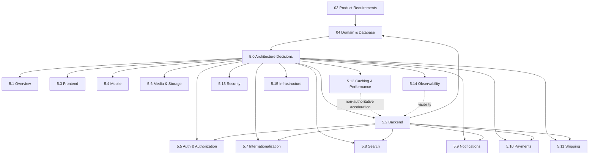

# 5.0 Architecture Decisions

**Document ID:** FANNAN-ARCH-5.0  
**Status:** Architectural source of truth for Section 05  
**Scope:** MVP architecture decisions and constraints for 5.1–5.15  
**Based on:** Sections 03 Product Requirements and 04 Domain & Database

## 1. Purpose

This document establishes the architectural contract for FANNAN's MVP. It records the decisions that the remaining Section 05 documents must follow and identifies the few decisions that remain genuinely open.

It is intentionally not an implementation guide, API specification, database schema, UI design, or deployment manual. Detailed structures remain in [04_Domain_&_Database](../04_Domain_&_Database/) and endpoint contracts belong in Section 06.

## 2. Architectural Principles

### MVP simplicity

Choose the smallest architecture that safely supports discovery, artist selling, checkout, COD, shipping, offers, notifications, Arabic/English localization, and administration. Future capability must not become an MVP dependency.

### Modular monolith first

Deploy one NestJS backend and one primary PostgreSQL database, while enforcing meaningful internal module boundaries. This keeps delivery, operations, transactions, and debugging simple without abandoning domain separation.

### Domain-driven module boundaries

Modules own business capabilities and their invariants, not merely individual tables. Cross-module access uses explicit application contracts or domain events rather than direct access to another module's internals.

### Separation of concerns

Business rules belong in the backend/domain modules, persistence belongs behind repositories, external providers belong behind adapters, and web/mobile clients present state without becoming authorities for pricing, inventory, payment, or authorization.

### API-first thinking

Web, mobile, and admin clients consume the same versioned REST API contracts. A client-specific experience may differ, but it must not create a second business implementation.

### Security by design

Authentication, authorization, ownership checks, private data handling, secure media access, input validation, rate limiting, and auditability are architectural requirements, not later hardening tasks.

### Localization by design

Arabic (`ar`, RTL) and English (`en`, LTR) are first-class from day one. User-facing wording uses stable translation keys. Locale resolution, fallback, formatting, notifications, validation, errors, APIs, and clients must be consistent.

### Replaceable integrations

Payments, shipping, object storage, email/push delivery, and search infrastructure are accessed through application-level interfaces. The marketplace core must not depend on a provider's proprietary model.

### Explicit ownership and authorization

Every writable business concept has an authoritative module and an authorization policy. A single User may have Customer and Artist capabilities; artist selling still requires verification.

### Database integrity

PostgreSQL remains authoritative for business state. Foreign keys, constraints, transactions, immutable snapshots, and lifecycle rules protect invariants even when a client or job fails.

### Observability

Technical logs, metrics, request correlation, audit records, domain events, and health signals must make marketplace failures and business outcomes diagnosable.

### Maintainability over premature optimization

Prefer clear modules, simple jobs, measured indexes, and standard technologies. Add infrastructure or specialized stores only when a measured requirement justifies it.

## 3. Technology Decisions

| Area | Decision | Rationale | MVP | Future Evolution |
|---|---|---|---|---|
| Web | Next.js + TypeScript | Supports the responsive marketplace and dashboard experiences | One web application | Split experiences only if ownership or scale requires it |
| Mobile | React Native + Expo + TypeScript; Expo Router | Shared mobile delivery with platform navigation conventions | One mobile app consuming the REST API | Native modules only for justified platform capabilities |
| Backend | NestJS + TypeScript | Structured modules, validation, guards, and maintainable application services | One modular monolith | Extract a bounded capability only after operational evidence |
| Database | PostgreSQL | Strong relational integrity and transactional commerce state | One primary database | Read replicas/partitioning only when measured |
| ORM | Prisma | Type-safe access aligned with Section 04 | Prisma repositories and migrations | Direct SQL only for measured specialized queries |
| Cache | Redis | Useful for short-lived cache, rate limits, sessions, and jobs | Selective use; never authoritative | Broader caching only with invalidation and measurement |
| Object storage | AWS S3 | Durable storage for artwork media and digital files; binaries do not belong in PostgreSQL | S3 metadata references in PostgreSQL | CDN/media processing as demand grows |
| API style | Versioned RESTful HTTP API | Clear shared contract for web, mobile, and admin | Resource-oriented API with consistent errors | Additional protocols only for a demonstrated need |
| Architecture style | Modular monolith | Lowest operational complexity while preserving domain boundaries | Single deployable backend | Service decomposition remains optional |
| Authentication | Backend-owned session/token authentication | One User identity across capabilities; clients do not implement identity rules | Secure web/mobile authentication with revocation policy | SSO/MFA can be added without changing marketplace ownership |
| Authorization | Server-side capability and resource ownership checks | Roles alone are insufficient for artist/order/resource access | Customer, Artist, Admin, verification-aware policies | Policy engine only if complexity warrants it |
| Search | Search module/read model fed by catalog events | Discovery needs Arabic/English search without making search the source of truth | PostgreSQL-backed or simple provider-backed index, selected in 5.8 | Specialized search infrastructure when scale/relevance requires it |
| Notifications | Notification module with channel adapters | In-app, email, and push need common events and delivery state | In-app plus configured email/push adapters; localized templates | Provider expansion and more advanced delivery orchestration |
| Payments | Payment abstraction with COD implementation | Keeps orders independent of any future Palestinian-compatible provider | COD | Add provider adapter without redesigning Order |
| Shipping | Shipping abstraction and provider adapters | Provider can change without changing order fulfillment concepts | MVP provider-independent shipping model | Multiple providers and live rates if required |
| Localization | Shared localization capability with PostgreSQL resources/templates and content translations | Stable keys, fallback, admin control, and future locales without duplicated columns | `ar`/`en`, RTL/LTR, fallback to English | Additional locales and richer translation workflows |
| Deployment/infrastructure | Simple cost-conscious deployment of web, API, PostgreSQL, Redis, and S3 | Operationally appropriate for MVP | Minimal observable environments and backups | Independent scaling/decomposition only when justified |

## 4. Architecture Style

FANNAN uses a modular monolith for MVP. “Modular” means each backend capability has explicit ownership, public application contracts, domain rules, persistence boundaries, and tests. It does not mean every entity gets a module.

### Backend module dependency rules

- Domain modules may depend on shared primitives and declared contracts.
- Application services may orchestrate multiple modules through contracts.
- Infrastructure adapters implement interfaces owned by application/domain code.
- Modules must not import another module's private repositories, database models, or internal services.
- Shared code must contain stable primitives and cross-cutting utilities, not hidden business ownership.
- Cross-module workflows use a short synchronous transaction where consistency is required and domain events/jobs for side effects.

Microservices are deferred because MVP does not require independent deployment, independent scaling, or distributed ownership. The monolith can evolve by extracting a module only after its boundary, data ownership, traffic, and operational need are proven.

## 5. FANNAN Core Backend Module Boundaries

| Module | Responsibility and owned concepts | May depend on | Must not depend on |
|---|---|---|---|
| Identity / Users | User identity, credentials, profile preferences, preferred locale, sessions | Shared security and persistence contracts | Catalog internals or client-specific UI |
| Customer | Customer capability, addresses, favorites, cart references, customer views | Identity, Catalog read contracts, Orders | Payment-provider internals |
| Artist | Artist profile, storefront, artist settings, artist-owned content | Identity, Catalog, Media | Customer private data |
| Artist Verification | Verification workflow and decisions | Identity, Artist, Admin policy | Payment/shipping provider internals |
| Catalog / Products | Artwork/product metadata, publication, visibility, categories/tags/collections references | Artist, Media, Localization, Inventory contracts | Order settlement internals |
| Categories / Tags | Taxonomy identity and localized labels | Localization, Catalog read contracts | Order/payment state |
| Media | Media metadata, upload authorization, S3 references, processing state | Identity, Catalog, object-storage adapter | Direct database binary storage |
| Inventory | Stock, reservations, availability, unique/quantity rules | Catalog, Orders/Offers contracts | Client state or cache as authority |
| Wishlist / Favorites | User-to-catalog saved relationships | Identity, Catalog | Artist private data |
| Cart | Short-lived buyer intent and cart items | Identity/Customer, Catalog, Inventory read contracts | Payment success or order authority |
| Checkout / Orders | Order creation, snapshots, state transitions, order history | Cart, Inventory, Payments, Shipping | Client-calculated totals |
| Payments | Payment attempts, COD state, provider abstraction, reconciliation | Orders, provider adapters | Catalog editing or inventory ownership |
| Shipping | Shipment state and provider abstraction | Orders, provider adapters | Payment authorization rules |
| Reviews | Eligible review creation and moderation state | Identity, Orders, Artist | Unrelated catalog mutation |
| Offers / Negotiations | Structured offers, rounds, acceptance, expiry, negotiated price snapshots | Identity, Catalog, Inventory, Orders | Real-time chat requirement |
| Notifications | Event-to-message orchestration, localized templates, delivery state | Identity locale, Localization, provider adapters | Owning source business state |
| Search | Search read model, Arabic/English normalization, ranking and suggestions | Catalog, Categories, Tags, Artist read contracts | Becoming source of truth |
| Admin / Moderation | Administrative actions, translation/template management, moderation, audit access | All module public contracts and authorization | Bypassing domain invariants |
| Analytics | Event collection and aggregate read models | Domain events | Blocking core transactions |

## 6. Client Architecture Decisions

Next.js web, React Native mobile, and the admin interface use the shared backend API. Admin may be a protected surface in the web application or a separate client later; it must not create a separate backend authority.

Shared between clients:

- API contracts, resource/status semantics, error codes, pagination conventions, and stable translation keys.
- Authentication intent, capability presentation, and locale resolution rules.
- Domain-independent validation metadata where it improves UX.

Platform-specific:

- Navigation, secure credential storage, responsive layout, RTL/LTR layout mechanics, offline UX, push-token handling, and accessibility implementation.

The backend owns authorization, business validation, monetary values, inventory, orders, offers, payments, and localized server messages. Clients own presentation, locale selection UI, layout direction, and display formatting using authoritative numeric/date/currency values. Clients must never hard-code product copy or infer a successful mutation from optimistic state alone.

## 7. Data & Persistence Decisions

PostgreSQL and the Section 04 schema are authoritative for users, catalog, inventory, orders, offers, payments, shipping, notifications, translation resources, localized content, and audit-relevant state. Prisma provides type-safe access through module-owned repositories.

- Use PostgreSQL transactions for order creation, inventory reservation/decrement, offer acceptance, negotiated purchase creation, payment-state recording, and order-state transitions.
- Use UUIDs for primary identifiers and UTC/TIMESTAMPTZ for persisted timestamps.
- Use precise decimal/integer monetary representations; never floating-point application calculations for financial values.
- Use JSONB only for bounded flexible metadata, provider payloads, parameter schemas, or metadata—not to hide queryable core relationships.
- Store media binaries in S3; store ownership, metadata, and access references in PostgreSQL.
- Preserve immutable order-item, negotiated-price, payment, and rendered-notification snapshots.
- Use soft deletion or archival only where Section 04 requires history or recovery; do not use it as a substitute for authorization.
- Keep translations separate from domain data: stable UI resources, localized message templates, and user-generated content translations are distinct.

## 8. External Integration Strategy

External systems are isolated behind interfaces and adapters:

```text
Orders -> Payment Port -> COD adapter / future payment provider adapter
Orders -> Shipping Port -> shipping provider adapter
Media -> Object Storage Port -> S3 adapter
Notifications -> Email/Push Ports -> delivery provider adapters
Catalog events -> Search Port -> PostgreSQL/simple index or future provider
```

Adapters translate provider-specific errors and payloads into FANNAN concepts. Provider identifiers and raw payloads may be retained as integration metadata, but provider models must not leak into core aggregates. This keeps COD, shipping, storage, delivery, and search replaceable without redesigning marketplace workflows.

## 9. Localization Decision

Localization is first-class and shared across backend and clients:

- Supported MVP locales: Arabic `ar` (RTL) and English `en` (LTR).
- Effective locale order: explicit request locale, authenticated user preference, browser/device locale, then English.
- Stable namespaced translation keys drive UI, validation, errors, notifications, email, and push content.
- Missing translations fall back to English, are observable, and do not silently alter business rules.
- Locale-aware pluralization, dates, numbers, and currency display use standard internationalization facilities.
- APIs expose language-neutral codes plus resolved localized content/metadata according to each contract.
- Cache keys and ETags vary by locale and resource/template version.

Three data classes must remain distinct:

1. System/UI translation resources.
2. Marketplace/domain content such as category and tag labels.
3. User-generated content such as artwork titles, descriptions, and artist biographies.

Use translation tables for queryable multilingual content and do not add duplicated `_ar`/`_en` columns to every entity. The backend owns notification/email/push wording; clients consume keys/resources and handle RTL/LTR presentation.

## 10. Authentication & Authorization Direction

Authentication establishes one User identity that may have Customer and Artist capabilities. Preferred locale is a user preference, not a second identity. Sessions/tokens must be revocable and stored/handled according to the security architecture.

Authorization is server-side and combines:

- authenticated identity;
- capability/role;
- artist verification state;
- ownership of the resource;
- lifecycle/status;
- administrative permission.

Artist capability does not imply approved selling capability. Admin actions, moderation, translation/template publication, private artist data, and customer data require explicit authorization. Resource ownership is checked in the backend even when a client hides controls.

## 11. API Architecture Direction

The REST API is resource-oriented, versioned, validated, and documented. Section 06 owns the endpoint catalog; this document sets the rules:

- Use consistent envelopes/status codes and machine-readable error codes.
- Return stable domain codes separately from localized human messages.
- Resolve locale from an explicit supported request preference, user preference, or fallback.
- Return authoritative money as structured numeric/decimal values with currency codes.
- Apply server-side pagination, filtering, sorting, visibility, and authorization.
- Use idempotency for retryable order, checkout, payment, and other mutation operations where duplicate effects are possible.
- Make search a distinct read operation backed by the Search module.
- Avoid exposing private prices, credentials, provider secrets, or internal database structure.
- Maintain backward-compatible versioning and generate API documentation from the approved contract.

## 12. Business Transaction Boundaries

Strong PostgreSQL transactions are required for:

- creating an order and immutable item/price snapshots;
- reserving or decrementing inventory;
- accepting an offer and creating the negotiated purchase opportunity;
- recording payment state and reconciling order state;
- updating order state where concurrent transitions could lose data.

Email, push, search indexing, analytics aggregation, media processing, and cache invalidation are asynchronous side effects. They must be retryable and idempotent; failure must be observable without rolling back an already valid core transaction.

## 13. Asynchronous Processing Direction

MVP uses a simple application job/queue mechanism backed by existing infrastructure where sufficient. Do not introduce Kafka, RabbitMQ, or another broker without a measured requirement.

Suitable asynchronous work:

- notification delivery and retries;
- email/push dispatch;
- localized template rendering where not needed in the request transaction;
- search read-model updates;
- analytics event processing;
- media thumbnail/metadata processing;
- cache invalidation and non-critical reconciliation.

Core order, inventory, offer, and payment state remains synchronous and PostgreSQL-authoritative.

## 14. Caching Direction

Redis may cache:

- published catalog/category/tag read models with short, explicit TTLs;
- locale-specific translation resources and message templates by version;
- search results/suggestions where keys include query, filters, user context, locale, and index version;
- rate-limit counters and short-lived session/job data.

PostgreSQL remains authoritative for inventory, orders, negotiated prices, payment status, shipping state, user permissions, and financial records. Cache invalidation occurs on publication/update/deletion events. A stale cache may affect freshness or latency, but never correctness or authorization.

## 15. Security Direction

Use secure authentication, server-side authorization, input/schema validation, least privilege, parameterized ORM access, and OWASP-aligned defenses. Protect passwords, tokens, addresses, payout references, private offer minimums, and provider credentials.

Media access uses authorization-aware upload/download flows and private object controls. Apply rate limits to authentication, search abuse, offers, checkout, and notification-triggering actions. Keep secrets in deployment secret storage, not source or database content. Record security-sensitive administrative and ownership changes in an audit trail.

## 16. Observability Direction

Use structured logs with request/correlation IDs, module/action context, outcome, latency, and safe identifiers. Never log passwords, tokens, full payment data, private minimums, or unnecessary PII.

Track technical metrics (latency, errors, job retries, database/cache health), product metrics (search quality, checkout conversion, offer outcomes), and localization metrics (missing keys, fallback rate, template failures). Distinguish immutable business audit records from operational logs. Health checks must cover critical dependencies without exposing secrets.

## 17. Deployment Direction

MVP deployment should be simple, cost-conscious, backup-capable, and observable:

- one deployable backend;
- web and mobile client delivery;
- managed or operationally simple PostgreSQL;
- Redis only where needed;
- S3 for media;
- separate development, staging, and production configuration/data;
- automated migrations with backup and rollback planning;
- centralized logs, health checks, and basic alerting.

Provider-specific topology, CI/CD, network design, and scaling details belong in 5.15.

## 18. MVP vs Future Architecture

| Concern | MVP | Future if Needed |
|---|---|---|
| Architecture style | Modular monolith | Extract proven bounded capabilities |
| Scaling | Scale web/API/database vertically or with simple replicas | Independent service scaling |
| Search | Simple locale-aware read model/provider | Specialized search cluster and relevance pipeline |
| Queues | Simple Redis/application jobs | Dedicated broker/workflow system |
| Payments | COD through payment port | Additional provider adapters and reconciliation |
| Shipping | Provider abstraction with initial integration | Multiple providers/rates/tracking |
| Media processing | S3 metadata and basic asynchronous processing | Dedicated media pipeline |
| Notifications | In-app plus localized email/push adapters | Multi-provider routing and advanced campaigns |
| Analytics | Domain events and scheduled aggregates | Dedicated analytics platform |
| Infrastructure | Small observable deployment | Multi-region/independent scaling |
| Database scaling | One PostgreSQL authority | Read replicas, partitioning, or extraction |
| Service decomposition | None required | Only for measured ownership/scale/availability needs |

Future evolution is not an MVP requirement and must preserve the contracts and ownership rules established here.

## 19. Architectural Trade-offs

| Trade-off | Decision | Benefit | Cost | Why now |
|---|---|---|---|---|
| Modular monolith vs microservices | Modular monolith | Simple deployment and strong local transactions | Less independent scaling | MVP team and workflows benefit more from simplicity |
| PostgreSQL vs specialized stores | PostgreSQL authority | Integrity, transactions, and one source of truth | Search/read workloads need care | Commerce correctness is central |
| S3 vs database media | S3 references | Durable scalable binary storage | Extra integration | Database remains manageable and secure |
| REST vs complex API styles | REST | Shared web/mobile/admin contract | More explicit resource endpoints | Requirements do not justify added protocol complexity |
| Redis usage | Selective cache/jobs | Lower latency and practical rate limits | Invalidation complexity | Useful only for non-authoritative or short-lived state |
| Simple infrastructure vs scale-first | Simple deployment | Lower cost and operational burden | Less isolation at high scale | No MVP requirement for distributed systems |
| Translation tables vs duplicated locale columns | Translation tables | Future locales, provenance, optional content, admin/versioning | More joins and read-model work | Correctly separates UI and user content |

## 20. Architecture Decision Rules for Future Documents

Documents 5.1–5.15 MUST:

1. Remain consistent with Sections 03 and 04 and this document.
2. Avoid introducing a technology without a requirement, trade-off, and operational rationale.
3. Preserve modular-monolith deployment for MVP.
4. Keep external providers behind replaceable adapters where practical.
5. Keep PostgreSQL authoritative for business-critical state.
6. Never make Redis authoritative for financial, inventory, order, offer, or payment state.
7. Keep Arabic/English, RTL/LTR, stable keys, fallback, and locale-aware formatting first-class.
8. Keep user-generated multilingual content separate from UI translations.
9. Preserve security, ownership, privacy, and audit boundaries.
10. Prefer asynchronous side effects without weakening synchronous transaction boundaries.
11. Avoid endpoint-level detail in architecture documents when it belongs in Section 06.
12. Treat future features as extension points, not hidden MVP scope.
13. Do not introduce microservices, brokers, CMSs, or specialized databases by convention alone.

## 21. Open Architectural Decisions

| Decision | Why it is open | What depends on it | When to decide |
|---|---|---|---|
| Exact authentication/session mechanism | Requirements establish secure backend-owned auth but not one token/session product choice | 5.5, client session handling, deployment secrets | Before implementation of authentication |
| Initial search implementation/provider | Requirements require Arabic/English discovery but leave provider and ranking internals open | 5.8, indexing, search operations and cost | During MVP technical spike, before search build |
| Email and push delivery providers | Requirements define channels, not vendors | 5.9, secrets, retry and delivery monitoring | Before notification integration |
| Initial shipping provider | Shipping must be replaceable and provider selection is not fixed | 5.11, fulfillment operations | Before production shipping integration |
| Admin translation editing scope | Runtime translation/template administration is architecturally supported, but operational ownership and UI scope are not finalized | 5.7, 5.9, 5.3/5.15 | Before admin implementation |

## 22. Architecture Dependency Map



## 23. Final Architectural Summary

FANNAN MVP is a NestJS/TypeScript modular monolith backed by PostgreSQL and Prisma, with Next.js web and React Native/Expo mobile clients consuming a shared versioned REST API. S3 stores media binaries, Redis is selective and non-authoritative, and integrations are replaceable through ports and adapters.

Domain modules own marketplace capabilities and PostgreSQL transactions protect orders, inventory, offers, payments, and shipping state. Notifications, search indexing, analytics, media processing, and cache invalidation are asynchronous side effects. Arabic and English localization, RTL/LTR, stable translation keys, fallback, localized templates, and multilingual marketplace content are architectural requirements from the beginning. Future scale may evolve individual boundaries, but it must not complicate the MVP before evidence requires it.