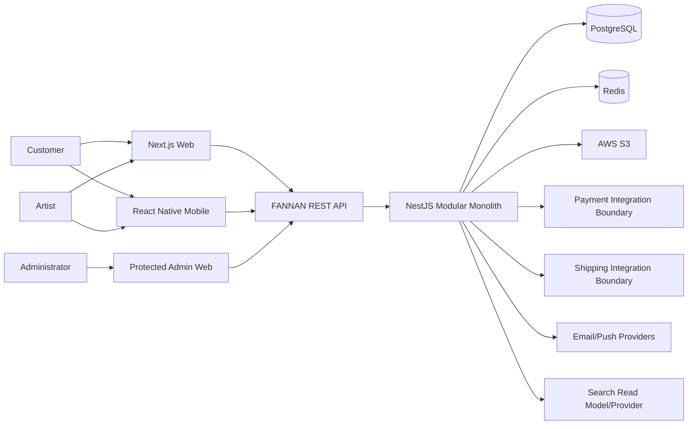
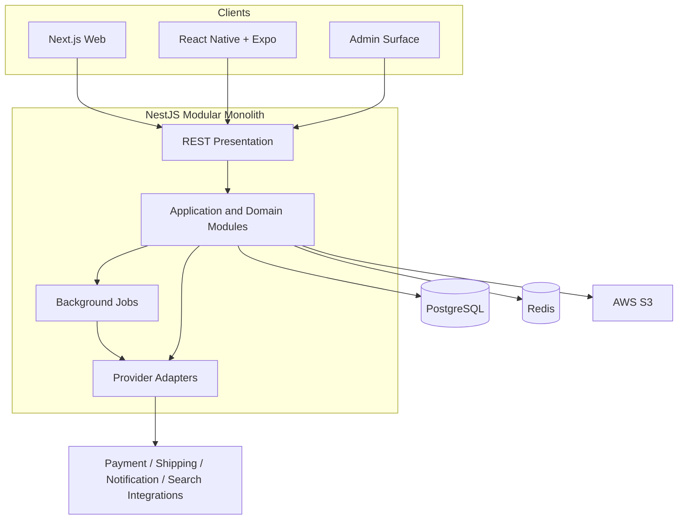

# 5.1 Architecture Overview

**Document ID:** FANNAN-ARCH-5.1  
**Status:** MVP system architecture  
**Depends on:** 5.0 Architecture Decisions, Sections 03 and 04

## 1. Purpose

This document describes the complete high-level architecture of FANNAN. It defines the system boundaries, major components, communication paths, data ownership, client responsibilities, integration boundaries, and MVP evolution path. It does not define implementation code, endpoint catalogs, or the complete database schema.

## 2. Architectural Goals

- Deliver a practical MVP quickly with low operational complexity.
- Keep marketplace business rules centralized and maintainable.
- Preserve clear ownership for catalog, inventory, orders, offers, payments, shipping, and notifications.
- Support Arabic/English, RTL/LTR, stable translation keys, fallback, and localized marketplace content from the beginning.
- Protect user, artist, order, payment, offer, and media data.
- Keep payment, shipping, storage, notification, and search providers replaceable.
- Support reliable transactions for commerce while allowing non-critical work to run asynchronously.
- Scale selected components later without forcing distributed infrastructure into MVP.

## 3. System Context

Customers discover and purchase works through web or mobile clients. Artists manage profiles, products, media, inventory, and offers after verification. Administrators use protected web functionality to moderate the marketplace and manage operational resources such as translations/templates.



External providers are integration boundaries, not domain authorities. PostgreSQL is authoritative for persistent marketplace state; S3 stores binaries; Redis accelerates non-authoritative workloads.

## 4. High-Level System Architecture



### Boundaries

- **Clients:** presentation, navigation, secure local storage, RTL/LTR layout, and display formatting.
- **REST API:** authentication boundary, request validation, resource responses, pagination, errors, and locale negotiation.
- **Application/domain modules:** business rules, authorization, orchestration, and transaction boundaries.
- **PostgreSQL:** source of truth for users, products, inventory, orders, offers, payments, shipping, notifications, translations, and audit-relevant records.
- **Redis:** short-lived cache, rate limits, sessions/jobs where selected; never business authority.
- **S3:** media and digital-file binaries; database stores metadata and access references.
- **Jobs/adapters:** retryable side effects and provider-specific translation.

## 5. Application Layers

### Presentation/API

REST controllers, request DTO validation, authentication guards, authorization guards, locale resolution, response mapping, and API documentation. Controllers do not contain pricing, inventory, or workflow rules.

### Application

Use cases coordinate modules, transactions, repositories, ports, and domain events. This is where request-level orchestration belongs.

### Domain

Aggregates, value objects, policies, state transitions, and invariants defined by Section 04. Domain code does not depend on HTTP, Redis, S3, or provider SDKs.

### Infrastructure

Prisma repositories, PostgreSQL migrations, Redis adapters, S3 adapter, job implementation, and external-provider adapters. Infrastructure implements contracts owned by application/domain code.

This layering is practical rather than ceremonial: small modules may combine files where complexity is low, but ownership and dependency direction remain explicit.

## 6. Backend as the Business Authority

The backend owns:

- product visibility, pricing rules, and eligibility;
- artist verification and selling capability;
- inventory availability, reservations, and unique/quantity behavior;
- cart validation and order creation;
- offer rounds, acceptance, expiry, and negotiated-price snapshots;
- payment and shipping state;
- review eligibility and moderation;
- notification generation and localized template selection;
- authorization, ownership, privacy, and audit decisions.

Clients may provide optimistic UX, but the backend revalidates every mutation. Cache contents, client state, and user-provided totals cannot authorize or complete commerce.

## 7. Client Applications

### Web

Next.js + TypeScript serves public marketplace pages, customer/artist dashboards, and the protected admin surface. It consumes the same versioned API as mobile.

### Mobile

React Native + Expo + TypeScript with Expo Router provides the mobile marketplace and dashboards. Mobile owns platform navigation, secure credential storage, push-token handling, and mobile-specific accessibility/offline UX.

### Admin

Admin is a protected web surface consuming the shared REST API. It may be routed within the web application for MVP. A separate admin frontend is not required and must not create a separate backend.

### Shared and platform-specific responsibilities

Shared: API contracts, stable codes, translation keys, locale policy, validation semantics, pagination, and error structure.

Platform-specific: navigation, layout, RTL/LTR mechanics, secure storage, responsive behavior, push integration, and accessibility implementation.

## 8. Backend Modular Structure

The NestJS application contains business-capability modules rather than one module per database table:

| Module | Owns |
|---|---|
| Identity / Users | User identity, credentials, capabilities, locale preference, sessions |
| Customer | Customer profile, addresses, customer-facing saved state |
| Artist | Artist profile and artist-facing catalog workflows |
| Artist Verification | Verification submissions and decisions |
| Catalog / Products | Artwork/product metadata, publication, visibility |
| Categories / Tags | Taxonomy identity and localized labels |
| Media | Media metadata, upload authorization, S3 references |
| Inventory | Stock, reservations, and availability |
| Cart / Checkout / Orders | Buyer intent, order creation, snapshots, order lifecycle |
| Payments | COD and future payment-provider abstraction |
| Shipping | Shipment lifecycle and provider abstraction |
| Reviews | Review eligibility and moderation state |
| Offers / Negotiations | Structured offers and negotiated purchase opportunities |
| Notifications | In-app/email/push orchestration and templates |
| Localization | Translation resources, locale policy, formatting metadata |
| Search | Locale-aware read model, indexing, suggestions, ranking |
| Admin / Moderation | Administrative operations, moderation, translation/template publishing |
| Analytics | Domain-event collection and aggregate metrics |

Modules communicate through public application contracts and domain events. They must not import another module's private repositories or mutate another module's tables as an informal shortcut.

## 9. Data Architecture

PostgreSQL stores authoritative relational state according to Section 04. Prisma provides access through module-owned repositories and migrations.

System/UI translation resources, localized message templates, and user-generated content translations remain distinct. Artwork titles/descriptions and artist biographies are not UI strings and are not represented by duplicated language columns on every table.

S3 stores artwork images, videos, previews, and digital files. Access is authorized by the backend and delivered through controlled references or URLs.

Redis may contain:

- locale/version-aware translation and template caches;
- published catalog/category read caches;
- search result/suggestion caches;
- rate-limit counters and job/session data.

It must not be authoritative for inventory, orders, negotiated prices, payments, shipping state, or financial records.

## 10. Request Flow

1. Client sends an authenticated or guest REST request with supported locale preference when applicable.
2. API validates input, resolves locale, authenticates identity, and applies authorization.
3. Application service executes the use case and opens a PostgreSQL transaction when required.
4. Domain rules validate ownership, lifecycle, inventory, pricing, and capability.
5. PostgreSQL commits authoritative state.
6. Domain events schedule search, notifications, analytics, media processing, and cache invalidation.
7. API returns stable codes, authoritative values, and localized content according to the contract.

## 11. Critical Business Flows

### Product discovery

Catalog publishes eligible content. Search consumes catalog/category/tag/artist events, maintains Arabic and English normalized fields, and returns only public eligible results. Search is a read model, not the source of truth.

### Product purchase

Checkout validates cart contents and current availability, calculates authoritative totals, reserves/decrements inventory, creates immutable order-item snapshots, and records COD payment state in one appropriate transaction. Shipping creation and notifications may follow asynchronously.

### Negotiated purchase

Offers validates that offers are enabled and the requester is eligible. Acceptance is transactional with the agreed price and purchase opportunity. The private minimum remains inaccessible to customers. Negotiation is structured workflow, not real-time chat.

### Digital product

Digital products use the same catalog/order/payment abstractions. Entitlement and secure download access are granted only after the applicable order/payment state is authoritative.

## 12. Cross-Cutting Concerns

- **Localization:** explicit request locale, user preference, browser/device hint, then English fallback; stable keys and locale-aware formatting.
- **Security:** authentication, ownership, least privilege, protected media, input validation, rate limits, and secrets management.
- **Observability:** correlation IDs, structured logs, metrics, audit events, and job failure visibility.
- **Reliability:** idempotent mutations/jobs, retries for side effects, backups, and clear failure boundaries.
- **Accessibility:** clients support both RTL/LTR layout and accessible loading, error, empty, and success states.

## 13. External Integration Boundaries

```text
Orders      -> Payment Port       -> COD / future provider adapter
Orders      -> Shipping Port      -> shipping provider adapter
Media       -> Storage Port       -> S3 adapter
Notifications -> Delivery Ports   -> email/push adapters
Catalog     -> Search Port        -> simple read model/provider
```

Provider payloads stay in adapter/integration metadata. Core domain objects use FANNAN concepts and stable internal states.

## 14. Synchronous vs Asynchronous Work

| Synchronous and transactional | Asynchronous and retryable |
|---|---|
| Order creation and price snapshots | Email and push delivery |
| Inventory reservation/decrement | Search indexing |
| Offer acceptance | Analytics processing |
| Payment-state recording | Media thumbnails/metadata |
| Order-state transitions | Cache invalidation |

MVP may use a simple Redis/application job mechanism. Kafka, RabbitMQ, and other brokers are deferred.

## 15. Failure Boundaries

- Payment/shipping provider failure must not corrupt the order; persist an explicit integration state and retry/reconcile.
- Notification failure must not roll back a committed order or offer.
- Search lag may temporarily affect discovery freshness but cannot expose ineligible content after the API eligibility check.
- Redis failure falls back to PostgreSQL/application computation for correctness.
- S3 failure blocks the relevant media operation but does not corrupt relational business state.
- Job processing is idempotent and observable.

## 16. MVP Architecture vs Future Evolution

| Concern | MVP | Future evolution |
|---|---|---|
| Deployment | One modular backend | Extract proven modules |
| Database | One PostgreSQL authority | Replicas/partitioning if measured |
| Search | Simple locale-aware read model | Specialized search infrastructure |
| Jobs | Simple Redis/application jobs | Dedicated broker/workflow engine |
| Notifications | Localized templates and adapters | Multi-provider routing/campaigns |
| Media | S3 plus basic processing | Dedicated media pipeline/CDN |
| Analytics | Events and scheduled aggregates | Dedicated analytics platform |

## 17. Architecture Trade-offs

The MVP intentionally trades independent scaling for simpler transactions and operations. PostgreSQL is preferred over multiple specialized databases because commerce integrity is central. S3 is preferred over database binaries for durability and manageable database size. REST is preferred over more complex protocols because web, mobile, and admin need a clear shared contract. Redis is used selectively because cache invalidation is a cost, not a reason to move authority out of PostgreSQL.

## 18. Architecture Constraints

1. Do not introduce microservices, Kubernetes, brokers, or multiple databases for MVP.
2. Do not make Redis authoritative for commerce state.
3. Do not store media binaries in PostgreSQL.
4. Do not duplicate UI and marketplace content responsibilities.
5. Do not hard-code user-facing text or assume English-only behavior.
6. Do not expose private artist minimums or protected customer data.
7. Do not bypass module ownership through direct table mutation.

## 19. Dependencies on Other Architecture Documents

5.2 defines NestJS module structure and backend layering. 5.3 and 5.4 define client responsibilities. 5.5 defines authentication/authorization details. 5.6–5.11 define storage, localization, search, notifications, payments, and shipping. 5.12–5.15 define cache, security, observability, and infrastructure details.

## 20. Final Architecture Summary

FANNAN is a modular-monolith marketplace: Next.js web and React Native/Expo mobile clients use a shared NestJS REST API; PostgreSQL is authoritative, Redis is selective, and S3 stores media. Business capabilities are separated into internal modules with explicit ownership. Commerce transactions remain synchronous and relational; search, notifications, analytics, media processing, and cache invalidation are asynchronous. Arabic/English localization, RTL/LTR, stable translation keys, fallback, and multilingual marketplace content are included from the first release.