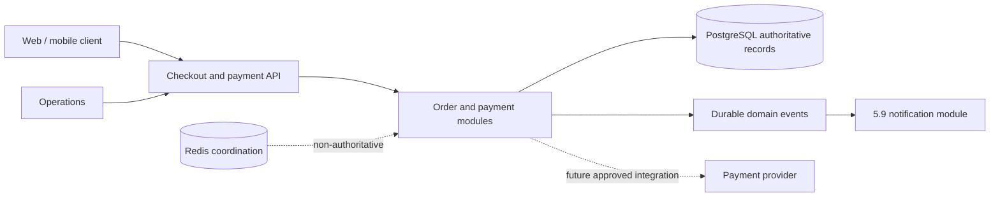

# 5.10 Payment Architecture

| Attribute | Value |
|---|---|
| Document ID | FANNAN-SYS-ARCH-5.10 |
| Status | Proposed Phase 3 architecture baseline |
| Scope | Order payment intent, Cash on Delivery, payment-method/provider boundaries, refunds, reconciliation, security, and payment auditability |
| Authority | Architecture direction only; Section 04, API, data, compliance, and provider contracts remain required before implementation |

> **Source-of-truth and stack note.** `02_PRODUCT_REQUIREMENTS/3.12 Checkout.md`, `3.13 Payments.md`, `3.17 Negotiation & Offers.md`, and `3.10 Notifications.md` are the product behavior baselines. Section 04, architecture documents `5.0`–`5.4`, and PRD `3.18` are absent from this repository. Section 04 is authoritative when it exists; this document must be reconciled with it rather than silently replacing it. The PRDs describe Laravel, Next.js, and Flutter, while 5.5–5.9 provisionally describe NestJS, React Native, Expo, PostgreSQL, Redis, and AWS. That conflict is recorded here and requires an approved technology ADR.

## 1. Purpose

Payment architecture makes a checkout commercially safe without making payment infrastructure the source of truth for the whole order. MVP supports Cash on Delivery (COD), explicit order/payment separation, negotiated prices, clear failure recovery, and an extension boundary for an approved future provider. It does not select an online Palestinian gateway, invent settlement law, or define provider-specific API contracts.

## 2. Scope

Checkout requires revalidation before commitment, a single valid order, guest and authenticated paths, address/shipping review, and recoverable failure. Payments requires approved methods, COD, payment statuses, refunds and partial refunds, operational visibility, fraud/PCI considerations, settlement, and future wallet separation. Negotiation requires a locked negotiated price attached to a transaction rather than overwriting catalog price. Notifications requires authoritative domain events and safe, localized, preference-aware delivery.

## 3. Architectural Context

| Gap | Impact | Resolution gate |
|---|---|---|
| Section 04 missing | No authoritative cross-cutting API/data/infrastructure contract | Reconcile and approve Section 04 |
| `5.0`–`5.4` missing | Platform/deployment assumptions are incomplete | Reconcile before implementation |
| PRD `3.18` missing | Later requirements cannot be traced | Confirm successor or addendum |
| Laravel/Next.js/Flutter in PRDs | Existing product contracts may target another stack | Approve stack ADR; do not rewrite PRDs implicitly |
| NestJS/React Native/Expo in 5.5–5.9 | Phase 3 direction is provisional | Treat as proposed until ADR approval |

## 4. Responsibilities

1. The order records the commercial commitment; the payment records how and whether it is paid.
2. COD is a real payment method with a pending collection lifecycle, not a fake successful online payment.
3. Money is represented as exact amounts with explicit currency, never binary floating point.
4. External or retried commands are idempotent; authoritative transitions are server-side.
5. Durable records are authoritative; Redis and notifications are coordination and communication aids.
6. Every state change is attributable, auditable, and safe to retry.

## 5. Non-Responsibilities

Payment does not own catalog pricing, inventory policy, shipping execution, notification delivery, user authentication, or provider-specific secrets. It records payment outcomes and emits events; it does not silently redefine order, fulfillment, or negotiation state.

## 6. Related Product Requirements

Checkout requires revalidation before commitment, a single valid order, guest and authenticated paths, address/shipping review, and recoverable failure. Payments requires approved methods, COD, payment statuses, refunds and partial refunds, operational visibility, fraud/PCI considerations, settlement, and future wallet separation. Negotiation requires a locked negotiated price attached to a transaction rather than overwriting catalog price. Notifications requires authoritative domain events and safe, localized, preference-aware delivery.

## 7. Related Domain Entities

The expected conceptual entities are User/Customer, Artist, Product or Artwork, Offer/Negotiation, Order, Order Item, Payment, Payment Attempt, Payment Method, Payment Provider reference, Refund, Shipping, and Audit Record. Exact names, fields, relationships, and lifecycle constraints remain subject to the missing Section 04 documents.

## 8. Payment Architecture

Clients, provider callbacks, delivery staff, and operations are untrusted inputs. Only authorized server-side commands can change an order or payment. Credentials and provider payloads cross a restricted integration boundary and must not be exposed to clients or ordinary support users.

### Logical components

| Component | Responsibility | Not responsible for |
|---|---|---|
| Checkout | Snapshot and validate cart, address, shipping, coupons, and chosen method | Collecting money itself |
| Order | Commercial items, parties, totals, fulfillment relationship, and lifecycle | Provider authorization |
| Payment | Attempt/obligation against an order, amount, currency, and method | Catalog pricing |
| Payment method | COD or an approved future method and its eligibility policy | Provider credentials |
| Payment provider adapter | Translation and callback verification for one approved provider | Order policy or user permissions |
| Reconciliation/operations | Exception review and evidence matching | Silent state mutation |
| Notification integration | Publishes payment/order events to 5.9 | Becoming payment truth |

## 9. Order ↔ Payment Relationship

An **Order** is the accepted purchase snapshot and may contain a negotiated price. A **Payment** is an obligation or collection record linked to one order, including amount, currency, method, attempts, and outcome. A **Payment Method** is a customer-selectable business option such as COD; it has eligibility and customer-facing rules. A **Payment Provider** is an external or internal processor used by a method. COD can have no external provider. This separation permits provider replacement without rewriting orders and prevents provider status from being mistaken for order status.

### Order lifecycle and invariants

| State | Meaning | Allowed next states |
|---|---|---|
| `DRAFT` | Checkout has not created a commitment | `PENDING_PAYMENT`, `CANCELLED` |
| `PENDING_PAYMENT` | Order created, payment not yet collected/confirmed | `CONFIRMED`, `PAYMENT_FAILED`, `CANCELLED` |
| `CONFIRMED` | Payment condition satisfies order confirmation policy | `FULFILLING`, `CANCELLED` |
| `FULFILLING` | Handed to fulfillment/shipping workflow | `DELIVERED`, `CANCELLED` |
| `DELIVERED` | Delivery outcome recorded | `COMPLETED`, `REFUND_PENDING` |
| `COMPLETED` | Commercial lifecycle complete | `REFUND_PENDING` |
| `CANCELLED` | No further fulfillment; financial reversal handled separately | `REFUND_PENDING` |
| `REFUND_PENDING` | Reversal is requested or being resolved | `REFUNDED`, `PARTIALLY_REFUNDED` |

An order cannot be marked paid merely because checkout was opened. Fulfillment must not proceed from an unconfirmed payment unless an explicit COD policy permits it.

## 12. Payment Lifecycle

### Payment lifecycle and invariants

| State | Meaning |
|---|---|
| `INITIATED` | Payment intent created for a current order snapshot |
| `PENDING` | Collection or provider result is outstanding |
| `AUTHORIZED` | Provider authorized funds but capture policy is not complete |
| `PAID` | Amount is confirmed collected, including a recorded COD collection |
| `FAILED` | Attempt definitively failed; retry may create another attempt |
| `CANCELLED` | Payment obligation abandoned before collection |
| `REFUND_PENDING` | Reversal requested but not confirmed |
| `PARTIALLY_REFUNDED` | Some, but not all, collected amount reversed |
| `REFUNDED` | Full collected amount reversed |
| `DISPUTED` | Operational dispute requires review; does not imply a refund |

Only an authorized transition can move a payment to `PAID`. A payment is immutable in amount and currency after order commitment; correction uses a new adjustment/refund record.

## 13. Payment States

The canonical payment states are `INITIATED`, `PENDING`, `AUTHORIZED`, `PAID`, `FAILED`, `CANCELLED`, `REFUND_PENDING`, `PARTIALLY_REFUNDED`, `REFUNDED`, and `DISPUTED`. Only an authorized transition can move a payment to `PAID`; a payment is immutable in amount and currency after order commitment.

## 10. Payment Methods

The method catalogue returns only approved, region- and order-eligible options. MVP exposes COD. Future methods must declare whether they require a provider, authorization/capture, redirect, callback, refund support, and additional customer verification. Method availability is rechecked at checkout submission and must not be inferred from a client-supplied label.

## 11. Cash on Delivery — MVP

COD is the only payment method required for MVP. Eligibility is evaluated against delivery coverage, order value limits, product/order type, risk policy, contact and address completeness, and operational configuration. The customer sees that money is due on delivery and any collection conditions before confirmation.

COD creates an order and payment in a pending collection state. A delivery actor records collection success or refusal through an authorized workflow; only then does the payment become `PAID`. Refusal, failed delivery, partial collection, or missing evidence must produce a defined exception for operations rather than a false success. COD must remain distinguishable in customer, artist, and support views.

## 16. Future Online Payment Providers

No online Palestinian payment gateway is selected for MVP. A future online method may use a hosted or tokenized provider flow, subject to a separate provider, compliance, security, and operational approval.

## 17. Provider Abstraction

The boundary is a small capability contract: create/confirm an attempt, query status, cancel where supported, request refund, and verify a callback. An adapter translates provider-specific data into canonical payment outcomes. Provider selection is configuration and policy, not client authority. Do not add a generic payment orchestration platform, wallet, ledger, multi-provider routing, or speculative gateway until a real approved provider and operational need exist.

### Checkout-to-order-to-payment flow

1. Checkout snapshots eligible line items, shipping, negotiated price if applicable, discounts, and currency.
2. Server revalidates inventory, address, shipping, offer acceptance/expiry, and total.
3. Server creates one order and one initial payment obligation atomically with an idempotency key.
4. For COD, the order remains pending collection and receives confirmation instructions.
5. For a future provider, the server returns a provider-safe next action; it does not expose credentials.
6. A confirmed outcome transitions payment and order according to the state policy and publishes events.

## 15. Negotiated Prices & Offers

An accepted offer produces a locked negotiated transaction price tied to the offer and checkout snapshot. It does not overwrite the artwork’s original catalog price. The order stores the agreed line-item amount and price provenance; later catalog changes cannot alter an existing order. An expired, rejected, withdrawn, or already-used offer cannot authorize checkout. Currency and rounding rules must be identical between offer acceptance, checkout review, and order creation.

## 14. Money & Currency Handling

Every monetary amount has an integer minor-unit value, ISO currency code (pending Section 04 approval), and explicit rounding policy. Totals are calculated from line items plus shipping and approved adjustments; negative or mixed-currency totals are rejected. The authoritative order total is snapshotted before payment. Display formatting is localized through 5.7 and never used for calculation. Tax and commission concepts remain policy gaps unless Section 04 or an approved finance specification defines them.

### Payment attempts and retries

A retry is a new attempt under the same payment obligation, with a unique attempt reference and reason. It must not create a second order or double-charge. A previously successful attempt makes later duplicate success callbacks no-ops. Exponential retry is appropriate for transient provider transport failures; business declines require customer action. COD collection retries are operational actions, not repeated payment creation.

## 18. Idempotency & Concurrency

Checkout submission, payment commands, refund requests, provider callbacks, COD collection, and event publication require an idempotency key or canonical provider event identity. The server stores the key with request scope, result, and expiry/retention policy. A repeated request returns the original result; a reused key with different material inputs is rejected. Notifications use 5.9’s event identity and deduplication rather than inventing a second payment result.

### Concurrency and inventory interaction

Order creation rechecks inventory and offer usage inside the same consistency boundary as commitment. Concurrent checkout attempts must not sell a single unique artwork twice. Locking/version checks must be short-lived and deterministic; stale checkout snapshots fail with a refresh response. Payment confirmation cannot resurrect a cancelled order or consume an offer twice.

## 19. Transactions & Consistency

The local transaction atomically persists the order snapshot, payment obligation/attempt, price provenance, inventory or offer reservation decision, idempotency result, and an outbox/domain-event record. External provider calls and email/push delivery are outside the database transaction. A worker or request handler advances state only after verified external evidence, using reconciliation for uncertain outcomes. Transaction boundaries must be reconciled with authoritative Section 04 data rules.

## 20. Failure Handling

| Situation | Required behavior |
|---|---|
| Validation failure | Do not create a commitment; return actionable refresh errors |
| Client timeout | Query by idempotency key before retrying |
| Provider timeout | Mark pending/unknown, reconcile; do not assume failure or success |
| Decline | Mark failed and allow a safe retry or eligible method change |
| User cancellation | Cancel only an uncollected/unconfirmed obligation |
| Order cancellation after collection | Start a refund workflow; preserve original evidence |
| COD refusal | Record delivery/payment exception and apply fulfillment policy |

## 21. Refunds / Cancellation

Refunds are separate, authorized records against a collected payment and may be full or partial. The sum of completed refunds cannot exceed collected amount. Refund reason, actor, approval, amount, currency, and evidence are auditable. A refund request may be pending while provider or operations confirmation is outstanding. For COD, the refund mechanism and cash-handling policy must be approved before promising a customer a specific channel; no online gateway is assumed.

## 25. Analytics & Auditability

MVP reconciliation covers COD collection evidence, order/payment totals, cancellations, refunds, and manually reviewable exceptions. A future provider requires matching provider references, gross amounts, currencies, fees where approved, and timestamps against internal records. Artist settlement/payout is downstream of confirmed policy and is not implied by `PAID`; its ledger, timing, and legal rules are missing source-of-truth concepts.

## 22. Security

5.5’s API-enforced RBAC and resource policies apply. Customers may view only their orders/payments; artists see only permitted order and settlement information; operations access is scoped and audited. Guest access uses a verified, bounded order lookup path. Sensitive commands require a fresh authenticated context where policy demands it. Payment identifiers are opaque; full credentials, secrets, and sensitive provider payloads never enter client-visible logs.

### Sensitive information, credentials, and authorization

Provider secrets live in an approved secret-management boundary and are rotated without source control exposure. MVP COD avoids card-data handling. A future online method must use a compliant hosted/tokenized flow and establish PCI scope before implementation. Store only provider references and status evidence necessary for reconciliation; redact payment credentials and authentication data from logs, analytics, notifications, and support screens.

## 23. Webhooks & External Callbacks

Future provider callbacks must use verified signatures, replay protection, provider-event idempotency, timestamp/amount/currency checks, and a state-transition allowlist. A callback is evidence to evaluate, not an instruction to blindly trust. Unknown, conflicting, or late callbacks are retained for operations and reconciliation. COD collection submissions require equivalent actor authorization and evidence rules.

## 24. Notifications Integration

Payment and order modules publish versioned authoritative events such as `order.created`, `payment.pending`, `payment.failed`, `payment.paid`, `payment.refund_pending`, `payment.refunded`, and `cod.collection_failed`. The 5.9 notification module resolves recipients, preferences, locale, quiet hours, channels, and safe templates. Notifications never authorize payment, expose secrets, or replace a destination recheck. “Accepted for processing” is not “delivered.”

### Payment event analytics and auditability

Operational analytics may measure checkout conversion, COD selection, collection success/refusal, payment failure categories, refund latency, pending-age, reconciliation mismatches, and negotiated-price conversion. Events must use stable opaque IDs and avoid sensitive payment data. Audit records capture actor, role, command/event, prior and resulting state, amount/currency where appropriate, reason, correlation ID, and timestamp. Analytics is non-authoritative and must not mutate payment state.

## 26. Performance & Scalability

Logs and metrics use correlation IDs across checkout, order, payment, provider, notification, and fulfillment. Dashboards expose pending-age, duplicate/replay counts, failed collection, refund backlog, webhook verification failures, and reconciliation mismatches. Support views show safe state and next action, not credentials. Manual state changes require explicit reason, authorization, and immutable audit evidence.

### Performance and reliability

Checkout validation and local order/payment commitment should meet an agreed interactive latency target once Section 04 defines NFRs. No request should wait for notification delivery. Provider and callback processing must be retry-safe and bounded. PostgreSQL is durable authority; Redis may provide locks, rate limits, and queues as provisionally described in 5.9, never payment truth. Availability degradation must preserve an accurate pending state.

## 27. MVP Scope

MVP includes COD eligibility, order/payment separation, negotiated-price snapshotting, idempotent order creation, explicit lifecycle states, authorized COD collection/refusal, cancellation/refund placeholders with operational review, audit records, safe payment notifications, Arabic/English-ready status keys, and support visibility. Gates are approved Section 04 contracts, stack ADR, currency/rounding policy, COD coverage/limits, collection evidence, refund policy, access-control tests, and reconciliation procedures.

## 28. Future Extensions

Future work may add an approved provider adapter, hosted/tokenized online payment, authorization/capture, verified webhooks, automated reconciliation, partial refunds, settlement ledger, risk controls, and wallet only after separate requirements and compliance review. Each addition must preserve the canonical order/payment/method/provider boundaries and event compatibility.

## 29. Alternatives Considered

| Decision | Chosen direction | Trade-off |
|---|---|---|
| MVP payment | COD only | Lower technical/compliance risk, less convenience and no prepayment |
| Payment architecture | Canonical domain plus small adapter boundary | Slight modeling overhead, avoids provider lock-in |
| Authority | PostgreSQL/domain records | Requires reconciliation workers, but prevents transient-store truth |
| Notifications | 5.9 internal events/outbox direction | Less immediate than a direct send, but durable and auditable |
| Refunds | Explicit refund records | More records and operations, but supports partial and safe retries |
| Money | Integer minor units plus currency | Requires explicit rounding, but avoids arithmetic ambiguity |

## 30. Tradeoffs

The chosen architecture adds a small separation between orders, payments, methods, and providers, but avoids provider lock-in and preserves auditability. COD reduces MVP compliance and integration risk at the cost of requiring delivery collection operations. PostgreSQL remains authoritative, while Redis and notifications remain non-authoritative coordination and communication components.

## 31. Dependencies

`3.12 Checkout`, `3.13 Payments`, `3.17 Negotiation & Offers`, `3.10 Notifications`, 5.5 Authentication & Authorization, 5.7 Internationalization, 5.9 Notifications, shipping/fulfillment policy, inventory authority, PostgreSQL/Redis direction, and the missing Section 04 and 5.0–5.4.

## 32. Consistency & Open Issues

- Section 04, `5.0`–`5.4`, and `3.18` remain explicit source gaps; when supplied, they supersede provisional assumptions where authoritative.
- Resolve Laravel versus NestJS and Flutter/Next.js versus React Native/Expo through an approved ADR; this document does not amend prior docs.
- Confirm canonical currency/currencies, minor units, rounding, tax, commission, settlement, payout, and refund channels.
- Define COD geography, value limits, delivery evidence, refusal behavior, and staff permissions.
- Define the authoritative order, inventory, shipping, and finance schemas and API contracts.
- Select no online gateway until approval, due diligence, compliance, and a concrete integration decision exist.

## 33. Traceability

| Architecture concern | Source |
|---|---|
| Revalidation, order creation, guest/authenticated checkout, recovery | `3.12 Checkout`, sections 4–16 |
| Providers, COD, statuses, failed payments, refunds, settlement, PCI | `3.13 Payments`, sections 4–17 |
| Locked negotiated transaction price and no catalog overwrite | `3.17 Negotiation & Offers`, offer acceptance and checkout sections |
| Payment/order notifications, preferences, localization, retries | `3.10 Notifications`, `5.9 Notifications` |
| RBAC, resource policies, guest/session security | `5.5 Authentication & Authorization` |
| RTL/LTR and locale presentation | `5.7 Internationalization Architecture` |
| PostgreSQL authority and Redis as coordination | `5.8 Search Architecture`, `5.9 Notifications` |
