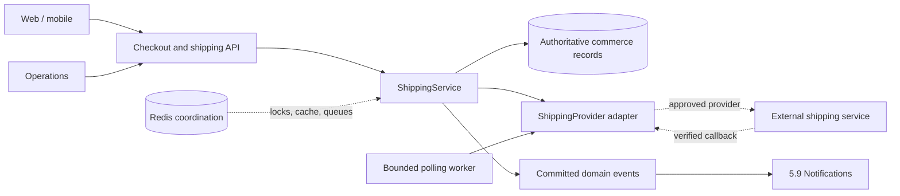
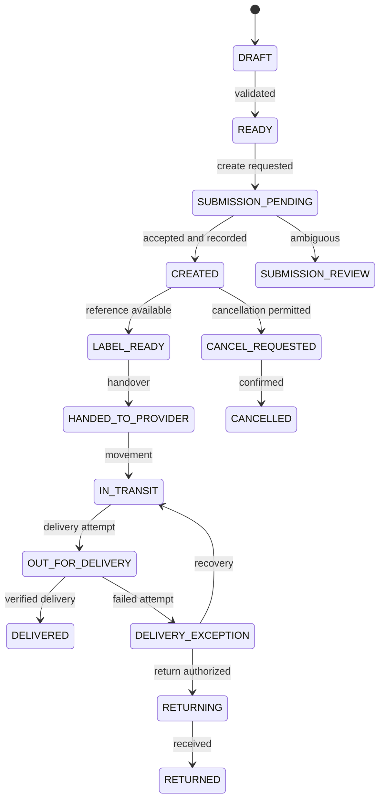
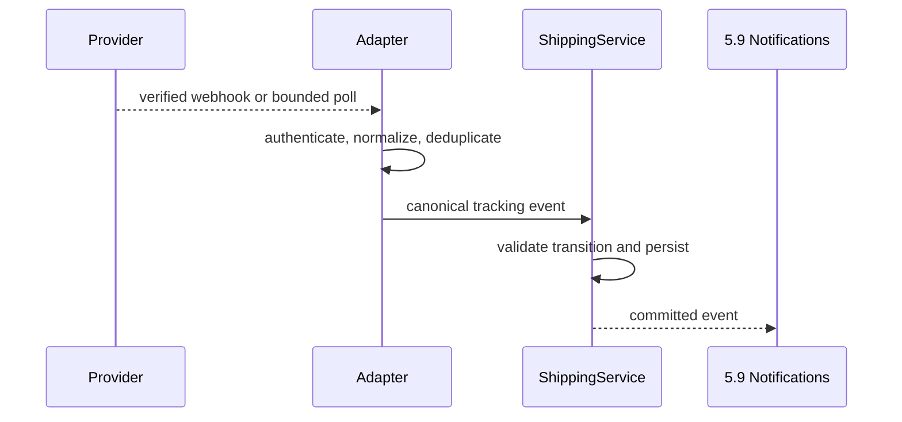

# 5.11 Shipping Architecture

| Attribute | Value |
|---|---|
| Document ID | FANNAN-SYS-ARCH-5.11 |
| Status | Proposed Phase 3 architecture baseline |
| Scope | Shipping rates, fulfillment, shipments, tracking, delivery exceptions, returns, and provider integrations |
| Authority | Architecture direction only; Section 04, API, data, compliance, and provider contracts remain required before implementation |

> **Source-of-truth and stack note.** `02_PRODUCT_REQUIREMENTS/3.14 Shipping.md` is the product behavior baseline, with checkout, payments, offers, and notifications contributing related behavior. Section 04, architecture files `5.0`–`5.4`, and PRD `3.18` are absent. Section 04 remains authoritative when available; this document must be reconciled with it rather than silently inventing entities or schema. The PRDs describe Laravel, Next.js, and Flutter, while the Phase 3 architecture direction in `5.5`–`5.10` provisionally uses NestJS, React Native, Expo, PostgreSQL, Redis, and AWS. This conflict requires an approved technology ADR.

## 1 Purpose

Define a provider-neutral shipping architecture that makes delivery eligibility, rates, fulfillment, tracking, exceptions, and returns predictable while protecting customer and artist addresses. It preserves COD behavior and keeps shipping execution separate from commercial order and payment truth.

## 2 Scope

This document covers local shipping zones and rates, checkout estimates, address snapshots, fulfillment work, shipment creation, tracking synchronization, delivery outcomes, cancellation and returns, provider adapters, notifications through 5.9, security, auditability, and failure recovery. International shipping is future and policy-gated.

## 3 Architectural Context

Shipping sits between checkout/order, inventory and packaging authority, payment policy, notifications, operations, and optional external providers. Durable domain records are authoritative; queues, caches, polling, webhooks, and notifications coordinate work but do not define shipment truth.

| Gap or conflict | Required resolution |
|---|---|
| Section 04 is absent | Publish and approve authoritative order, address, fulfillment, shipment, API, and data contracts |
| `5.0`–`5.4` are absent | Reconcile platform, deployment, and cross-cutting assumptions |
| PRD `3.18` is absent | Confirm its successor or add an addendum |
| PRDs name Laravel/Next.js/Flutter | Approve a technology ADR before implementation |
| 5.5–5.10 provisionally name NestJS/React Native/Expo | Treat that direction as provisional until the ADR is approved |

## 4 Responsibilities

- `ShippingService` owns shipping policy, zone/rate selection, estimates, canonical shipment states, order/fulfillment relationships, address authorization, idempotency, and shipping events.
- A `ShippingProvider` adapter translates approved provider capabilities, responses, and callbacks into canonical shipping data.
- Shipping records the selected service, rate, destination snapshot, package facts, tracking evidence, and audit history.
- Fulfillment prepares authorized order-item quantities and may produce multiple shipments.
- Shipping publishes committed events to 5.9 and exposes safe customer and operations projections.
- COD-aware dispatch may proceed while payment is `PENDING_COLLECTION`; shipment creation must not require `PAID` merely because a parcel is being created.

## 5 Non-Responsibilities

Shipping does not own catalog pricing, inventory authority, order commercial acceptance, payment collection or refund execution, offer negotiation, authentication, notification delivery, or provider credentials. It consumes approved contracts from those domains and emits delivery facts without redefining them.

## 6 Related Product Requirements

`3.14 Shipping` requires providers, zones, rates, estimates, fulfillment, tracking, delivery status, returns, packaging, notifications, accessibility, and future international shipping. `3.12 Checkout` requires address and shipping selection, revalidation, correct totals, and recovery. `3.13 Payments` and `5.10 Payment` define payment states and COD as pending collection rather than online payment. `3.17 Negotiation & Offers` carries an accepted price into checkout without changing shipping policy. `3.10 Notifications` and `5.9 Notifications` govern localized, preference-aware shipping updates.

## 7 Related Domain Entities

Expected conceptual entities are Customer/User, Artist, Address, Address Snapshot, Order, Order Item, Fulfillment, Shipment, Shipment Item, Shipping Service, Shipping Rate Quote, Shipping Zone, Package/Parcel, Tracking Event, Delivery Attempt, Return/Exchange Case, Provider Reference, Idempotency Record, and Audit Record. Exact names, fields, keys, ownership, retention, and relationships remain unresolved until Section 04; no schema is invented here.

## 8 Shipping Architecture

`ShippingService` owns business policy and canonical state. `ShippingProvider` is a provider-neutral boundary for quote, create, cancel, tracking, and optional return capabilities. No carrier, endpoint, credential, label format, or provider API is selected by this architecture.

## 9 Order ↔ Shipment Relationship

An **Order** is the accepted purchase snapshot, including any locked negotiated price. A **Fulfillment** is internal preparation for order items. A **Shipment** is a physical fulfillment unit containing one or more quantities from one fulfillment and one order. One order may have multiple fulfillments and shipments; a shipment may not contain items from unrelated orders. Shipment stores service, destination snapshot, package, rate, tracking reference, and lifecycle evidence.

Shipping state is not inferred from payment state. An order may be commercially confirmed while fulfillment is preparing, and COD may permit dispatch while payment remains `PENDING_COLLECTION`. Partial shipment, inventory reservation, and split-package aggregation remain Section 04/open-policy decisions.

## 10 Fulfillment Lifecycle

1. Validate the order, address, destination eligibility, payment policy, and order-item quantities.
2. Reserve or confirm items through the inventory authority and resolve packaging constraints.
3. Select an eligible service and rate snapshot; revalidate it before commitment.
4. Create one or more shipment intents for permitted quantities.
5. Prepare and hand over the package through an approved provider or internal delivery process.
6. Record blockers such as unavailable items, unsafe packaging, address correction, or operational review.

Fulfillment is idempotent and item-quantity aware. It must not mark an item shipped because a label or provider request was merely accepted, and aggregate shipped/delivered quantities cannot exceed order quantities.

## 11 Shipment Lifecycle

A shipment command rechecks current order, fulfillment, address, service, rate, and COD policy; persists intent before external work; verifies provider response; commits the canonical reference and event; and leaves ambiguous results pending for reconciliation. `DELIVERED` requires an approved signal or authorized operational evidence.

## 12 Shipment States

| State | Meaning |
|---|---|
| `DRAFT` / `READY` | Intent exists / validation passed |
| `SUBMISSION_PENDING` / `SUBMISSION_REVIEW` | External creation is active, ambiguous, or requires review |
| `CREATED` / `LABEL_READY` | Reference recorded / handover material available |
| `HANDED_TO_PROVIDER` / `IN_TRANSIT` | Accepted for movement / moving toward destination |
| `OUT_FOR_DELIVERY` / `DELIVERED` | Delivery attempt active / delivery evidence recorded |
| `DELIVERY_EXCEPTION` | Delay, failed attempt, damage, loss, or address issue |
| `RETURNING` / `RETURNED` | Authorized return in transit / return received |
| `CANCEL_REQUESTED` / `CANCELLED` | Cancellation awaiting confirmation / shipment will not proceed |

Unknown provider statuses map to `UNMAPPED` and review rather than silently changing state. Terminal states, reversals, and order-level aggregation require Section 04.

## 13 Shipping Addresses

Addresses are user-controlled data with ownership, validation status, locale, and lifecycle controls. Checkout takes an authorized address snapshot attached to the order and shipment; later profile edits cannot silently rewrite a committed destination. Guests receive a bounded verified lookup path and do not gain an address book by implication.

Only minimum required recipient and destination data crosses the provider boundary. Customer-facing views mask details where possible; artist, support, operations, and provider access is role- and task-scoped. Exact fields, residency, retention, deletion exceptions, and address correction policy require Section 04/privacy approval.

## 14 Shipping Provider Abstraction

The interface is capability-based and provider-neutral:

| Capability | Canonical responsibility |
|---|---|
| Quote | Return eligible service, rate, currency, expiry, and estimate |
| Create/cancel | Create or cancel a shipment using an idempotency key |
| Tracking | Retrieve normalized tracking events and current status |
| Webhook verification | Authenticate and normalize callbacks |
| Label/reference | Return approved reference metadata |
| Returns | Optional; unsupported capability is explicit |

Adapters map provider-specific names and payloads to canonical values. They never decide order authorization, payment policy, or customer visibility.

## 15 Provider Integration

Provider responses are untrusted input. Validate signatures where available, constrain payloads, normalize timestamps and statuses, redact secrets, preserve raw evidence only under approved retention, and reject mismatched references or invalid transitions. Provider credentials, geography, SLAs, data residency, commercial terms, and due diligence require separate approval. No carrier is invented or selected in this document.

## 16 Shipment Creation

MVP rate calculation uses policy-controlled local zones and rates. A quote contains service identity, currency, exact amount, package assumptions, expiry, and an estimate range/date with timezone and calculation time. Inputs may include destination, weight/dimensions, item constraints, order value, COD eligibility, and approved service rules; client-supplied totals and provider credentials are never trusted.

Checkout revalidates an expiring quote before commitment, and shipment creation revalidates selected service/rate policy again. Expired, unavailable, or materially changed quotes require a new selection. Tax, insurance, duties, packaging surcharges, and free-shipping policy remain open source-of-truth decisions.

## 17 Tracking

Tracking reads canonical shipment state and a normalised event history, retaining provider references, timestamps, last-updated time, delivery attempts, exceptions, and evidence. Customer views show safe canonical statuses, not raw unverified claims. Status projections distinguish partial, delayed, refused, lost, damaged, and returned outcomes; an order with multiple shipments is delivered only under an explicit aggregation policy.

## 18 Webhooks / Polling / Synchronization

Use verified webhooks when available and bounded polling as recovery. Deduplicate by provider event identifier or stable fingerprint; retain late, duplicate, contradictory, and unknown events for reconciliation. Synchronization must expose lag and last successful poll, respect provider limits, and never let notifications determine shipment truth.

## 19 Idempotency & Concurrency

Create, cancel, return, rate selection, webhook ingestion, polling updates, and operational commands require scoped idempotency keys or provider-event identifiers. Store request fingerprint, result/status, and correlation ID. Identical replays return the prior outcome; conflicting payloads are rejected for review.

Use database constraints and transactional compare-and-set state transitions. Redis may provide locks, queues, and cache under 5.9, but correctness must survive lock expiry or Redis loss. Concurrent checkout, address edits, shipment creation, callbacks, cancellation, and operations actions must not create duplicate authoritative shipments or regress state.

## 20 Failure Handling & Retries

Classify failures as validation/policy, authorization/privacy, transient network/provider, permanent provider rejection, ambiguous external outcome, or internal persistence failure. Do not retry validation or privacy failures. Use bounded exponential backoff with jitter for transient failures; leave ambiguous outcomes pending for idempotent reconciliation; make permanent failures actionable and auditable. Provider outages must not block browsing or imply delivery success.

## 21 Cancellation & Returns

Cancellation is a policy decision based on shipment state, fulfillment progress, payment method, and customer/artist rights. A cancellation request is separate from its terminal result and may require provider confirmation; history is never erased. Returns and exchanges are explicit cases linked to order items and shipment evidence, recording eligibility, authorization, movement, receipt/inspection, replacement or restocking, and financial handoff to 5.10. COD refunds require an approved cash/refund channel.

## 22 Payment Integration

Shipping consumes payment policy from 5.10 and does not duplicate payment logic. Prepaid dispatch follows the approved payment state. COD `PENDING_COLLECTION` may permit shipment creation and handover when geography, value, risk, and fulfillment policy allow it; shipping must not require `PAID`. Tracking alone never marks payment collected. COD collection, refusal, delivery evidence, and post-delivery payment updates are payment-relevant events for 5.10.

## 23 Notifications Integration

After an authoritative commit, publish versioned events such as `shipment.created`, `shipment.in_transit`, `shipment.out_for_delivery`, `shipment.delivered`, `shipment.delivery_exception`, `shipment.returning`, `shipment.returned`, `shipment.cancelled`, and `shipment.estimate_changed` to 5.9. That module resolves recipient, role, locale, preferences, quiet hours, channel, retry, and safe template. Notifications omit full addresses, secrets, and unverified claims; notification failure never rolls back shipping state.

## 24 Security & Privacy

Apply 5.5 RBAC and resource policies: customers see only their own records, artists see permitted fulfillment information, and staff access is scoped and audited. Protect provider callbacks with authentication, replay protection, payload limits, reference validation, and transition validation. Keep credentials out of source control, client payloads, labels, logs, and support screens. Use TLS, encryption at rest, least privilege, rate limits, redaction, retention, deletion, and approved address-export controls.

## 25 Performance & Scalability

Quote responses for common local zones should meet an agreed interactive target; shipment commands return durable pending/accepted results without waiting for tracking; tracking reads use bounded pagination and non-authoritative caching. Workers bound polling, webhook processing, retries, payload sizes, and notification fan-out. Capacity tests cover provider outages, bursts, and multi-shipment orders. PostgreSQL remains authoritative; Redis is coordination only.

## 26 Observability & Auditability

Every command, transition, callback, retry, override, and external reference carries correlation and actor/context data. Audit immutable before/after state, reason, authorization, idempotency key, provider evidence, and address-access decisions. Measure quote latency/expiry, creation latency, provider errors, synchronization lag, queue age, stale tracking, duplicate/replay count, exception age, return backlog, and access denials. Alert on stuck pending states and reconciliation mismatches.

## 27 MVP Scope

MVP includes local zones and policy-controlled rates, address snapshots and privacy controls, transparent estimates, provider-neutral adapters only after provider approval, fulfillment and shipment states, approved webhook/polling tracking, COD-aware dispatch, delivery exceptions, cancellation/return placeholders, 5.9 notifications, idempotency, auditability, Arabic/English-ready status keys, and operations visibility.

MVP gates are approved Section 04 contracts, the stack ADR, address/privacy policy, inventory and packaging authority, zone/rate rules, COD geography and limits, provider due diligence, synchronization targets, and cancellation/return/refund policy.

## 28 Future Extensions

Possible extensions include multiple-provider routing/failover, international shipping, customs/duties, insurance, pickup points, scheduled delivery, parcel optimization, automated return labels, richer delivery proof, carrier performance scoring, and dedicated event infrastructure. Each requires product requirements, compliance/privacy review, provider approval, and compatible canonical contracts.

## 29 Alternatives Considered

- Direct carrier calls from checkout were rejected because they couple policy and credentials to clients and make retries unsafe.
- A single order delivery status was rejected because it cannot represent split shipments, partial delivery, exceptions, or returns.
- Webhooks-only synchronization was rejected because callbacks can be missing; polling-only was rejected because it increases cost and staleness.
- Requiring `PAID` before every dispatch was rejected because it breaks approved COD behavior.
- Inventing a carrier integration was rejected because no provider contract has been approved.

## 30 Tradeoffs

| Decision | Benefit | Cost |
|---|---|---|
| `ShippingService` plus `ShippingProvider` adapters | Provider neutrality and canonical policy | Mapping and adapter-test overhead |
| Transactional records plus event history | Durable, auditable authority | Reconciliation and storage work |
| Verified callbacks plus bounded polling | Recovery from missing callbacks | Rate-limit and synchronization complexity |
| Separate fulfillment and shipment records | Split shipments, COD, returns, exceptions | More entities and operational states |
| Expiring quotes and committed snapshots | Explainable checkout totals | Revalidation is required |
| Local MVP zones/rates | Smaller launch scope | Defers international capability |

## 31 Dependencies

Dependencies include `3.14 Shipping`, `3.12 Checkout`, `3.13 Payments`, `3.17 Negotiation & Offers`, `3.10 Notifications`, 5.5 Authentication & Authorization, 5.6 Media & Storage for labels/documents, 5.7 Internationalization, 5.9 Notifications, 5.10 Payment, inventory/order/return authorities, PostgreSQL/Redis direction, approved provider contracts, and missing Section 04 and `5.0`–`5.4` decisions.

## 32 Consistency & Open Issues

This document is consistent with the provider-neutral `ShippingService`/`ShippingProvider` boundary, local MVP zones/rates, COD-aware dispatch without a `PAID` prerequisite, address minimization, tracking synchronization, retries, idempotency, and 5.9 notifications. Open issues are the missing Section 04, `5.0`–`5.4`, and `3.18`; Laravel/Flutter versus NestJS/React Native/Expo stack gaps; exact schema/API; inventory and packaging authority; rate/tax/insurance policy; partial-shipment aggregation; address retention/residency; provider selection; and cancellation/return/refund rules.

## 33 Traceability

| Architecture concern | Source |
|---|---|
| Providers, rates, zones, estimates, fulfillment, tracking, returns, notifications, accessibility, international future | `02_PRODUCT_REQUIREMENTS/3.14 Shipping.md` |
| Address selection, revalidation, totals, confirmation, recovery | `02_PRODUCT_REQUIREMENTS/3.12 Checkout.md` |
| COD, payment states, cancellation/refund, payment/fulfillment separation | `02_PRODUCT_REQUIREMENTS/3.13 Payments.md`; `05_SYSTEM_ARCHITECTURE/5.10 Payment.md` |
| Negotiated price carried into checkout/order | `02_PRODUCT_REQUIREMENTS/3.17 Negotiation & Offers.md` |
| Shipping event recipients, localization, preferences, retries, audit | `02_PRODUCT_REQUIREMENTS/3.10 Notifications.md`; `05_SYSTEM_ARCHITECTURE/5.9 Notifications.md` |
| Authorization, privacy, storage, localization, and platform direction | `05_SYSTEM_ARCHITECTURE/5.5`–`5.10` |
| Missing authoritative data model, API, platform, and later requirements | Section 04, `5.0`–`5.4`, and PRD `3.18` — absent; reconcile when supplied |
