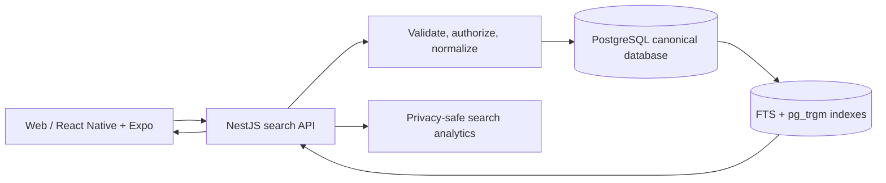

# 5.8 Search Architecture

| Attribute | Value |
|---|---|
| Document ID | FANNAN-SYS-ARCH-5.8 |
| Status | Phase 3 architecture baseline |
| Scope | Public discovery, authenticated search, artist catalogue search, and operational search |

> **Source-of-truth note.** `02_PRODUCT_REQUIREMENTS/3.11 Search.md` is present and defines bilingual discovery, filters, relevance, pagination, and role visibility. Section 04, Section 05, and `3.18` are absent, so no index schema or search vendor is an existing repository decision.

## 1. Goals and boundaries

Search must make published artwork and artists discoverable in Arabic and English, support keyword search, category/medium/artist/price filters and sorting, return accessible empty/error states, and respect publication, ownership, and role visibility. Search is read-optimized and must never become the authority for price, stock, order, or permission decisions.

MVP covers catalogue/artist indexes, Arabic normalization, bilingual fields, faceting, bounded pagination, relevance and deterministic tie-breaks, safe query handling, indexing retries, and basic search analytics. AI recommendations, semantic/vector search, personalized ranking, typo learning, and cross-domain global search are future scope.

## 2. Logical architecture

The transactional database remains the source of truth and the MVP search index. The API applies visibility and field-level policy before returning results. PostgreSQL generated/search-vector columns and trigram indexes are maintained with the relevant domain writes or a bounded maintenance job; they are never a second business authority. If search is temporarily unavailable, show a bounded error state rather than exposing an unbounded fallback query.

## 3. Index and query behavior

Index published artists and artwork with opaque IDs, searchable title/description/tags/material/medium/category/artist terms, locale variants, normalized facetable values, price range, availability, publication timestamp, and a version/update sequence. Never index private notes, support data, credentials, unpublished drafts, or unauthorized customer data. PostgreSQL full-text search handles tokenized English and Arabic text where configured; `pg_trgm` supports prefix, partial, and typo-tolerant matching within bounded query limits.

Arabic processing must be specified and tested: Unicode normalization, diacritics handling, common character variants, tokenization, Arabic/English analyzers, synonyms, and optional transliteration. Preserve original display text; normalization affects matching, not rendering. Use language-aware analyzers and bilingual query expansion only when approved, with explainable behavior.

Query parsing validates length, operators, wildcard/regex behavior, sort allowlists, page size, and filter types. Use cursor/search-after pagination where supported and a stable tie-break (score, then approved recency/ID). Return total-count semantics explicitly because approximate counts may be used at scale. Highlighting must escape output and preserve bidi readability.

Relevance priority starts with exact title/artist/category matches, then field-weighted prefix/text matches, approved synonyms, availability and quality signals, and deterministic recency tie-breaks. Business promotion must be explicit, auditable, time-bounded, and never hide safety/moderation constraints. Search analytics record aggregate query, locale, filters, result count, latency, and outcome without raw sensitive input where possible; rate-limit and redact abusive or personal queries.

## 4. Index lifecycle and resilience

Create and deploy database indexes through the normal schema-change process. Publication, unpublication, edits, and deletion update the searchable representation as part of the authoritative write path or a bounded, observable maintenance job. Periodically reconcile searchable rows against publication state. Monitor latency, error rate, zero-result rate by locale, maintenance lag, rejected queries, and relevance signals.

## 5. Architecture decisions

### ADR-5.8-01 — PostgreSQL search for MVP

**Status:** Proposed. **Decision:** use PostgreSQL full-text search plus `pg_trgm` for MVP. **Rationale:** it satisfies the documented catalogue scope with lower operational complexity, keeps search close to the canonical visibility rules, and avoids introducing a search cluster before scale or relevance evidence justifies it. **Rejected:** unbounded `LIKE` scans and a dedicated search engine without measured need.

### ADR-5.8-02 — Visibility-first indexing and authorization

**Status:** Proposed. **Decision:** index only eligible public/role-scoped fields and re-check authoritative visibility/policy at the API boundary. **Rationale:** prevents stale indexes from becoming a data leak. **Consequence:** deletion/unpublish propagation and reconciliation are release gates.

### ADR-5.8-03 — Dedicated engine only after evidence

**Status:** Future trigger. **Decision:** evaluate a dedicated search engine only when catalog scale, query latency, faceting, Arabic linguistic requirements, or relevance experiments exceed PostgreSQL’s measured capability. **Rationale:** preserves MVP simplicity while defining a clear migration boundary. **Consequence:** the search application boundary and indexed-field contract must remain portable.

## 6. Responsibility matrix

| Concern | Product/Content | API team | Data/Platform | Client teams | QA/Operations |
|---|---|---|---|---|---|
| Search scope, ranking policy, promotions | A/R | C | C | C | C |
| Canonical publication and visibility | A | R | C | I | C |
| Index mapping/analyzers/rebuilds | C | C | R | I | A |
| Query validation and authorization | A | R | C | C | C |
| UI filters, pagination, empty states | C | C | C | R | A |
| Arabic relevance and accessibility | A/R | C | C | R | R |
| Monitoring, replay, incident response | I | C | R | I | A/R |

## 7. MVP versus future

| MVP | Future / explicitly deferred |
|---|---|
| PostgreSQL full-text search plus `pg_trgm` for artwork/artist keyword search in Arabic and English | Dedicated search engine after measured scale or relevance evidence |
| Category, medium, artist, price, availability filters | Personalized ranking and recommendations |
| Facets, bounded pagination, safe sorting, and deterministic ranking | Vector/semantic search, learning-to-rank, and advanced typo learning |
| Database indexes, bounded maintenance, and reconciliation | Cross-domain global search and vendor-specific analyzers |

## 8. Open gaps and acceptance gates

Define PostgreSQL text-search configuration, ranking weights, synonym governance, measurable staleness expectations, privacy policy for analytics, and fallback behavior. Resolve whether NestJS is the API authority versus the PRD's Laravel contract. Before implementation, test Arabic/English relevance, RTL highlighting, authorization leakage, unpublish/delete propagation, abuse limits, maintenance recovery, and performance against the NFR targets. Reassess a dedicated engine only after those measurements are available.
