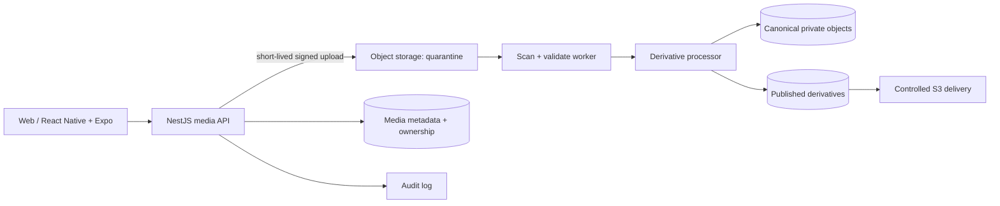
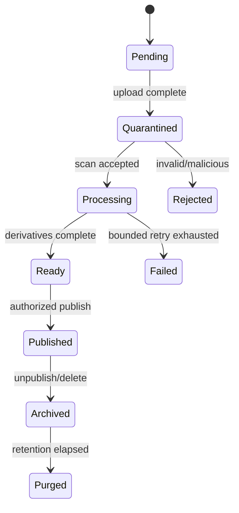

# 5.6 Media & Storage Architecture

| Attribute | Value |
|---|---|
| Document ID | FANNAN-SYS-ARCH-5.6 |
| Status | Phase 3 architecture baseline |
| Scope | Artwork, avatar, portfolio, document, and derived media |

> **Source-of-truth note.** Only Sections 00–02 are present. Section 04 (database), Section 05 (architecture), and `3.18` are missing. Storage names and schemas below are decisions to validate, not existing infrastructure.

## 1. Goals and boundaries

The design must provide durable, private-by-default ingestion; responsive delivery for public artwork; safe moderation; deterministic derivatives; lifecycle/retention controls; and accessibility metadata. It must not become a document database or permit clients to write arbitrary object keys.

MVP supports images for profiles and published artwork, private upload staging, virus/content checks, metadata extraction, resizing/format derivatives, controlled S3 delivery, moderation states, deletion/retention requests, and auditability. Video, audio, 3D/AR, originals for digital downloads, and advanced transformation pipelines are future scope.

## 2. Logical topology

The API owns authorization, media records, object-key issuance, publication state, and deletion. Object storage owns bytes; delivery and browser caching never make authorization decisions. Workers are idempotent and do not mutate commerce state directly.

## 3. Ingestion and publication

1. Authenticated user requests an upload slot for an authorized resource and declares a constrained media purpose.
2. API validates role, ownership, quota, declared type/size, and creates a pending media record with an opaque key.
3. Client uploads directly to quarantine with a short-lived signed URL; the API never trusts client MIME/filename.
4. Worker verifies magic bytes, decodes safely, strips unsafe metadata, scans malware, enforces pixel/dimension limits, and records failure without publishing.
5. Approved content generates bounded derivatives (thumbnail, card, detail, and accessible original policy as applicable). Originals remain private.
6. A separate authorized publish action changes visibility. Only published, approved derivatives receive public delivery URLs.
7. Failed, abandoned, rejected, or deleted objects are cleaned by lifecycle jobs, with retention exceptions recorded.

## 4. Security, privacy, and resilience

Use private buckets, encryption at rest, TLS, least-privilege service identities, object-key nonces, signed URLs with short expiry, and separate quarantine/canonical/public prefixes or buckets. Do not derive authorization from a filename or URL. Validate decompression/pixel bombs, SVG/script content, EXIF location, malformed images, and archive/polyglot payloads. Apply per-user and per-role quotas, request/body limits, rate limits, and cost alerts.

Never expose private commissions, support documents, or unapproved originals through public delivery. Cache keys must not contain access tokens or personal data. Deletion invalidates metadata access and queues object purge; legal/commerce retention is explicit. Backups are encrypted, access-controlled, tested for restore, and subject to documented retention.

Operational metrics include upload success/failure, scan latency, processing retries, queue age, storage growth, delivery/error rate, orphan objects, and deletion completion. A failed media dependency must not take down browsing, authentication, or checkout.

## 5. Architecture decisions

### ADR-5.6-01 — Object storage and metadata in the transactional store

**Status:** Proposed. **Decision:** store bytes in AWS S3 and ownership/state/derivative metadata in the canonical transactional database; deliver MVP public derivatives through controlled S3 delivery with normal browser caching. **Rationale:** satisfies MVP needs without adding a CDN dependency. **Rejected:** database blobs and client-direct unrestricted bucket access. A CDN remains a future optimization if measured traffic, latency, or egress cost justifies it.

### ADR-5.6-02 — Quarantine before publication

**Status:** Proposed. **Decision:** no upload is public until validation, scanning, processing, and an authorized publish transition succeed. **Rationale:** protects users and moderators from active content and unsafe files.

## 6. Responsibility matrix

| Concern | Product/Security | API team | Worker/Platform | Client teams | Operations |
|---|---|---|---|---|---|
| Allowed media policy and quotas | A/R | C | C | I | C |
| Upload authorization and records | A | R | C | C | I |
| Scan and derivative pipeline | C | C | R | I | A |
| S3/bucket IAM and lifecycle | A | C | R | I | R |
| Alt text and moderation state | A/R | R | C | C | R |
| Restore, purge, incident response | A | C | R | I | R |

## 7. MVP versus future

| MVP | Future / explicitly deferred |
|---|---|
| JPEG/PNG/WebP/AVIF derivatives, avatars and artwork | Video/audio, 3D, AR previews, live streaming |
| Quarantine, scan, metadata stripping, moderation | Automated semantic moderation and rights registry |
| Signed uploads/downloads and controlled S3 public derivatives | CDN optimization, resumable multi-part large media, and edge transforms |
| Quotas, lifecycle, audit, backup/restore runbook | Digital-download licensing and watermark marketplace |

## 8. Open gaps and acceptance gates

Choose the object-storage/CDN vendors, exact limits, malware/content scanning service, transformation library, residency requirements, retention schedule, backup RPO/RTO, copyright/takedown policy, and whether originals are downloadable. Validate EXIF/privacy handling, signed URL expiry, orphan cleanup, restore drills, and authorization tests before implementation.
