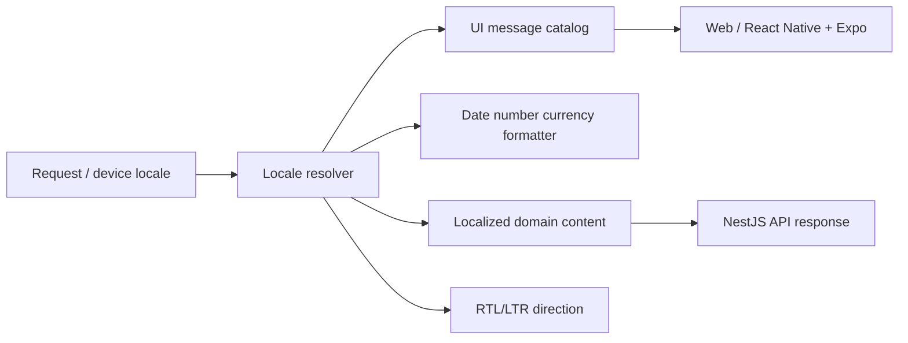

# 5.7 Internationalization Architecture

| Attribute | Value |
|---|---|
| Document ID | FANNAN-SYS-ARCH-5.7 |
| Status | Phase 3 architecture baseline |
| Launch locales | Arabic (`ar`) and English (`en`) |
| Scope | Web, React Native/Expo, dashboards, API messages, search, notifications, and content |

> **Source-of-truth note.** Existing PRDs require Arabic/English, RTL/LTR, and bilingual-ready behavior, but the repository has no Section 05 or `3.18` architecture source. Existing documents refer to Flutter/Next.js; Phase 3 establishes React Native/Expo and NestJS. This document records the conflict rather than silently replacing the PRD.

## 1. Goals and boundaries

Locale choice changes language, direction, typography, dates, numbers, currency presentation, accessibility labels, notification templates, and search behavior without changing business meaning. MVP ships an Arabic and English interface, locale negotiation and persistence, RTL-safe layouts, translated system copy, locale-aware formatting, bilingual catalog/search fields where available, and fallback telemetry.

MVP does not require a full multi-language editorial CMS, machine translation, per-field translation workflows, or every future locale. Product-owned artist content may be entered in one language and displayed with an explicit missing-translation state; it must not be silently machine-translated.

## 2. Resolution and data model

Locale precedence is explicit user preference, authenticated profile preference, supported device/browser locale, then `en` fallback. Persist only supported canonical locale tags. Store timestamps in UTC and format at presentation time. Store money as exact values/currency codes and format with locale rules; never localize stored numeric values.

Translation keys are versioned source resources, namespaced by domain, with plural/select variants and translator context. User-generated text is stored as content, not translated UI strings. Where bilingual catalog fields are required, keep language variants linked to one domain object and preserve editorial review status.

The API returns stable error codes and structured parameters; clients translate display messages. Notifications render approved server templates in the recipient locale with a safe fallback. Logs and audit events retain machine-stable codes plus locale context, not translated prose as the only record.

## 3. RTL, accessibility, and quality

Use logical CSS properties and direction-aware component primitives. Mirror directional icons and navigation affordances where meaning is directional; do not mirror logos, numerals, media, or culturally meaningful artwork. Mixed Arabic/English titles, prices, dimensions, and IDs require bidi isolation and tested reading order. Arabic typography must use approved brand-compatible fonts with fallback coverage.

Keyboard order, focus, screen-reader labels, truncation, forms, validation, charts, and notifications must work in both directions at 200%/400% zoom and mobile text scaling. Translation overflow is expected; components must not depend on English string lengths. Pseudo-localization, missing-key detection, screenshot review, and native-speaker QA are release checks.

## 4. Security and privacy

Locale and translation preferences are personal data and must follow the same access, retention, and deletion rules as profile data. Do not place private user content, addresses, tokens, or support details in translation keys, analytics labels, URLs, or fallback logs. Translation tooling receives the minimum approved content, with access control and auditability; external machine translation is disabled unless a privacy and quality review explicitly approves it. Escape interpolated values and keep localized error messages from revealing account existence or authorization details.

## 5. Architecture decisions

### ADR-5.7-01 — Stable keys with client presentation and API error codes

**Status:** Proposed. **Decision:** UI clients own presentation catalogs; the API exposes stable error/event codes and validated parameters. **Rationale:** supports independent releases and consistent behavior across web/native clients. **Rejected:** server-rendered prose as a client contract and hard-coded strings.

### ADR-5.7-02 — Explicit locale, direction, and content fallback

**Status:** Proposed. **Decision:** resolve locale deterministically and expose translation/content fallback state. **Rationale:** avoids accidental language mixing and makes missing translations measurable. **Rejected:** silent machine translation or implicit LTR assumptions.

## 6. Responsibility matrix

| Concern | Product/Content | Design | API team | Client teams | QA/Accessibility |
|---|---|---|---|---|---|
| Supported locales and terminology | A/R | C | C | C | C |
| Translation source catalogs | A/R | C | I | R | C |
| Locale negotiation/profile preference | A | R | R | R | C |
| Domain content translation status | A/R | C | R | C | C |
| RTL components and typography | C | A/R | I | R | R |
| Formatting, errors, notifications | A | C | R | R | R |
| Native-speaker and a11y release gate | A | C | C | C | R |

## 7. MVP versus future

| MVP | Future / explicitly deferred |
|---|---|
| Arabic/English UI, locale persistence and fallback | Additional locales and regional variants |
| RTL/LTR-safe responsive web and native UI | Full editorial translation CMS |
| Localized dates, numbers, currency, validation, notifications | Machine translation with human review |
| Bilingual-ready catalog/search fields and QA | Per-artist language publishing workflow |

## 8. Open gaps and acceptance gates

Confirm canonical locale tags, default language, supported currencies, translation ownership/tooling, Arabic font decision, plural rules, content translation policy, and notification template governance. Resolve Flutter/Next.js versus React Native/Expo ownership before client implementation. Release requires zero missing critical keys, RTL visual and assistive-technology checks, bidi tests, and verified fallback telemetry.
