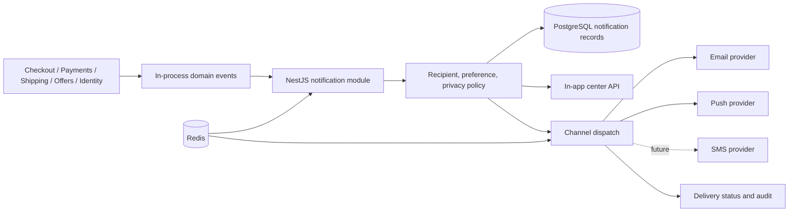
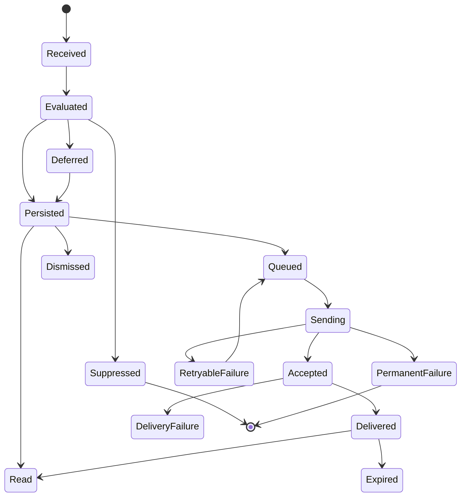

# 5.9 Notifications Architecture

| Attribute | Value |
|---|---|
| Document ID | FANNAN-SYS-ARCH-5.9 |
| Status | Phase 3 architecture baseline |
| Scope | In-app notification center, email, push, future SMS, preferences, delivery operations, and notification audit |
| Authority | Architecture direction only; approved API, data, security, and provider contracts remain required before implementation |

> **Source-of-truth note.** `02_PRODUCT_REQUIREMENTS/3.10 Notifications.md` is the product behavior baseline. Section 04, Section 05 documents `5.0`–`5.4`, and `02_PRODUCT_REQUIREMENTS/3.18` are absent from this repository. The PRDs describe a Laravel REST API, Next.js, and Flutter, while the Phase 3 architecture direction in 5.5–5.8 uses NestJS, React Native, and Expo. This document records that conflict and does not silently amend earlier documents. The MVP mechanism below is an internal NestJS modular-monolith mechanism, not a commitment to Kafka or RabbitMQ.

## 1. Goals and boundaries

Notifications turn approved business and operational events into role-aware, localized communications. The architecture provides durable in-app history, extensible outbound channels, preference and quiet-hour enforcement, delivery status, privacy controls, and operational traceability.

Notifications are not the authority for orders, payments, shipping, offers, identity, permissions, or analytics. They do not invent or mutate those domain states, authorize an action, replace an API response, or guarantee that an external provider delivered a message. A linked action must re-check authorization and current state at the destination.

## 2. Source-of-truth gaps and technology conflict

| Gap | Consequence | Required resolution |
|---|---|---|
| Section 04 is absent | No approved cross-cutting API/data/infrastructure contract is available | Publish and approve the missing section before implementation |
| Architecture files `5.0`–`5.4` are absent | Earlier platform and deployment decisions cannot be assumed | Reconcile this document with those decisions when created |
| PRD `3.18` is absent | No later requirements baseline can be traced | Confirm whether a successor or addendum exists |
| PRDs name Laravel/Flutter (and product vision names Next.js) | Existing product contracts may target a different stack | Approve a technology ADR; do not rewrite prior PRDs implicitly |
| 5.5–5.8 establish NestJS/React Native/Expo and PostgreSQL/Redis/AWS direction | This document follows Phase 3 direction provisionally | Treat it as proposed until the stack ADR is approved |

## 3. Logical architecture

The notification module is a bounded module inside the NestJS modular monolith. Domain modules publish typed internal events through an application event mechanism; notification handlers resolve recipients and create durable work. Redis may support transient scheduling, locks, rate limiting, and deduplication, while PostgreSQL remains the durable source of truth.

## 4. Responsibilities and non-responsibilities

| Responsibility | Notification module | Producing domain | Client | Operations |
|---|---|---|---|---|
| Define approved notification policy | R/C | A/R | C | C |
| Publish authoritative business event | I | A/R | I | I |
| Resolve eligible recipients and channels | A/R | C | I | C |
| Render approved localized content | R | C | C | C |
| Persist center item and delivery state | A/R | I | I | C |
| Enforce authorization at action destination | I | A/R | C | C |
| Monitor provider and replay failures | R | C | I | A/R |

The module must not calculate payment totals, change order or shipment state, expose hidden records, or treat a client acknowledgement as proof of delivery.

## 5. Recipients and audience resolution

Recipients are derived from the event and authoritative relationships: customer, artist, support/admin staff in an explicitly permitted operational scope, or a system-owned operational sink. Recipient resolution must validate account status, role, ownership, visibility, consent, and channel address/device availability at dispatch time.

Group or staff notifications use an approved audience rule rather than copying private data into an event. A deleted, blocked, inaccessible, or no-longer-related recipient is suppressed or receives a safe generic outcome. Guests may receive only approved order communications through a verified contact path; they do not receive an account notification center.

## 6. Notification categories

| Category | Examples | Typical recipients | Default handling |
|---|---|---|---|
| Account and security | Verification, sign-in risk, password/security change | Account holder | Security policy may require delivery; never include secrets |
| Order and checkout | Confirmation, failure, cancellation, status change | Customer, relevant artist | In-app plus approved transactional channel |
| Payment | Authorization, failure, refund, dispute/update | Customer, scoped operations | Minimal payment-safe wording |
| Shipping | Fulfilment, dispatch, tracking, delivery exception | Customer, artist/operations as allowed | Do not claim unconfirmed carrier state |
| Negotiation and offers | Offer received, accepted, rejected, expired, counter-offer | Customer and artist in the negotiation | Access follows negotiation relationship |
| Marketplace and catalogue | Approved/rejected listing, relevant platform action | Artist or staff | Avoid noisy promotional defaults |
| Support and operations | Case update, intervention, delivery failure | Case participants and scoped staff | Case authorization is mandatory |
| Product/marketing | Campaigns and recommendations | Opted-in audience | Deferred until explicit campaign and consent policy |

## 7. Event and trigger taxonomy

Events are stable, versioned, machine-readable facts such as `order.created`, `payment.failed`, `shipment.delayed`, `offer.received`, `offer.accepted`, `account.security_changed`, and `support.case_updated`. The exact catalogue is an implementation/API contract dependency and must be approved before coding.

Each event must identify its type and version, source domain, authoritative entity reference, occurred-at time, correlation/reference context, and enough non-sensitive relationship information for recipient policy. It must not carry credentials, full payment data, private notes, or unrestricted content. A trigger creates a notification only when a policy rule explicitly maps that event to a recipient, category, channel, priority, and action context.

## 8. Recipient and channel policy evaluation

Processing evaluates, in order: event validity; current entity visibility and relationship; recipient eligibility; category preference and consent; quiet hours and urgency; locale; channel address/device health; deduplication; rate limits; and safe template variables. A notification may be persisted as suppressed or deferred with a machine-readable reason. “Accepted for processing” is not “sent” or “delivered”.

Critical security or legally required messages may bypass category opt-out only where approved by policy. Quiet hours, provider failure, and preference changes must never change the authoritative business event.

## 9. Channel model

Channels share a common logical notification identity but have channel-specific rendering and delivery state.

| Channel | MVP position | Characteristics |
|---|---|---|
| In-app | Required | Durable center item, read/unread state, deep link to an authorized context |
| Email | Required/extensible | Durable asynchronous communication through an approved provider |
| Push | Required/extensible | Timely device alert; payload is minimal and safe if exposed on a lock screen |
| SMS | Future | Opt-in, region/compliance gated, short-form, provider contract required |

One event may create several channel attempts under one logical policy decision. Channel fallbacks are explicit policy, never an accidental duplicate send.

## 10. In-app notification center

The center is a queryable, role-scoped view of durable notification items. It supports unread/read, priority, created/updated time, category, dismissal/expiry, and a safe action reference. It must show accurate counts across sessions and remove stale unread indicators when an item expires or is withdrawn.

The center is not a copy of the source entity. On opening an item or deep link, the client calls the authoritative resource API; stale, deleted, or unauthorized targets produce a safe unavailable state. Pagination and bounded filters are required; clients must not infer business state from a notification alone.

## 11. Email delivery

Email uses approved templates, sender identities, locale fallback, and minimum necessary content. Account, transaction, and support messages are separated from promotional policy. Before dispatch, validate the address, recipient policy, template version, interpolation values, and safe subject/body rules. Record provider acceptance, bounce/complaint or failure outcomes, and retryability without storing unnecessary message content.

## 12. Push delivery

Push uses registered devices and current user/channel policy. Payloads should contain opaque notification/action references and non-sensitive short text; they must remain safe on a lock screen. Invalid or revoked device registrations are retired through a controlled path. Provider tokens, receipts, and failures are operational data with restricted access and retention.

## 13. SMS extension

SMS is explicitly future scope. It requires verified phone ownership, regional availability, explicit opt-in, sender/provider and compliance review, length validation, quiet-hour policy, and an approved fallback. It must not become a default account-recovery mechanism or disclose sensitive payment, identity, or operational data without a separate security decision.

## 14. Preferences, consent, and suppression

Preferences are category- and channel-aware, scoped to the authenticated account, and presented with clear transactional versus optional distinctions. Changes take effect for future dispatch decisions and are auditable. Unsubscribe or opt-out controls must be honored without requiring a notification to reveal private state. Channel availability, verified contact status, role eligibility, and legal requirements can further suppress delivery.

## 15. Quiet hours and scheduling

Users may define a timezone-aware quiet window. Non-urgent messages are deferred to the next permitted window or coalesced according to category policy; critical/security messages are exempt only when explicitly approved. A deferred notification retains its event time and records the scheduled-send decision. Re-evaluate preferences and authorization when releasing deferred work.

## 16. Localization and accessibility

Use 5.7-compatible stable machine-readable event/category/template keys, with Arabic (`ar`) and English (`en`) launch locales, explicit locale resolution, and an approved fallback. Clients own presentation catalogs where 5.7 requires it; the API and notification records retain stable keys and parameters rather than translated prose as the only truth.

Templates must support RTL/LTR, plural/select variants, bidi-safe identifiers and prices, accessible labels, readable contrast, text scaling, and channel length constraints. Never put private content, addresses, tokens, or secrets in translation keys or fallback logs. Missing translations are observable and use a reviewed safe fallback.

## 17. Notification lifecycle

Lifecycle states are operational facts, not business state. In-app persistence and channel delivery are separate transitions. A read action means the user/client acknowledged the center item, not that an email or push provider delivered it.

## 18. Retry and failure handling

Classify failures as validation/policy suppression, permanent address/template/provider rejection, or transient timeout/unavailability. Retry transient failures with bounded exponential backoff and jitter, a maximum attempt policy, and a dead-letter/review state. Do not retry invalid recipients, unauthorized targets, revoked devices, malformed templates, or explicit opt-outs.

The user-facing experience must never report success before durable acceptance. Support and operations can see safe failure reason, attempt count, correlation ID, and next action; ordinary users see actionable but non-sensitive status. Replay requires authorization, idempotency protection, and an audit record.

## 19. Idempotency and deduplication

The producing domain is responsible for publishing an event once as far as its transaction guarantees allow; notification processing must still tolerate duplicates. Derive a stable deduplication identity from event type/version, authoritative event or entity transition identity, recipient, category, and channel policy. Store or reserve it durably so retries and concurrent handlers cannot create duplicate work.

Deduplication must not merge genuinely distinct transitions. Coalescing (for example, repeated non-critical status changes) requires an explicit category rule and must preserve the latest truthful state. Redis locks may reduce races, but PostgreSQL is the durable authority for deduplication outcome.

## 20. Ordering and causality

Ordering is guaranteed only within a defined recipient/entity/category stream where the source event supplies a monotonic sequence or authoritative occurred-at plus deterministic tie-break. Cross-domain global ordering is not promised. The center uses server-created time, priority, and stable ID tie-breaks; channel delivery may arrive out of order.

When a newer event supersedes an older notification, mark the older item stale, coalesce it, or retain it according to category policy. Never infer causal order from provider delivery timestamps.

## 21. Security and authorization

The NestJS API enforces authentication, resource authorization, and field-level visibility at center reads, preference writes, action links, support views, and replay tools, consistent with 5.5. Client guards are not security controls. Default deny applies to recipient resolution, staff audiences, templates, operational status, and message variables.

Use TLS, managed secrets, strict validation, safe headers, and least-privilege service identities. Do not log tokens, credentials, raw provider secrets, full addresses, or sensitive payment data. Administrative template changes, preference overrides, recipient changes, replay, and delivery-status access require scoped permissions and audit.

## 22. Privacy and retention

Persist only the minimum event references, stable keys, status, timestamps, recipient/channel identifiers, and safe parameters needed for delivery and the center. Avoid duplicating source records. Encrypt data in transit and at rest according to platform policy; restrict provider payload access and redact operational logs.

Retention, deletion, anonymization, legal holds, and guest-contact handling must align with the missing data/privacy contracts. Account deletion must remove or anonymize notification data where lawful while preserving only required audit or financial evidence. Notification content must not be used as an analytics warehouse.

## 23. Rate limits and abuse controls

Apply per-recipient, category, channel, event source, provider, and operational replay limits. Use burst limits and quiet-hour coalescing for noisy events; protect preference and center endpoints with authenticated API limits and pagination bounds. Detect anomalous fan-out, template loops, repeated failures, and provider abuse. Rate limiting must fail closed for unsafe bulk sends and produce an operational signal.

## 24. Redis usage

Redis is an optimization and coordination component, not the notification source of truth. It may provide short-lived idempotency reservations, distributed locks, delayed-work hints, rate-limit counters, quiet-hour scheduling hints, and bounded coalescing state. Keys require TTLs, namespacing, and privacy-safe values.

On Redis loss, durable PostgreSQL records and an observable recovery/reconciliation process preserve correctness; the system may delay dispatch rather than send duplicates or bypass policy. Do not rely on volatile Redis data for audit, irreversible delivery status, or unread history.

## 25. Observability and audit

Emit structured metrics, logs, and traces with correlation ID, event type/version, category, channel, locale, recipient class, policy decision, latency, attempt, provider result class, and redacted error code. Track trigger-to-persist, persist-to-send, provider acceptance, delivery failure, retry, suppression, unread/read, queue lag, template fallback, and provider health.

Audit security-sensitive and operational actions: preference changes, consent, suppression/override, template publication, replay, recipient/audience changes, staff access, and deletion/anonymization. Audit records are append-only to application actors and access to them is itself authorized and audited. Never use translated text as the sole audit evidence.

## 26. Performance and reliability targets

The center should be read from indexed, bounded PostgreSQL queries with cursor or equivalent stable pagination. Event handling should be non-blocking for the originating checkout, payment, shipping, or offer request; durable acceptance may be asynchronous. Avoid synchronous provider calls in business transactions.

Define measurable NFR targets before implementation for event-to-center availability, dispatch latency by channel, center query latency, throughput/fan-out, retry recovery, and acceptable staleness. Load testing must cover notification bursts, provider outages, duplicate events, locale fallback, and concurrent read/mark-read operations. Availability degradation should preserve authoritative commerce workflows.

## 27. MVP and future evolution

| MVP | Future / explicit deferral |
|---|---|
| NestJS in-process events in the modular monolith | Kafka/RabbitMQ or another broker after measured scale/reliability need |
| PostgreSQL durable center and delivery records | Dedicated notification service or event log |
| In-app center, approved email and push adapters | SMS, campaigns, advanced provider routing |
| Arabic/English stable keys, preferences, quiet hours, retries, deduplication | Rich user segmentation, digests, ML send optimization |
| Redis for bounded coordination and rate limits | Managed scheduler/queue if operational evidence requires it |

## 28. Alternatives and trade-offs

| Decision | Chosen direction | Trade-off / rejected alternative |
|---|---|---|
| Event mechanism | Internal NestJS event mechanism | Lower MVP operations burden, but process failure boundaries are narrower than a broker |
| Durable authority | PostgreSQL | Simple consistency with domain data, but high-volume fan-out may require later separation |
| Coordination | Redis plus durable records | Fast locks/counters, but volatile and not an audit store |
| Center ordering | Stream-scoped causality plus deterministic query ordering | Honest limits across domains instead of expensive global ordering |
| Rendering | Stable keys and approved templates | Independent client/localization evolution, with template governance overhead |
| Provider integration | Channel adapters behind a policy boundary | Portability and testing, but each provider contract still needs operational ownership |

## 29. Dependencies, consistency, open issues, and traceability

### Dependencies

Depends on 5.5 authorization/session policy, 5.6 storage/security direction (including AWS S3 where attachments are ever linked), 5.7 locale/key conventions, 5.8 PostgreSQL and visibility conventions, the missing Section 04 contracts, and approved domain event/API/data models for checkout, payments, shipping, negotiation/offers, identity, support, and operations. External email/push/SMS providers require separate security, privacy, compliance, and SLA approval.

### Consistency and open issues

Confirm the canonical stack (Laravel/Flutter/Next.js versus NestJS/React Native/Expo), event catalogue and versioning, PostgreSQL schema/retention, provider selection, delivery and NFR targets, template ownership, transactional/security-message opt-out rules, timezone/quiet-hour defaults, guest communication model, staff audience policy, and the missing `3.18` and Section 04 sources. Resolve these before implementation without silently changing prior documents.

### Traceability

| Requirement source | Architecture coverage |
|---|---|
| `3.10` NOT-PR-001–007 and NOT-FEAT-001–014 | Sections 5–26; channel, policy, localization, accessibility, resilience, and audit behavior |
| `3.12` checkout confirmation/failure/recovery | Sections 6–8, 11, 17–19 |
| `3.13` payment communication and privacy | Sections 6, 11, 21–22 |
| `3.14` shipping status, exceptions, and tracking truth | Sections 6, 8, 17–20 |
| `3.17` negotiation/offers actors and lifecycle | Sections 5–8, 20–22 |
| `5.5` auth and resource authorization | Sections 5, 10, 21, 25 |
| `5.6` storage/security and AWS assumptions | Sections 3, 22, 29 |
| `5.7` locale, stable keys, RTL/LTR | Section 16 |
| `5.8` PostgreSQL, visibility, and operational patterns | Sections 3, 10, 19, 20, 24–26 |

Acceptance requires approved event and template contracts, authorization and privacy review, duplicate/retry/order tests, Arabic/English and RTL accessibility checks, provider failure drills, rate-limit tests, and an explicit resolution of the source-of-truth and technology gaps above.
